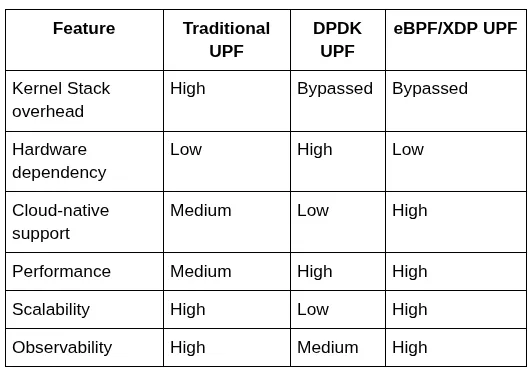
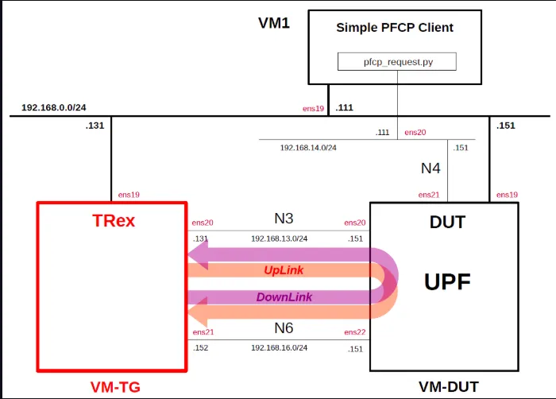
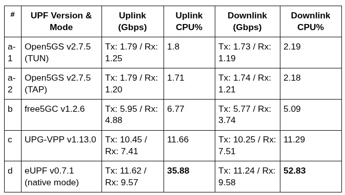

# Rewriting the 5G Data Plane: XDP/eBPF in the Fast Lane of UPF

**Author:** [Satyam Dubey](https://www.linkedin.com/in/satyam-dubey-142598258/)

**Published:** June 17, 2025

In the ever-evolving world of 5G, the User Plane Function (UPF) is the backbone of ultra-fast data delivery. With increasing throughput, low-latency expectations, and the explosion of IoT devices, traditional kernel networking struggles to keep up. The eBPF/XDP stack introduces programmable, high-performance packet processing at the NIC level, addressing many of these challenges.

> **Note:** Prior knowledge of eBPF is assumed. For an introduction, refer to this [beginner-friendly guide](https://ebpf.io/what-is-ebpf/). Familiarity with 5G core architecture and networking is also recommended.

## What is XDP?

The packet flow diagram above illustrates key processing stages inside the Linux kernel networking stack, highlighting interception points for tasks like filtering, forwarding, or dropping packets.

### Interpreting the Packet Flow Diagram

This flow is organized into four main layers:
- **Link Layer**: Early packet handling where drivers hand packets to the kernel.
- **Network Layer**: Routing, connection tracking, NAT, etc.
- **Protocol Layer**: L4-specific logic (TCP/UDP).
- **Application Layer**: Sockets and user applications.

XDP can hook at the earliest stage, immediately after the (start), in the NIC driver, before packet memory allocation. It allows the highest-speed possible processing with minimal system overhead.

### Why This Matters

- Bypasses layers such as Netfilter, qdisc, and routing logic.
- Enables line-rate filtering, DDOS protection, or forwarding from the driver point.
- Avoids kernel sk_buff allocation and associated system costs.

## XDP Modes

- **Native Mode**: Runs within the NIC driver for maximum performance, with true zero-copy. Requires compatible drivers (e.g., ixgbe, mlx5, virtio-net).
- **Generic Mode**: Executes after standard packet allocation, universally supported but slower than native.
- **Offloaded Mode**: Executes inside NIC firmware for SmartNICs, leveraging hardware acceleration.

## XDP Verdicts

- **XDP_DROP**: Drop the packet immediately.
- **XDP_PASS**: Pass into the kernel stack.
- **XDP_REDIRECT**: Redirect to another interface or AF_XDP socket.
- **XDP_TX**: Transmit back out on the same interface.
- **XDP_ABORTED**: Signals processing faults for debugging.

## What is the UPF?

The User Plane Function (UPF) in 5G networks is core to data transport between RAN (gNB) and external Data Network (DN). The UPF’s responsibilities include:

- GTP-U tunneling/decapsulation.
- IP forwarding and NAT.
- QoS enforcement.
- Lawful Interception.
- Traffic classification.
- Usage metering.
- Interaction with Session Management Function (SMF).

UPF is effectively the “traffic controller” in 5G, routing user data efficiently to its destination.

## What Makes a Desired UPF in 5G/6G?

Modern UPF requirements include:

1. **Ultra-Low Latency (URLLC Ready)**
2. **High Throughput**
3. **Horizontal Scalability**
4. **Cloud-Native Architecture**
5. **Programmability**
6. **Robust Flow and Session Management**
7. **Security and Isolation**
8. **Observability and Telemetry**
9. **Hardware Agnostic**
10. **Resilient and Fault-Tolerant**

## Where Traditional UPFs Fall Short

Traditional UPFs process packets through the full kernel stack, leading to:
- Context switching and memory copy overhead.
- Latency that is prohibitive for URLLC or high-throughput scenarios.

## DPDK UPFs — Speed with Strings Attached

DPDK-based UPFs improve throughput using kernel bypass and user-space polling, but:
- Require hardware with DPDK driver support.
- Present scaling challenges in Kubernetes.
- Offer limited integration with Linux observability tools.
- Scale poorly with rigid hardware dependencies.

## eBPF/XDP UPFs

eBPF/XDP-based UPFs offer a high-performance, programmable, in-kernel data path with:

- Near-DPDK performance without hardware dependency.
- No user-space context switches.
- Native integration into containerized/cloud (e.g., K8s) environments.
- Full observability (e.g., via BPF maps, tracepoints).
- Programmable behavior for instant adaptation.

## Noteworthy Open Source eBPF-Based UPF Projects

### 1. eUPF — Edgecom LLC

**Architecture:**  

- Kernel-resident data path via XDP/eBPF.
- GTP-U, PFCP message processing, modular Go and C code.
- KPIs: 25Gbps/core, <150μs RTT (Intel X550 NIC).
- Kubernetes-native.

### 2. OAI-UPF (OpenAirInterface)

**Architecture:**  

- Modular, integrates with OAI-AMF/SMF, flexible architecture.
- Supports both kernel/user-space paths.
- Written in C++/C, support for eBPF acceleration.
- 3GPP Rel-15 compliant with evolving QER support.

### 3. Ella Core

**Architecture Overview:**  

- Monolithic, cloud-native, lightweight, PVC-backed database.
- TLS offloading, data plane in virtualized environment.
- 500+ concurrent PDU sessions supported in tests.
- Integrated with Kubernetes; C for eBPF, Go for core.

Performance:  
[Performance test link](https://docs.ellanetworks.com/reference/performance/)

## UPF Performance Comparison Summary

Performance metrics: comparison of eUPF (XDP), Open5GS-UPF, Free5gc-UPF, UPG-VPP

Testbed details:  

**Load (1400B UDP payload):**  

**Latency (ms):**  

**N6 Raw Throughput:**  

Key insights:
- eUPF (XDP-native) delivers highest throughput, with higher CPU usage.
- UPG-VPP achieves best latency (<0.16ms).
- Open5GS and free5GC offer medium scalability and mid-tier performance.
- Results depend on virtualization, NIC drivers, and hardware.

## The Future of eBPF in 6G, AI-Native Networks

6G evolution will require:

- Ultra-low latency and deterministic performance.
- AI-native orchestration and programmable data planes.
- Continuous learning using real-time telemetry (eBPF maps, tracepoints).
- SmartNICs, DPUs, and offload into hardware-managed eBPF.

eBPF is expected to underpin in-kernel decision-making, real-time traffic adaptation, and integration with AI/ML pipelines at scale in next-generation mobile networks.

## References

- [Simple Measurement of UPF Performance (GitHub)](https://github.com/s5uishida/simple_measurement_of_upf_performance_9)
- [OAI 5G Core eBPF UPF Deployment Guide (GitLab)](https://gitlab.eurecom.fr/oai/cn5g/oai-cn5g-fed/-/blob/master/docs/DEPLOY_SA5G_WITH_UPF_EBPF.md)
- [OpenAirInterface eBPF UPF Implementation (GitLab)](https://gitlab.eurecom.fr/oai/cn5g/oai-cn5g-upf.git)
- [Ella Networks Core (eBPF-powered UPF framework) (GitHub)](https://github.com/ellanetworks/core)
- [A performance evaluation of eBPF-based UPFs (MDPI Electronics)](https://www.mdpi.com/2079-9292/11/7/1022)
- [How Bpf2Go works in Cilium (Golang + eBPF) (Cilium Docs)](https://docs.cilium.io/en/stable/ebpf/go/)