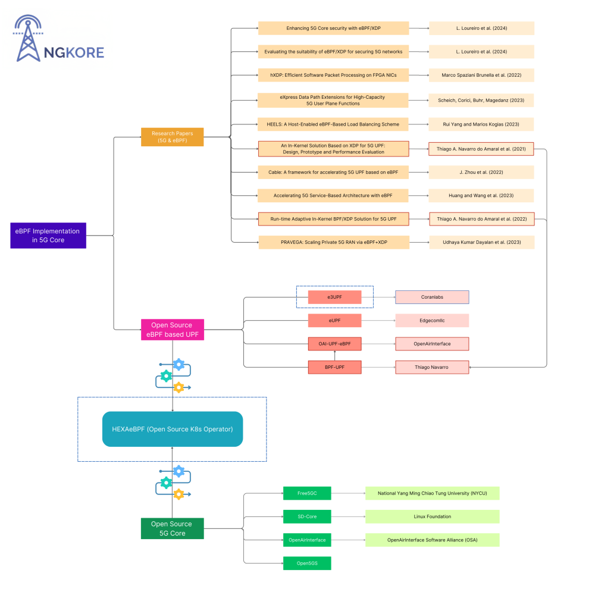
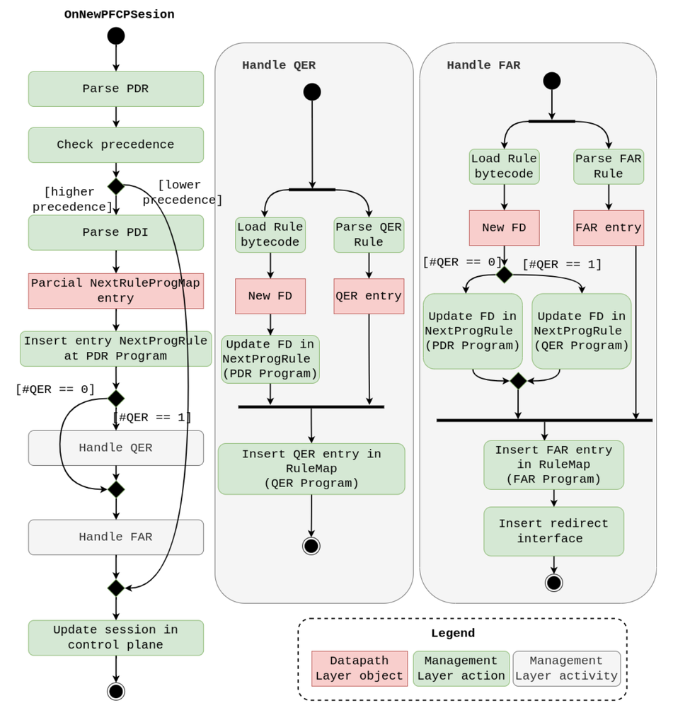

# eBPF Meets 5G: Transforming User Plane Function for Next-Gen Networks

**Author:** [Shankar Malik](https://www.linkedin.com/in/evershalik/)

**Published:** January 26, 2025

> *Part 1 of 2: HEXAeBPF Series*

eBPF has transformed the Linux kernel into a programmable platform through its lightweight, sandboxed virtual machine architecture. This innovation enables developers to extend kernel functionality without source code modifications or loading kernel modules, providing unprecedented efficiency and flexibility for system programming.

The technology has become fundamental to cloud-native infrastructure, revolutionizing packet processing through dynamic, secure, and high-performance data handling directly within the kernel space.

eBPF's impact extends significantly into 5G network architectures, where the User Plane Function (UPF) performs critical operations including packet routing, Quality of Service (QoS) enforcement, and policy application. Traditional UPF implementations operate in user space, requiring packet traversal through the kernel's network stack—a process that introduces latency through context switching, memory copying, and system call overhead.

eBPF integration addresses these performance bottlenecks by enabling streamlined packet processing and optimized data path operations. This combination of eBPF and 5G technologies enables enhanced network efficiency and performance characteristics.

The following research demonstrates eBPF implementation approaches within 5G Core User Plane Function architectures:

## Research Papers

### Research Paper 1

**[An In-Kernel Solution Based on XDP for 5G UPF: Design, Prototype and Performance Evaluation](https://ieeexplore.ieee.org/document/9615553)**

In this implementation, for PFCP sessions, the Session Manager dynamically loads eBPF bytecode into the kernel, creating a unique eBPF program for each session. These programs use eBPF maps to store PDRs and FARs. 

Communication between user and kernel space is handled via the libbpf library. The Session Manager parses incoming structures and updates the maps, enabling efficient session context creation in the Datapath Layer.

The Datapath Layer operates in kernel space and processes user traffic through a service chain with three components: the Parser, Traffic Classifier, and Traffic Forwarder. Packets are passed to the PFCP session context via tail calls. The Traffic Classifier retrieves PDRs from eBPF hash maps, and if found, the packet proceeds to the Forwarder. The Forwarder uses FAR IDs to apply actions, such as forwarding and outer header creation, and determines the destination interface using additional eBPF maps for next-hop MAC addresses and interface details.

### Research Paper 2

**[Run-time Adaptive In-Kernel BPF/XDP Solution for 5G UPF](https://www.mdpi.com/2079-9292/11/7/1022)**

This paper demonstrates how to use eBPF within the 5G core to optimize packet processing in the User Plane Function (UPF). By leveraging eBPF for PFCP session contexts, the solution deploys BPF programs for individual rules, such as FAR and QER, associated with the highest precedence PDR of each session. 

This approach removes the need for a PDR lookup loop, which previously caused scalability and latency issues, particularly in ultra-reliable low-latency communications (uRLLC) scenarios. 

The new design enhances flexibility, reduces the size of BPF programs, and improves the system’s responsiveness to network changes by decoupling rules, thereby optimizing processing times and avoiding the kernel verifier’s instruction limitations.

These research papers demonstrate eBPF's transformative impact on 5G Core network architectures. The following section examines open-source projects that implement these concepts in practical applications.

## Open-Source Projects

1. **upf-bpf**

    This project has evolved from two research papers briefed above,

    a) An In-Kernel Solution Based on XDP for 5G UPF: Design, Prototype and Performance Evaluation

    b) Run-time Adaptive In-Kernel BPF/XDP Solution for 5G UPF

    These two papers propose the overall idea used in this project’s implementation as well as **OAI-UPF-eBPF** which is based on the upf-bpf concept.

    This project provides a C++ library powered by BPF/XDP, designed for user planes in 5G/LTE networks.

    The key features of this project include:

    - In-kernel fast packet processing: Ensuring minimal latency and high performance.
    - Flexible and programmable dataplane: Allowing customization for varied use cases.
    - Portability: Usable across different systems and environments.

    It has been successfully integrated into the **OAI 5G UPF** project, marking a significant step toward more efficient packet processing in 5G Core networks.

2. **OAI-UPF-eBPF**

    An enhancement of upf-bpf, this project brings eBPF-driven functionality to 5G UPFs. It processes packets directly within the kernel, which minimizes latency and significantly improves efficiency.

3. **eUPF**

    Built with eBPF, eUPF focuses on high observability and performance.

    It is designed for:

    - *Multi-access edge computing (MEC)*: Optimizing traffic close to the user for reduced latency.
    - *Local traffic breakout*: Enhancing efficiency in data routing for localized networks.

    With its eBPF-based architecture, eUPF offers flexibility and reliability for handling user data traffic in advanced 5G use cases.

## Challenges in Adopting eBPF for 5G Core Networks

Above projects seem interesting and promising to the open source community, even though they are using eBPF, which provides a new way of how UPF throughput capability can be enhanced in 5G Core. This overall helps in many scenarios but also brings the cons of complexity and feature limitations:

1. **Complex Deployment Processes**

    For users who are new to eBPF, integrating and deploying these open-source projects to test 5G Core integrations can be tricky due to the complex deployment process, lack of documentation, and the complexity of eBPF programming. 

2. **Feature Limitations**

    Despite being 3GPP compliant, these projects lack support for certain critical features like IPv6 handling, advanced QoS capabilities, and correct GTP-u extension headers.

    The table below highlights the features currently missing in these projects:

## From Challenges to Solutions: Transforming 5G Core with eBPF

To address these limitations, the following two eBPF-powered projects effectively bridge the gaps, offering tailored solutions and addressing key challenges in the 5G Core ecosystem.

1. **HEXAeBPF** 

    HEXAeBPF simplifies the integration and deployment process, offering one-click deployment capabilities. 

    It bridges the gap between complexity and accessibility, making it an ideal choice for developers new to eBPF or 5G Core integrations.

2. **e3-UPF**

    e3-UPF (e3 stands for eBPF) addresses the limitations of existing projects while maintaining full 3GPP compliance. It offers support for critical features such as:

    - *IPv6 Handling*: Enabling seamless communication in modern networks.
    - *Advanced QoS Capabilities*: Ensuring superior traffic management and prioritization.
    - *Correct GTP-u Extension Headers*: Providing accurate and efficient packet encapsulation.
    - *Enhanced Observability*: Allowing better monitoring and diagnostics for optimized performance.

This makes e3-UPF a comprehensive solution for overcoming current challenges in the 5G Core ecosystem.

These projects not only address current challenges but also pave the way for eBPF integration in the 5G Core ecosystem.

Next, HEXAeBPF and e3-UPF will be explored in more detail to understand how they address the gaps in current solutions and contribute to the growth of open-source 5G technologies.
