# NR Frame Structure

**Author:** [Shubham Kumar](https://www.linkedin.com/in/chmodshubham/)

**Published:** July 10, 2022

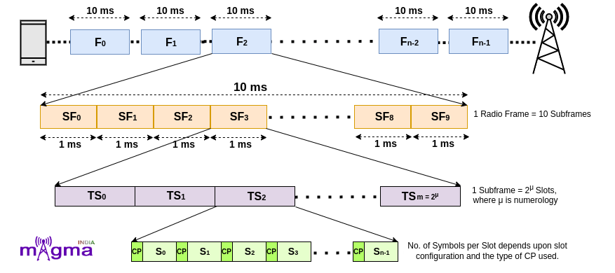

Data(UL/DL) is transmitted in the form of radio frames in the air. **Radio Frames** are of a duration of **10ms** which consists of **10** **subframes** each having a duration of **1ms**. Subframes inside a radio frame are serialized as SF0, SF1, SF2, SF3, …., and SF9. A subframe is made up of a **Resource Grid** which is a (m x n) matrix of Resource Elements where 'm' defines the number of Sub-carriers and 'n' defines the number of OFDM Symbols.

This arrangement of frames and subframes is similar to what is present in the LTE frame structure.

Subframes are further divided into slots. LTE has fixed 2 slots per subframe as per numerology, 15KHz. But in NR, the number of slots varies, depending on the **SCS**(*SubCarrier Spacing*). Slot length gets shorter as Subcarrier Spacing gets wider.

> Note: SCS is equivalent to numerology, mu(μ).

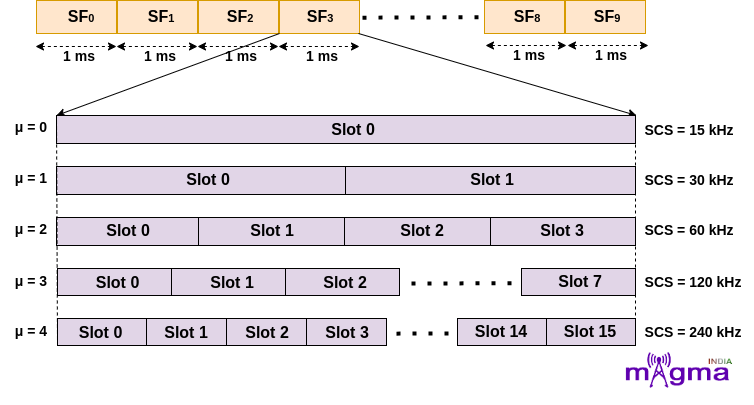

LTE supports **numerology** of 15KHz only but in 5G, the supported numerologies are 15KHz, 30KHz, 60KHz, 120KHz, and 240KHz. Multiple Subcarrier Spacing provides flexibility for multiple services on the same carrier frequency but it also introduces interference with other services having different numerology.

Formula to calculate, **SCS = 15 x 2μ kHz**(where μ = 0, 1, 2, 3, 4).

A **Slot** is another matrix of 12 subcarriers along with a variable number of symbols in the time domain or simply a **Resource Block**. It can further be classified based on the number of OFDM symbols. The number of OFDM Symbols varies with **slot configuration**, and the type of **Cyclic Prefix** used.

There are 2 types of slot configuration:

- **Slot Configuration 0** – This configuration is newly introduced in the NR System. The number of symbols in a slot is always 14 for Normal Cyclic Prefix and 12 for Extended Cyclic Prefix.

- **Slot Configuration 1** – In this configuration, the number of symbols in a slot is always 7 for Normal Cyclic Prefix and 6 for Extended Cyclic Prefix. This is the old Slot configuration mechanism used in the 4G System for resource allocation.

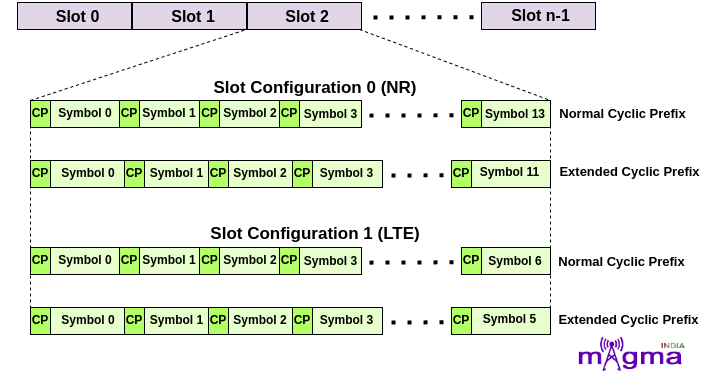

**OFDM**(*Orthogonal Frequency Division Multiplexing*) is an efficient **modulation technique** in which a wide frequency band is split into many small frequencies, known as subcarriers, and transmit in such a way that they overlap each other but do not influence other subcarriers. These subcarriers are **orthogonal** to each other which means the peak point of a sub-carrier occurs at the NULL point of others such that the resources can be used with maximum efficiency.

On a technical basis, it is the combination of **QAM**(*Quadrature Amplitude Modulation*) and **FDM**(*Frequency Division Modulation*) techniques to increase the channel efficiency and reduce bandwidth consumption, ultimately producing a high data rate communication system. OFDM symbols can be classified as **D**(*Downlink*), **U**(*Uplink*), and **X**(*Flexible*) based on the **slot format**.

Propagation of signals takes multiple diversions before reaching their destination due to which signals get distorted by fading and the doppler effect. At the frame structure level, if one symbol gets delayed a bit, then it coincides with the next symbol and causes interference between them called **ISI**(*Inter Symbol Interference*) which ultimately affects the transmission quality of digital signals.

So, to overcome this problem, a **time gap** is introduced between every 2 symbols. But leaving the space empty like turning off the transmission, would cause problems for the amplifier. So, to encounter this, a **CP**(Cyclic Prefix) is introduced in the space.

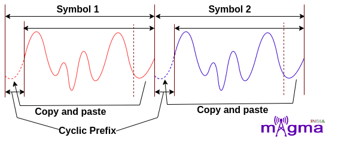

The **Cyclic Prefix** in OFDM refers to copying the end part of the signal and adding it at the beginning of it. This Cyclic Prefix is discarded at the receiver end.

Cyclic Prefix is of 2 types:

- **Normal CP** – In Normal CP, the slot is divided into **14/7 symbols** based on slot configuration. The normal CP length is designed to support propagation conditions with a delay spread up to 4.7 μs.

- **Extended CP** – The slot is divided into **12/6 OFDM symbols** based on slot configuration in the case of extended CP. This is intended to support deployments where the delay spread is up to 16.7 μs. This is only supported for the μ value 2 i.e. 60KHz SCS.

With the **increase** in the value of **μ**, the **OFDM symbols** occupying space in the **time domain** start to **decrease** with a simultaneous **increase** in the size of the **frequency domain**.

## Different Numerologies

1. For **μ = 0**, that means **15 kHz Subcarrier Spacing**. In this, a subframe contains only 1 slot which means a radio frame contains **10 slots** in it. For slot configuration 0, the number of OFDM symbols within each slot is 14. This configuration is for OFDM symbols having **Normal Cyclic Prefix**.

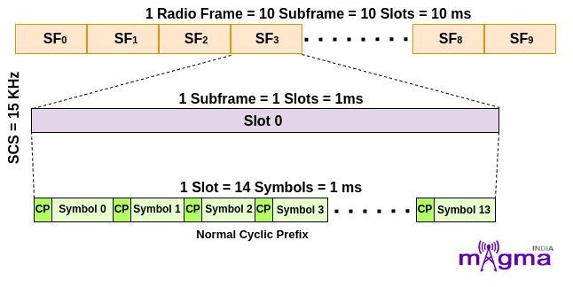

For **μ = 1**, that means **30 kHz Subcarrier Spacing**. In this, a subframe is divided into 2 slots which means a radio frame contains **20 slots** in it. For slot configuration 0, the number of OFDM symbols is 14 within each slot. This configuration is for OFDM symbols having **Normal Cyclic Prefix**.

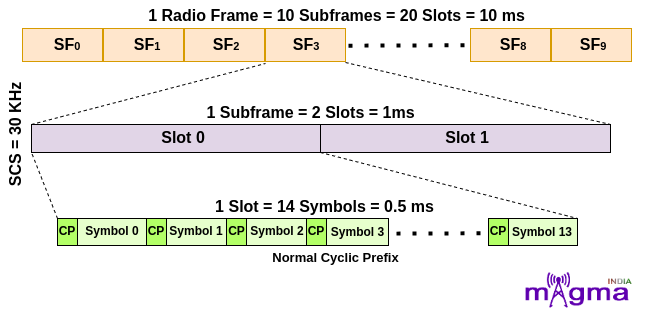

3. For **μ = 2**, that means **60 kHz Subcarrier Spacing**. In this, a subframe is divided into 4 slots which means a radio frame contains **40 slots** in it. This is further **categorized** based on the **type of Cyclic Prefix**.

- For OFDM symbols having **Normal Cyclic Prefix**, the number of OFDM symbols is **14** within each slot for slot configuration 0.

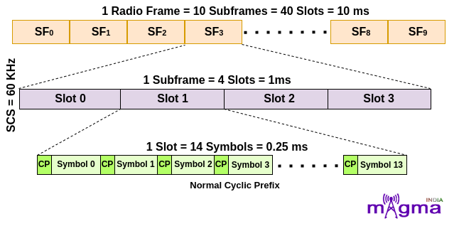

- For OFDM symbols having **Extended** **Cyclic** **Prefix**, the number of OFDM symbols is **12** within each slot configuration 0.

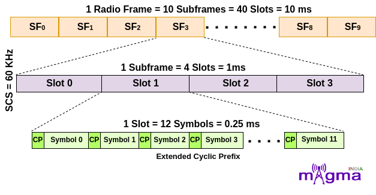

4. For **μ = 3**, that means **120 kHz Subcarrier Spacing**. In this, a subframe is divided into 8 slots which means a radio frame contains **80 slots** in it. For slot configuration 0, the number of OFDM symbols is 14 within each slot. This configuration is for OFDM symbols having **Normal Cyclic Prefix**.

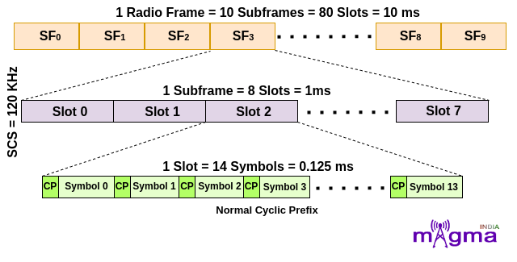

5. For **μ = 4**, that means **240 kHz Subcarrier Spacing**. In this, a subframe is divided into 16 slots which means a radio frame contains **160 slots** in it. For slot configuration 0, the number of OFDM symbols is 14 within each slot. This configuration is for OFDM symbols having **Normal Cyclic Prefix**.

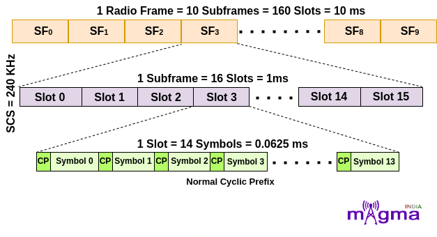

**Resource Element** is the **smallest physical time-frequency resource** consisting of **1 subcarrier** in **1 OFDM symbol**. **Subcarrier** is defined in the **frequency domain** and **OFDM Symbol** is defined in the time domain. To **identify the position** of each resource element, 2 parameters **(k,l)** are used where **'k'** and **'l'** are the indexes in the **frequency** and **time domain** respectively.

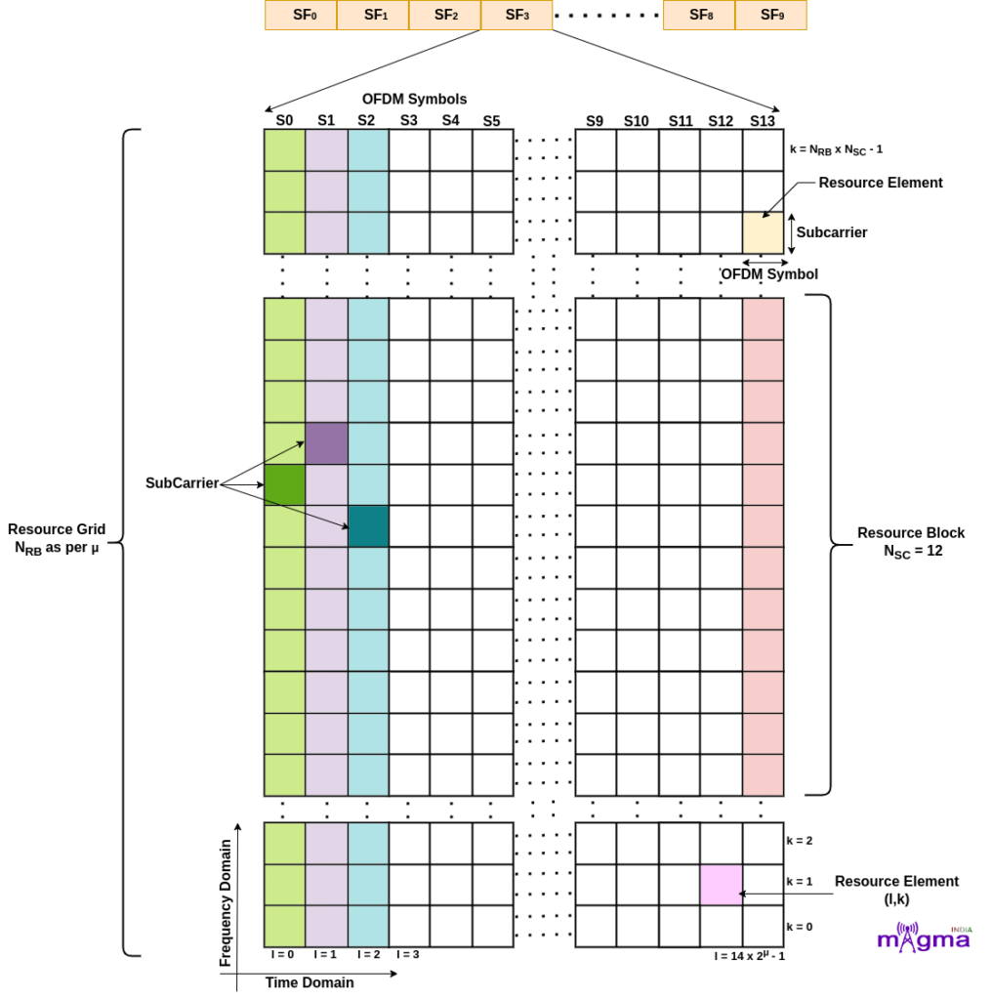

In **LTE**, a **Resource Block** is defined in the **time domain** of **0.5 ms** and **12 subcarriers** in the **frequency domain** but in **NR**, a **resource block** is **only defined** in the **frequency domain**. Unlike LTE, 5G has more flexibility in the time duration for different transmissions. The time domain can be altered based on the need. **E.g.** if a particular activity needs high throughput, it can be scheduled for multiple symbols and if it requires low latency, only fewer symbols will be allocated.

The number of **Resource Blocks** **varies** with **numerology**. **Resource Block** is defined as **12 consecutive subcarriers** in the **frequency domain**.

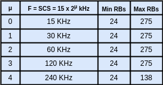
