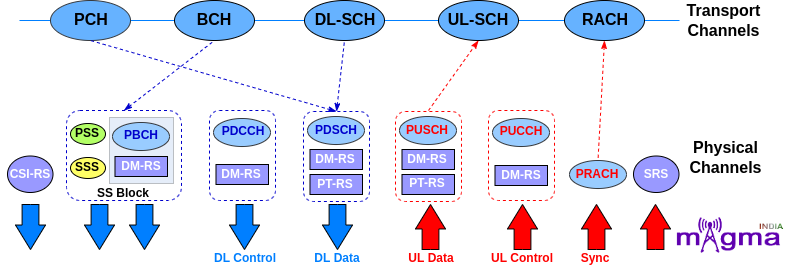
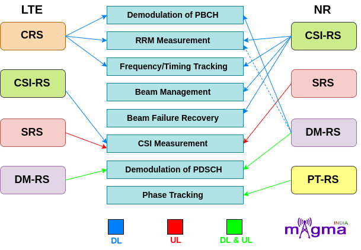
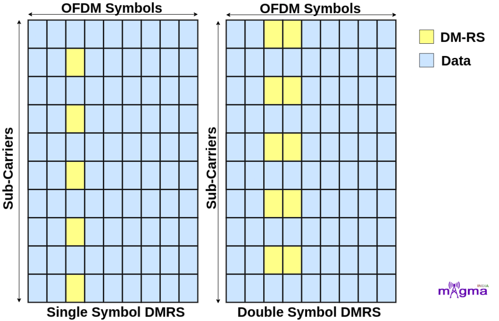
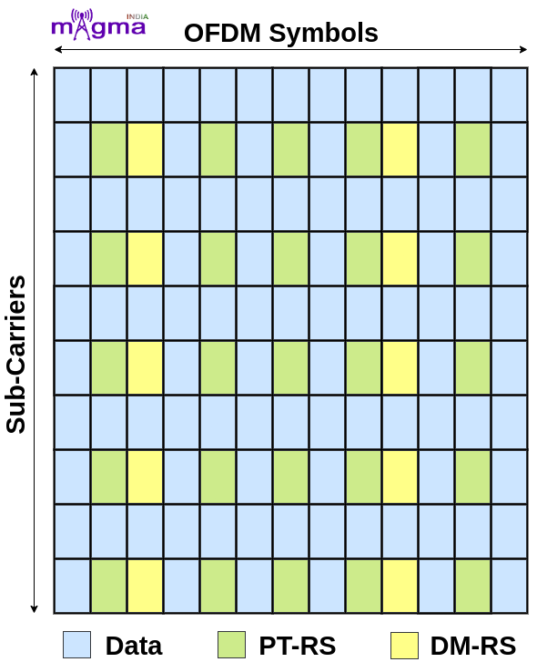
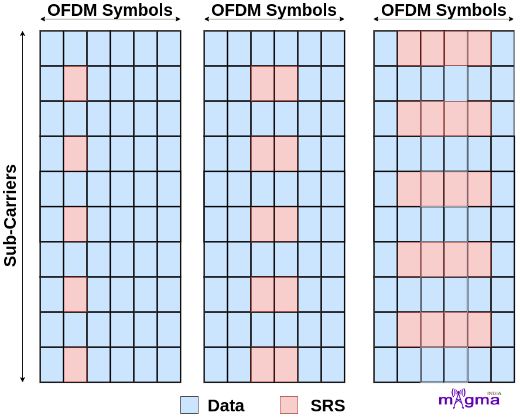
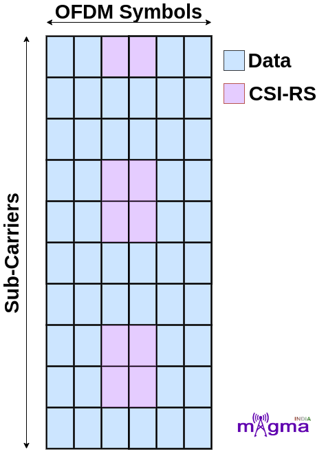

# NR Reference Signals

**Author:** [Shubham Kumar](https://www.linkedin.com/in/chmodshubham/)

**Published:** July 19, 2022

**Reference signals** are unique signals only **present** in **Physical channels** and are used to deliver a **reference point** for **resource scheduling** during **Uplink** and **downlink** **transmission**. It occupies specific resource elements within the grid.

NR constitutes 4 reference signals:

- **DMRS**(*Demodulation Reference Signal*)
- **PTRS**(*Phase Tracking Reference Signal*)
- **CSI-RS**(*Channel State Information Reference Signal*)
- **SRS**(*Sounding Reference Signal*)

## NR RF vs LTE RF

- In LTE, there is a reference signal called **C-RS**(*Cell-specific Reference Signal*) which is mainly used for **downlink purposes** such as **demodulation**, and **channel quality estimation**. But in NR, this reference signal is **removed** and instead, uses different downlink signals for different purposes.

- A **new reference signal**, **PTRS**, is **introduced** which tracks the phase of a local oscillator at the transmitter and receiver end. This is used to counter phase noise at higher frequencies.

- In LTE, DMRS is introduced only in Downlink transmission, but this limitation is no more available in NR. **NR** introduces **DMRS** for **both downlink** and **uplink channels**.

- In LTE, reference signals are always enabled for maintaining the link between the device and the network but in NR, **reference signals are transmitted only when they are required** which ultimately optimizes their performance.

## Types of Reference Signals

### DMRS

- **DMRS**(*Demodulation Reference Signal*) is the reference signal which is used for **demodulation** i.e. extracting the original signals from the received one(*modulated*) by altering its frequency and amplitude.

- DMRS is designed **specifically** for **each UE**, i.e. no 2 UE's use the same DMRS for the physical channels demodulation.

- As DMRS is used particularly for demodulation and **RRM**(*Radio Resource Management*) **measurement**, so this is transmitted only when it is needed.

- DMRS is **mapped** to different physical channels for both **Downlink** and **Uplink**. The physical channels that are associated with DMRS are **PDSCH, PDCCH PUSCH,** and **PUCCH**.

Apart from this, it is also found in **association with PBCH** inside the **SSB**(**Synchronization Signal Block**). **PBCH DMRS** occupies **25%** of **REs**(*Resource Elements*) allocated to PBCH. The **REs occupied** by the **PBCH** **DMRS** are **dependent** on the **PCI**(*Physical Cell Id*) value and its **location** is determined by the formula '**PCI mod4'**.

- Multiple **orthogonal** DMRSs i.e. *isolated from each other's effects*, can be allocated to **support** **MIMO**(*Multiple Input and Multiple Output*) transmission for higher throughput. It supports up to about 12 orthogonal layers.

- The network controls the rate of transmission of DMRS signals based on rate change. In high mobility scenarios, tracking fast changes in the channel increases the rate of transmission of DMRS signal whereas, in low-speed scenarios where the channel shows little change, it sends this information occasionally.

- **DMRS** is also found in **association** with **PTRS** only **once** **per** **transmission**. DMRS can also be **beamformed**.

### PTRS

- **PTRS**(*Phase Tracking Reference Signal*) is used to **track** the **phase** of the local **oscillator** present at the transmission and receiver end.

- The initial angle made by a sinusoidal function of a waveform generated by an oscillator is known as a **phase**. Any kind of **fluctuations** that occur in the phase of a **waveform** is called **phase noise**. The **orthogonality** of the **subcarriers** gets **destroyed** due to **ICI**(*Inter-Carrier Interference*) and this phase noise causes a **common phase rotation** to all the **subcarriers** known as **CPE**(*Common Phase Error*).

PTRS is responsible for **minimizing** the effect of the oscillator **phase noise** on system performance, especially at **mmWave frequencies**. The **phase noise increases** with an **increase** in the **frequency** of waves.

- PTRS has a **low density** in the **frequency domain** and **high density** in the **time domain** as phase noise tends to change across time but remains the same across the frequency domain. Or in other words, there are **low correlation** characteristics among the **consecutive OFDM symbols**.

- PTRS **occurs** **only** in **combination** with **DMRS** in physical channels. It is present in both uplink and downlink with **PUSCH** and **PDSCH** channels respectively.

- PTRS allocation within subcarriers is carried out depending on the quality of the oscillators, carrier frequency, subcarrier spacing, modulation, and coding schemes that are used.

### SRS

- **SRS**(*Sound Reference Signal*) is an **uplink reference signal** **transmitted** by **UE** which is used by the gNodeB to **estimate** the **uplink channel quality** over a wider bandwidth.

- Unlike DMRS and PTRS, **SRS** is **not associated** with any **uplink physical channels** but **supports** uplink **resource scheduling** and link adaption(*selecting an appropriate modulation and coding scheme to maximize the transmission of user bit rate*).

- SRS resources **span** over **1, 2, or 4 consecutive symbols** in the **time domain**. It is always **transmitted** in the **last 6 symbols** of the **slot**.

- SRS **provides information** about the **combined effect** of **multipath fading**, **scattering**, **Doppler**, and **power loss** of the transmitted signal. This information is used by the base station for **beam management** and **power control** of the signal.

- Max of 12 UEs can transmit SRS simultaneously using 1 antenna port.

### CSI-RS

- **CSI-RS**(*Channel State Information Reference Signal*) is a **downlink reference signal** used by UE to **measure** the **quality** of the **downlink** **channels** and **report** this to the base station through the **CQI**(*Channel Quality Indicator*) report. This information is used by gNodeB to implement appropriate modulation schemes, code rates, beamforming, etc.

- It is **used** for the **calculation** of **RSRP**(*Reference Signal Received Power*), **RSRQ**(*Reference Signal RecivedQuality*), and **SINR**(*Signal Interference + Noise Ratio*) during **mobility** and **beam management** in connected mode.

- It is also used in **frequency and time tracking**, and **UL reciprocity-based precoding**(*channel estimation in uplink so that it can be directly used for link adaption in the downlink*). For time and frequency tracking, CSI-RS transmission can either be **periodic** or **aperiodic**.

- 5GS(*5G System*) allows a **high** level of **flexibility** in **CSI-RS** **configurations**, its resources can be configured up to 32 ports.

- CSI-RS resources can be scheduled on any OFDM symbols within the slot but it **usually occupies 1, 2, or 4 OFDM symbols** based on configured number of ports.

- CSI-RS is uniquely configured for each UE but multiple UEs can share the same resources as they all are served by the same gNB.
