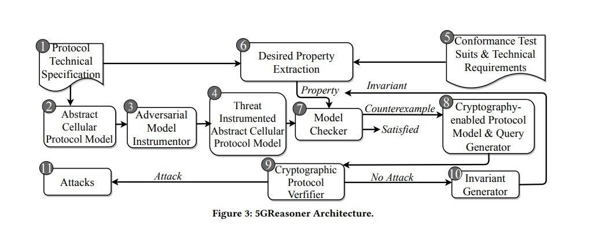
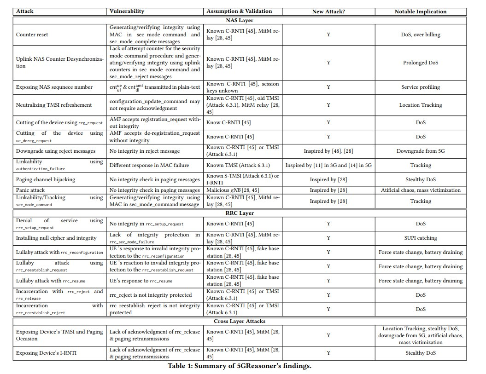
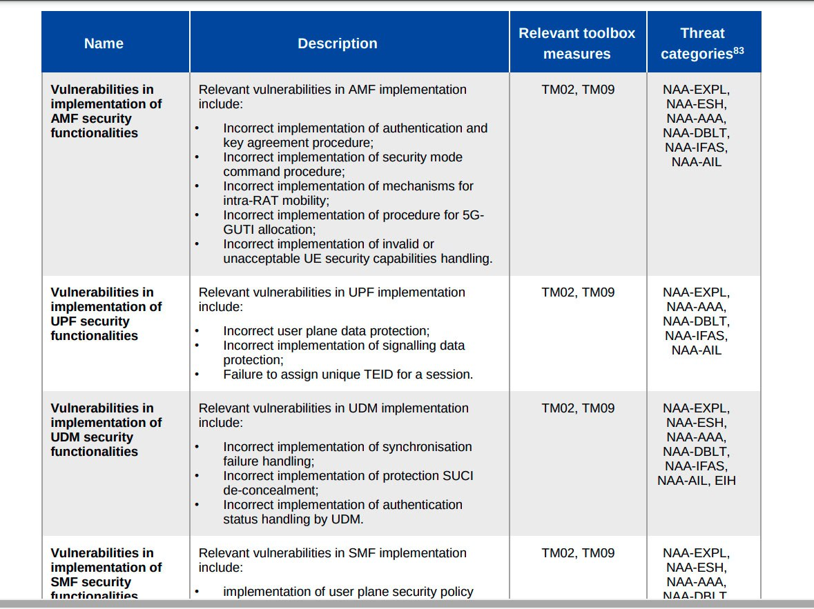
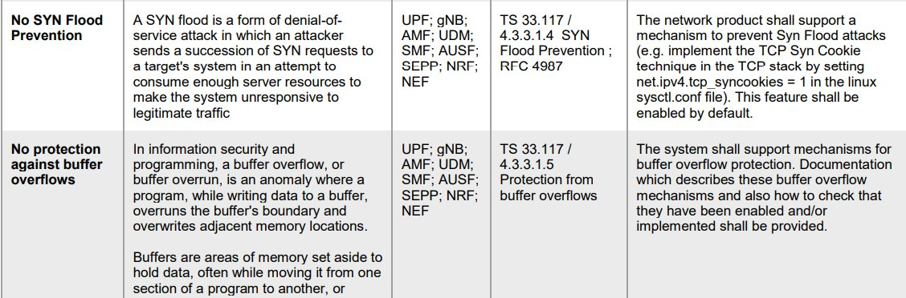
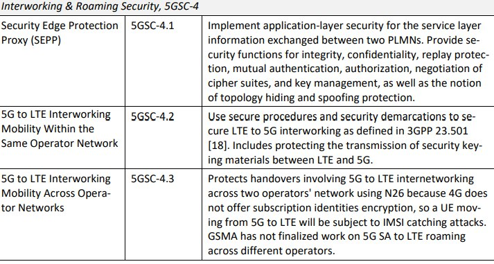
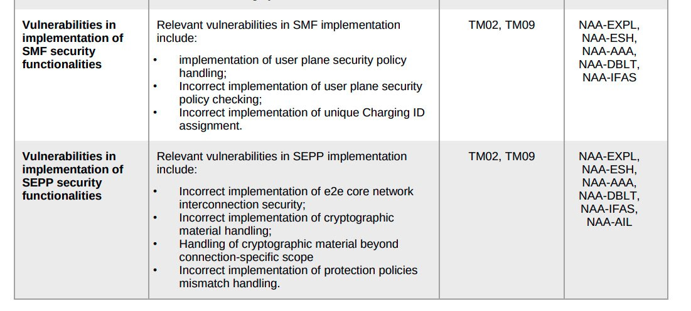

# 5G Core Vulnerabilities

**Author:** [Shankar Malik](https://www.linkedin.com/in/evershalik/)

**Published:** March 18, 2025

> **Note:** This is a curated catalog of publicly disclosed 5G Core vulnerabilities and related security research. Referenced repositories include [Open5GS](https://github.com/open5gs/open5gs), [5GBaseChecker](https://github.com/SyNSec-den/5GBaseChecker), [5Ghoul](https://github.com/asset-group/5ghoul-5g-nr-attacks), and [free5GC](https://github.com/free5gc/free5gc).

A running list of known CVEs, disclosed bugs, and academic research covering vulnerabilities across open-source and standardized 5G Core network functions (AMF, UPF, UDM, SMF, SEPP) and RAN-core interfaces.

## 1. Open5GS Stack Buffer Overflow During PFCP Session Establishment on UPF (CVE-2021-41794)

Reference: [NCC Group Technical Advisory](https://www.nccgroup.com/us/research-blog/technical-advisory-open5gs-stack-buffer-overflow-during-pfcp-session-establishment-on-upf-cve-2021-41794/)

- **Vendor:** [Open5GS](https://github.com/open5gs/open5gs)
- **Versions affected:** 1.0.0 to 2.3.3
- **Systems affected:** Linux
- **Advisory / CVE identifier:** CVE-2021-41794
- **Risk:** CVSSv3.1 8.2 (`AV:N/AC:L/PR:N/UI:N/S:U/C:N/I:L/A:H`)

## 2. 5GBaseChecker

Reference: [5GBaseChecker](https://github.com/SyNSec-den/5GBaseChecker)

## 3. ORANalyst: Systematic Testing Framework for Open RAN Implementations

Reference: [USENIX Security '24 presentation](https://www.usenix.org/conference/usenixsecurity24/presentation/yang-tianchang) — [paper (PDF)](https://www.usenix.org/system/files/usenixsecurity24-yang-tianchang.pdf)

## 4. 5Ghoul — 5G NR Attacks & 5G OTA Fuzzing

Reference: [5ghoul-5g-nr-attacks](https://github.com/asset-group/5ghoul-5g-nr-attacks)

## 5. Open5GS Incorrect Error Handling in the GMM State Exception (CVE-2024-56921)

Reference:

- [Issue #3608 — InitialUEMessage/Registration request can crash AMF due to incorrect error handling in the gmm state exception](https://github.com/open5gs/open5gs/issues/3608)
- [Fix commit](https://github.com/open5gs/open5gs/commit/f780f9af45c27b6f49987d96ba71dedb3dd85840)
- [Strengthening Open Source 5G Security — CVE-2024-56921](https://www.vaanmegam.net/Strengthening-Open-Source-5G-Security-CVE-2024-56921.html)

```text
[AMF] Fix crash due to incorrect handling of UE registration requests (#3608)

This commit addresses an issue in the AMF where it crashes upon
receiving the Nausf_UEAuthentication_Authenticate response in the
gmm_state_exception function.

The crash occurs when the same UE continuously sends registration
requests while the previous UE context is released before the AUSF
response is received, leading to incorrect states in the gmm state
machine.

The root cause was a lack of proper handling in the gmm_state_exception
function for the scenario where multiple registration requests from
the same UE cause the AMF to process outdated authentication vectors.

This update introduces a fix to handle this edge case and prevent the
AMF from crashing.
```

## 6. Exploit the Fuzz — Exploiting Vulnerabilities in 5G Core Networks

Reference:

- [Exploit the Fuzz – Exploiting Vulnerabilities in 5G Core Networks](https://www.nccgroup.com/us/research-blog/exploit-the-fuzz-exploiting-vulnerabilities-in-5g-core-networks/)
- [The Challenges of Fuzzing 5G Protocols](https://www.nccgroup.com/us/research-blog/the-challenges-of-fuzzing-5g-protocols/)

## 7. SCTP Insertion Attacks in 4G & 5G Networks

Reference: [Quantum of Malice — Enea](https://www.enea.com/insights/quantum-of-malice/)

TLS runs on top of TCP, and TCP sits on top of the IP protocol, which usually sits on top of Ethernet or a tunnelling protocol. In telecommunications specifically, a non-TCP protocol called SCTP (Stream Control Transmission Protocol) was selected to carry telecom protocol payloads.

This decision, made long ago, sets telecom networks apart from web communication. SCTP has a few features that make it different from the more popular TCP protocol, but in many ways they are also similar: both track communications using sequence numbers where each transaction is acknowledged by the recipient, both are cleartext protocols, and both use a handshake to initiate the connection.

PFCP operates at the **application layer**, unlike SCTP, UDP, or TCP, which operate at the **transport layer**.

## 8. 5GReasoner: A Property-Directed Security and Privacy Analysis Framework for 5G Cellular Network Protocols

Reference: [5GReasoner paper (PDF)](https://syed-rafiul-hussain.github.io/wp-content/uploads/2019/10/5GReasoner.pdf)





## 9. free5GC UDM Vulnerable to Invalid Curve Attack

Reference: [GHSA-cqvv-r3g3-26rf](https://github.com/advisories/GHSA-cqvv-r3g3-26rf)









## 10. RANsacked: A Domain-Informed Approach for Fuzzing LTE and 5G RAN-Core Interfaces

Reference: [RANsacked paper (PDF)](https://nathanielbennett.com/publications/ransacked.pdf)
