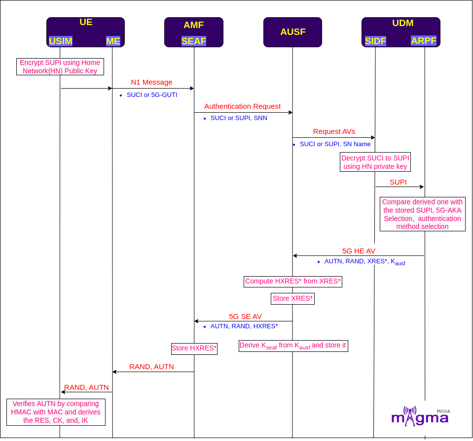
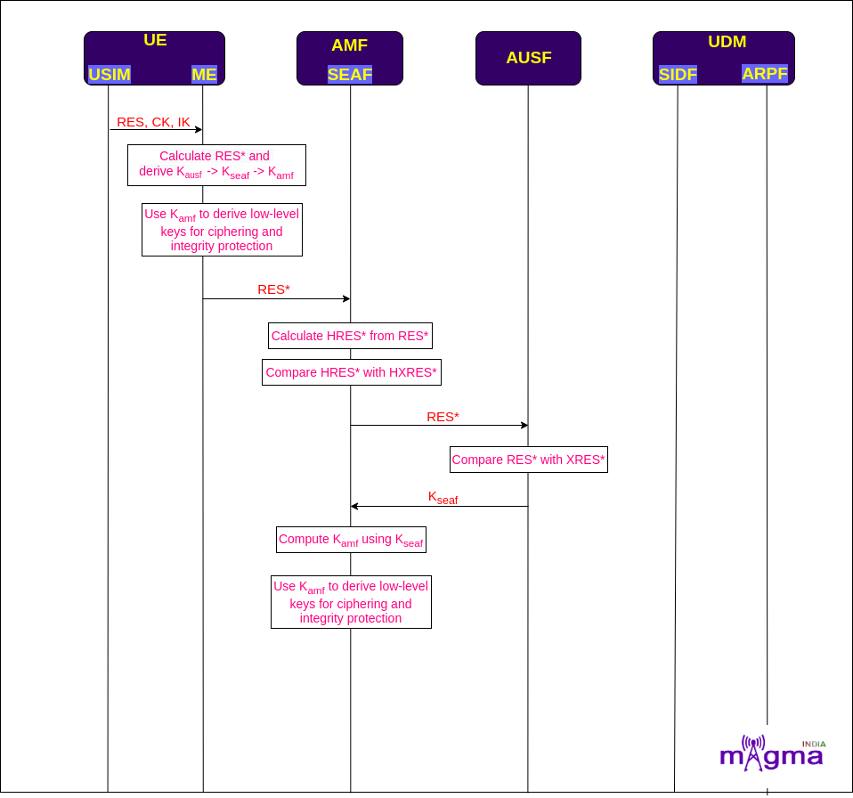

# AKA Procedure

**Author:** [Shubham Kumar](https://www.linkedin.com/in/chmodshubham/)

**Published:** October 14, 2022

If the UE(*User Equipment*) is previously registered with the network, it will have a **temporary identifier**, **5G-GUTI**(*5G- Global Unique Temporary Identifier*) stored in it. The UE will use this identifier for the Identification procedure.

The 5G-GUTI is sent to the SEAF(*Security Anchor Function*) in the logical N1 interface where SUPI(*Subscription Permanent Identifier*) is derived from it and further sent to the AUSF(*Authentication Server Function*) for the generation of authentication vectors.

> The N1 interface is called the logical interface because the signaling messages between the AMF(Access and Mobility Management) and UE are transferred through gNodeB but are shown as an independent interface in the architecture.*

But if the UE is not registered with the network earlier, it will use a **permanent identifier**, **SUPI** for UE authentication. But SUPI cannot be sent over the air interface in a plain-text message for privacy reasons. So, a **concealed version of SUPI** i.e. **SUCI**(*Subscription Concealed Identifier*) is used for transmission.

SUCI is created by UE using Public Key Cryptography Technique. UE encrypts the SUPI with the help of the **HN**(*Home Network*) **Public Key** so that it can only be decrypted by the SIDF(*Subscription Identifier De-concealing Function*) using its Private Key. After decoding the SUCI, it compares the subscriber SUPI with the stored SUPI in ARPF(*Authentication credential Repository and Processing Function*) to confirm that the request is from a genuine user.

Based on the SUPI received, ARPF decides which procedure should be implemented either 5G-AKA(*Authentication and Key Agreement*) Procedure(*for 3GPP supporting devices*) or EAP-AKA(*Extensible Authentication Protocol-Authentication and Key Agreement*) Procedure(*for non-3GPP supporting devices*).

For the 3GPP scenario, the 5G AKA procedure is used. ARPF derives 5G HE AV(*Home Environment Authentication Vectors*). HE AV contains 4 different authentication parameters i.e. **AUTN**(Authentication Token), **RAND**(*Random Number*), **XRES\***(*Expected Response*), and **Kausf**(*AUSF Key*). These parameters are generated by the ARPF with the use of Milenage and HMAC-SHA-256 KDF algorithms along with some other inputs.

> The Authentication Vector is sent as Home Environment because the AUSF is located in the Home Network.*

ARPF sends these authentication vectors to AUSF. AUSF derives the Kseaf(*SEAF key*) using the KDF algorithm and stores it. Once the UE authentication is completed, it sends this key to the SEAF.

AUSF calculates the HXRES*(Hash Expected Response)* from XRES by using the SHA-256 hash algorithm and sends it to the SEAF. AUSF also stores XRES\* to compare it with the response coming from the UE.

Now the AUSF sends the SE AV(*Serving Environment Authentication Vector*) which consists of AUTN, RAND, and HXRES\*.

> The Authentication Vector is sent as Serving Environment because the AMF is located in the Serving Network of the UE.*

SEAF will store the HXRES\* to compare it with the UE authentication response and sends the RAND, and AUTN to the UE.

The USIM(*Universal Subscriber Identity Module*) part of the UE verifies that the AUTN is from a genuine mobile Core Network by comparing the XMAC(*Expected Message Authentication Code*) with the MAC which it derives from the AUTN along with the RES(*Response*), CK(*Ciphering Key*), and IK(*Integrity Key*) using the Milenage algorithm.

Then USIM sends it to the ME(*Mobile Equipment*) another part of the UE(*without SIM*) where RES\* is calculated and, Kausf(*AUSF Key*) is derived using the HMAC-SHA-256 KDF algorithm. Then with the use of Kausf, Kseaf(*SEAF Key*) is derived and with the help of Kseaf, Kamf(*AMF Key*) is derived. UE then derives the low-level keys using Kamf for ciphering and integrity protection on the user side.

From the ME, RES is sent back to the SEAF in the authentication response.

SEAF derives the HRES\* from RES\* using the SHA-256 hash algorithm to compare it with the stored HXRES\*. If it matches, then the authentication procedure gets a green signal from the AMF side and forwards the response to the AUSF for its successful completion.

AUSF compares the RES\* with the XRES\* and sends the Kseaf to the SEAF if it completely matches, to let SEAF derive the Kamf which is further used to derive low-level keys that help in integrity and ciphering protection on the network side. After this, a secure connection is set up between the network and the UE.

[Download AKA Procedure PDF](./images/aka-procedure/aka-procedure.pdf)

