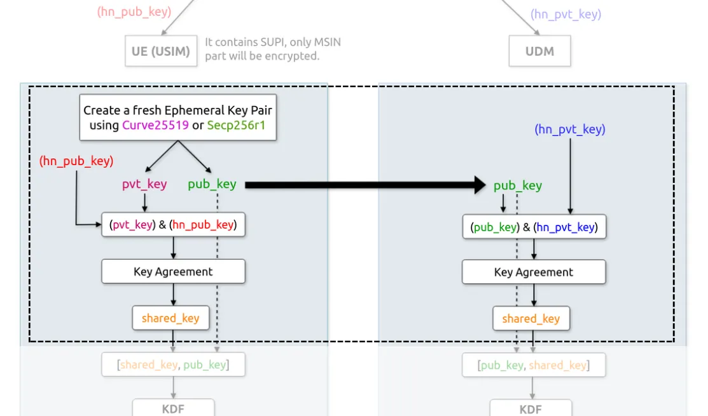
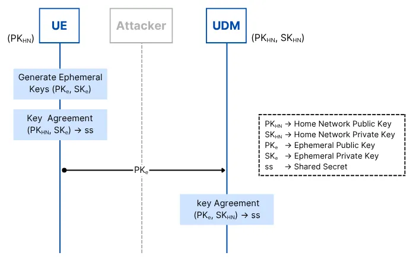

# Can 5G SUPI Concealment Really Ensure Forward Secrecy?

**Author:** [Shubham Kumar](https://www.linkedin.com/in/chmodshubham/)

**Published:** June 11, 2025

> *Part 1 of 2: SUPI Concealment ensures PFS Series*

## Introduction

In recent months, significant attention has focused on how 5G SUPI Concealment could potentially deliver forward secrecy. However, after studying published research and critically analyzing the details, an open question remains: can SUPI Concealment genuinely ensure forward secrecy—or even offer it at all?

This article comprehensively covers essential definitions, 5G cryptographic procedures, and a step-by-step evaluation of the SUPI concealment implementation, enabling any reader to critically assess the strength of forward secrecy in 5G networks.

## Pre-Requisite: Key Concepts

**Forward Secrecy:**  
Forward secrecy ensures that if a long-term cryptographic key is compromised, session keys from previous communications remain secure and cannot be derived from the compromised key.

**Public Keys in 5G:**  
Within a 5G network, a user’s SIM (or more broadly, the UE) contains the operator’s Home Network Public Key. This public key, though shared, cannot reveal the private key. Only those possessing the corresponding private (secret) key can perform decryption operations.

**Diffie–Hellman (DH) Key Exchange:**  
A cryptographic method for two parties to establish a shared symmetric key via public information. Each combines their private key and the other party’s public key to independently derive the same shared secret.

**Ephemeral Key:**  
A temporary, one-time-use key, freshly generated for each session and deleted after use, providing resistance to long-term key compromise.

## ECIES Scheme in 5G SUPI Concealment

Unlike 4G, which sends the IMSI (International Mobile Subscriber Identity) as plaintext, 5G transmits the SUPI in a concealed form (SUCI: Subscriber Concealed Identifier). ECIES (Elliptic Curve Integrated Encryption Scheme) is the underlying standard for this concealment, combining ECC with symmetric encryption and integrity protection.

**Operation Steps:**

1. **Key Generation:**
    - The Home Network (HN) generates an ECC key pair: public key (PKhn) and private key (SKhn).
    - PKhn is stored on the SIM (USIM or UE), and SKhn securely within the UDM’s SIDF.

2. **Session Initialization:**
    - The UE generates an ephemeral ECC key pair [PKe, SKe] for a single session.
    - The UE uses its SKe and the HN’s PKhn to generate a shared secret (ss) via ECDH.

3. **Key Derivation:**
    - The shared secret (ss) feeds into the ANSI-X9.63 KDF, producing:
        - AES key: used to encrypt the SUPI (MSIN portion) as ciphertext (SUCI).
        - MAC key: for message authentication.

4. **Encryption & Authentication:**
    - SUPI is encrypted with the AES key to produce the SUCI.
    - The MAC key generates UE_MAC for integrity assurance.

5. **Transmission:**
    - The UE transmits [PKe (ephemeral public), SUCI (ciphertext), UE_MAC] to the network.

6. **Decryption by Home Network:**
    - The UDM uses its SKhn and the received PKe to regenerate the shared secret (ss) and derive identical AES and MAC keys.
    - The MAC is verified; if valid, the SUCI is decrypted to obtain the original SUPI.
    - Successful verification and decryption authenticates the UE.

## Is Ephemeral Key Usage Alone Sufficient for Forward Secrecy?

A common misconception is that simply using ephemeral keys guarantees forward secrecy. The reality is more nuanced.

The following call flow diagram illustrates the cryptographic process implementation:

**Step Flow:**

- UE creates shared secret (ss) combining SKe (ephemeral private) and PKhn.
- UDM recreates the same ss using SKhn and PKe.
- Both ephemeral key pairs are deleted post-session, meaning they're unrecoverable.
- However, the ephemeral public key (PKe) is transmitted and can be captured (e.g., by a passive attacker).

**Critical Issue:**

If, at any later time, the HN’s private key (SKhn) is compromised, an attacker can combine any previously recorded PKe values (from prior sessions) with SKhn to recompute session shared secrets and decrypt past SUCI values. Thus, forward secrecy is not provided; compromise of SKhn retrospectively exposes all SUPIs concealed with that key.

## Exploring a Forward Secrecy Improvement

A proposed enhancement is to extend ephemeral key usage to both participating entities:

**Steps:**

1. UE generates a shared secret (ss) using (SKe, PKhn).
2. The UDM also generates its own ephemeral key pair (PKes, SKes) and shares PKes over the air, before registration.
3. UE encapsulates its PKec using PKes, sends the ciphertext (ct) to the UDM.
4. UDM decapsulates using SKes to retrieve PKec, and uses (SKhn, PKec) for shared secret generation.
5. All ephemeral keys ([PKec, SKec], [PKes, SKes]) are deleted after use.

Now, if an attacker obtains the long-term SKhn, combining it with stored PKes and ct (ciphertext) is insufficient for reconstructing past session secrets, as no single party holds both components simultaneously. This pattern achieves forward secrecy at the cryptographic handshake level.

> **Implementation Caveat:**
> - ECIES does not naturally support key encapsulation/decapsulation (like RSA); Hybrid Public Key Encryption (HPKE) is necessary to realize this dual-ephemeral scheme.
>
> - There is also a practical challenge: PKes in this model must be distributed to the UE before registration, which may require additional protocol modifications.

## Limitations and Real-World Considerations

Even a forward-secure handshake does not fully solve the problem in this context. The shared secret in each session encrypts/decrypts the same underlying SUPI (subscriber identity). SUPI does not change across sessions; if it is ever compromised, every session inevitably reveals the same concealed information.

Thus, while strengthening cryptographic process enhances security, the unchanging nature of SUPI means that its ultimate compromise weakens overall privacy, regardless of how forward-secure the concealment handshake may be.

This explains why more focus is often needed on protecting session keys (e.g., NAS/RRC keys) and overall operational security, rather than relying on SUPI concealment alone for forward secrecy.

## Conclusion

- The ECIES-based 5G SUPI concealment improves over 4G by encrypting the identifier in transit, but does not, in its standard form, provide forward secrecy if long-term keys are compromised.
- Incorporating ephemeral keys at both ends and adopting key encapsulation mechanisms can theoretically offer forward secrecy, but deployment introduces new protocol complexities and requirement shifts.
- Due to the persistent use of a static identifier (SUPI), the scope of forward secrecy is inherently limited—if SUPI is ever decrypted, all past and future SUPI exposures yield the same identity.
- Securing SUPI remains valuable, but true forward secrecy at this layer is ultimately constrained by the protocol design and identifier persistence.

If you find this analysis thought-provoking, consider this additional open question: Even if forward secrecy is conceptually achieved, how can the required cryptographic handshake (e.g., sharing PKes before registration) be practically accomplished within existing 5G architectures? This challenge, along with further enhancements, will be explored in the next post of this series.