# ECIES in 5G Core: SUPI to SUCI Conversion

**Author:** [Aditya Koranga](https://www.linkedin.com/in/aditya-koranga/)

**Published:** July 26, 2023

SUPI stands for Subscription Permanent Identifier, a permanent unique identifier assigned to each sim card for the identity of a subscriber. In 4G it was called IMSI(International Mobile Subscriber Identity).

SUPI is a 15 or 16 digits string that contains MCC(Mobile Country Code), MNC(Mobile Network Code), and **MSIN**(Mobile Subscriber Identification Number). SUPI can also be written in NAI format.

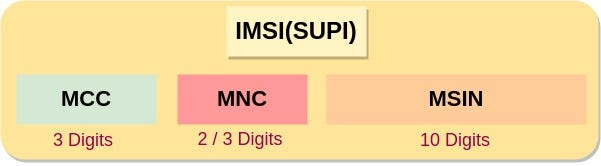

In 4G, this identifier was sent to the home network as plain text which was the cause of a problem called the '**Man In the Middle Attack**' in which an external third party can clearly watch the IMSI and intentionally change its value which may cause some problems in the network or use it for their own profit. This is how an **IMSI Catcher** violates network security.

So, in 5G there was a need to send the SUPI in a protected way and that is why we need to first Encrypt the SUPI and then send it to the home network. The Encrypted SUPI is called SUCI(Subscription Concealed Identifier). In SUPI we just need to Encrypt the MSIN part and the MCC & MNC parts are not required to be encrypted.

## ECIES Implementation

5G uses symmetric-key encryption and various ciphering algorithms but the SUPI to SUCI conversion mechanism is performed with the help of **Asymmetric-Key Encryption**, also known as **Public-Key Cryptography**. The scheme that is used in this whole encryption and decryption process is **ECIES**(Elliptic Curve Integrated Encryption Scheme).

Implementation of ECIES in 5G Core is mentioned in the [**3GPP TS 33.501 #Section C.3**](https://www.etsi.org/deliver/etsi_ts/133500_133599/133501/15.04.00_60/ts_133501v150400p.pdf) **[Section C.3].** You can also check [**this**](https://www.secg.org/sec1-v2.pdf) page for detailed implementation.

Right now, the ECIES scheme is quite safe and robust but in the future to make it safe from quantum attack we will have to implement Post-Quantum Cryptographic algorithms like lattice-based Crystals-Kyber key encapsulation mechanism.

According to the [3GPP Standard](https://www.etsi.org/deliver/etsi_ts/133500_133599/133501/15.04.00_60/ts_133501v150400p.pdf), for the ECIES scheme, two profiles: **Profile A** & **Profile B** are supported:

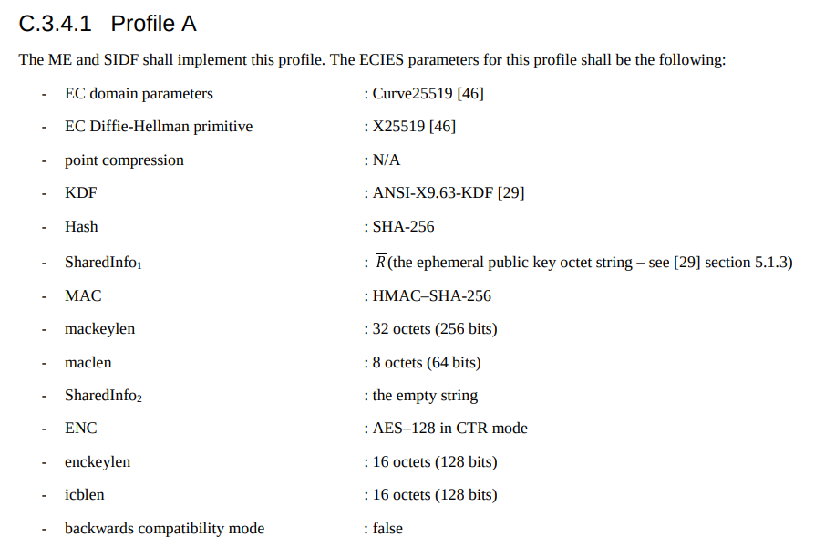
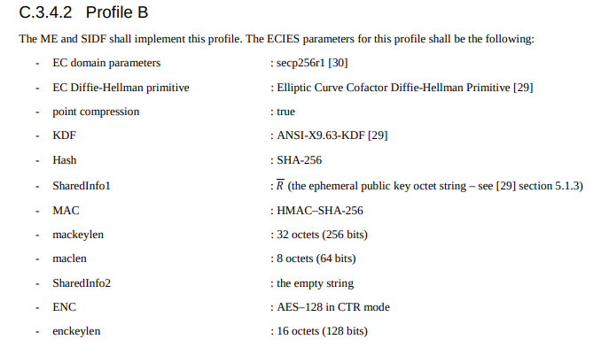

**Magma** currently uses [3GPP TS 33.501 version 15.4.0 Release 15 #Section C.3](https://www.etsi.org/deliver/etsi_ts/133500_133599/133501/15.04.00_60/ts_133501v150400p.pdf) for the implementation of the ECIES scheme.

**This is how it is done in MAGMA Core:**

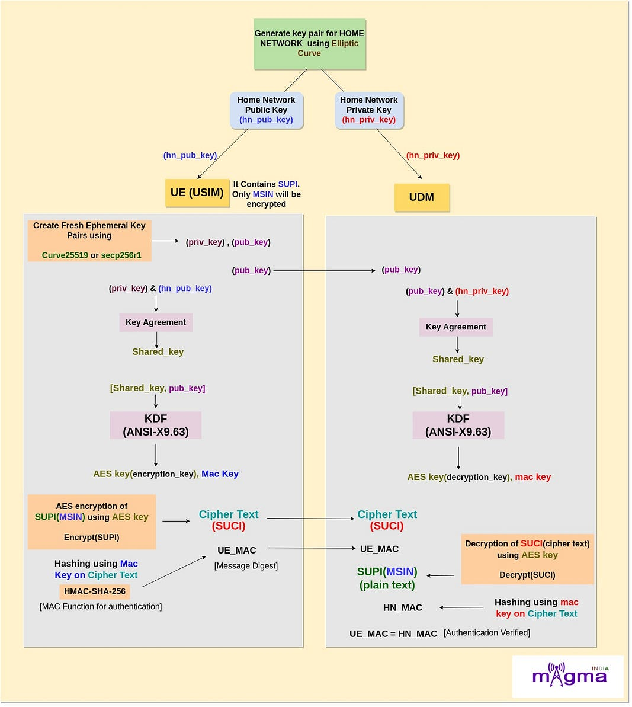

**Let's understand the flow diagram**

- First of all, we generate a Home Network Key pair using Elliptic Curve. These keys are the pre-provisioned keys that need to be saved against any physical attacks.
- The Home Network public key(**hn\_pub\_key**) is saved in USIM and the home network private key(**hn\_priv\_key**) is saved in UDM(SIDF)[Subscription identifier de-concealing function].
- Now at the UE side, we generate a new ephemeral key pair using **Curve25519** or **secp256r1**(according to the profile selected). Ephemeral **priv\_key** and **pub\_key** will be generated. Ephemeral keys are the keys that are used for a very short period of time, usually for just one transaction.
- Then we perform the **EVP Key Agreement** using the home network public key(**hn\_priv\_key**) & the ephemeral private key(**priv\_key**) and this forms a **Shared Key.**
- The Shared Key & the ephemeral public key(pub\_key) are then passed through **ANSI-X9.63 KDF**(Key Derivation Function) to generate **AES Key**(which is our **encrypting key**) and **MAC key**(used for the Message Authentication process). Along with these keys, some more minor elements are generated such as AES cnt and AES nonce which are also used in AES encryption.
- Then using the AES Key we perform **AES(CTR) encryption** in the **MSIN**(SUPI) which then creates a cipher text called **SUCI.**
- Then using **MAC Key** & **HMAC-SHA\_256** function on cipher text, we generate message digest **UE\_MAC.**
- After this, the ephemeral public key, SUCI(cipher text) & UE\_MAC are shared with the home Network(UDM). And the Encryption part is done.
- At the UDM/SIDF side, again the **EVP Key agreement** is done but this time it is done using the ephemeral public key(**pub\_key**, which was shared in the above step) & home network private key(**hn\_private\_key**) and this again forms the same **Shared Key** as it was generated at the UE side.
- Then again, we will pass the **Shared Key** and the ephemeral public key(**pub\_key**) to the same **ANSI-X9.63 KDF** which will then create the same **AES Key**(**decrypting key**) and the same **MAC Key.**
- Then using the **AES key**(**decrypting key**) we will decrypt the **SUCI**(which is our cipher text) and convert it back into plain text **MSIN(SUPi)**.
- Then again perform Message authentication using the **MAC key** and **HMAC-SHA\_256,** which gives a message digest **HN\_MAC** as output. We will then compare the UE\_MAC and HN\_MAC: if both are the same then the Authentication is verified and if fails, the plain text will not appear.
- And finally, the ECIES process is completed.

You can read the files of this procedure in different cores:

**Magma** — [File1](https://github.com/magma/magma/blob/master/lte/gateway/python/magma/subscriberdb/crypto/ECIES.py), [File2](https://github.com/magma/magma/blob/master/lte/gateway/python/magma/subscriberdb/crypto/EC.py), [File3](https://github.com/magma/magma/blob/master/lte/gateway/python/scripts/test_supi_decrypt_imsi_cli.py)

**Free5GC** — [File](https://github.com/free5gc/udm/blob/68f208f8544112ab891bede8fe1c195183e24059/pkg/suci/suci.go)

**You can also understand the complete flow with the help of the code explanation below:**

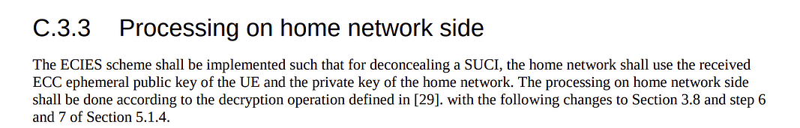

Source: <https://github.com/magma/magma/blob/6122b3a667/lte/gateway/python/scripts/test_supi_profile_cli.py#L43>

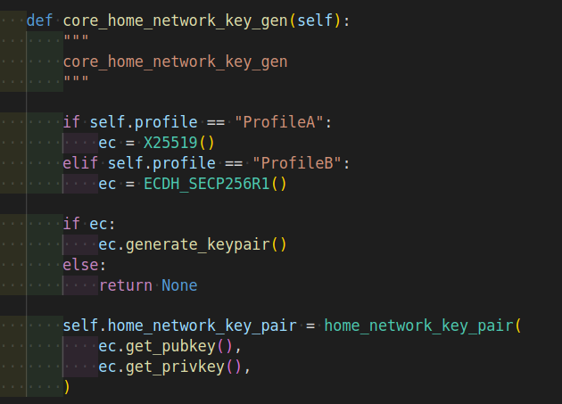

### For Private Key Generation

1. Using X25519/CURVE25519

The Private Key is handled as a simple bytes buffer.

Source: <https://github.com/magma/magma/blob/6122b3a667/lte/gateway/python/magma/subscriberdb/crypto/EC.py#L74>

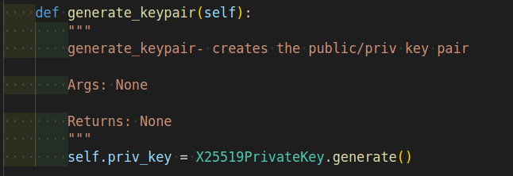

Source: <https://github.com/pyca/cryptography/blob/main/src/cryptography/hazmat/primitives/asymmetric/x25519.py#L38>

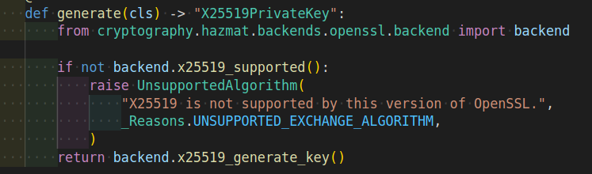

Source: <https://github.com/pyca/cryptography/blob/b70f16e9d8f15b05624fd1cfca29d44141f6aa9b/src/cryptography/hazmat/backends/openssl/backend.py#L1957>

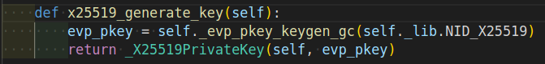

1. Using ECDH SECP256R1

The Private Key is handled within a DER-encoded PKCS8 structure.

Source: <https://github.com/magma/magma/blob/6122b3a667/lte/gateway/python/magma/subscriberdb/crypto/EC.py#L156>

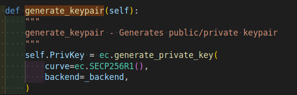

Source: <https://github.com/pyca/cryptography/blob/b70f16e9d8/src/cryptography/hazmat/primitives/asymmetric/ec.py#L319>

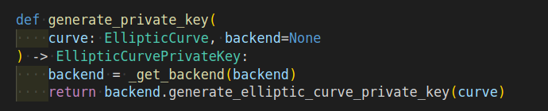

Source: <https://github.com/pyca/cryptography/blob/b70f16e9d8f15b05624fd1cfca29d44141f6aa9b/src/cryptography/hazmat/backends/openssl/backend.py#L1295>

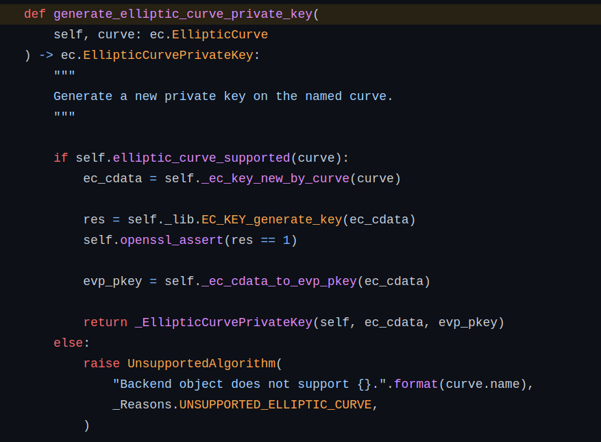

### For Public Key Generation

1. Using X25519/CURVE25519

The Public Key is handled as a simple bytes buffer.

Source: <https://github.com/magma/magma/blob/6122b3a667/lte/gateway/python/magma/subscriberdb/crypto/EC.py#L84>

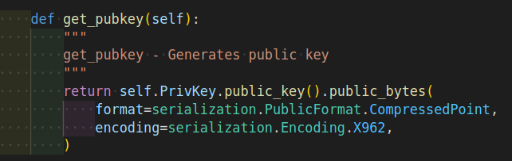

1. Using ECDH SECP256R1

The Public Key is handled as a compressed point bytes buffer according to ANSI X9.62.

Source: <https://github.com/magma/magma/blob/6122b3a667/lte/gateway/python/magma/subscriberdb/crypto/EC.py#L165>

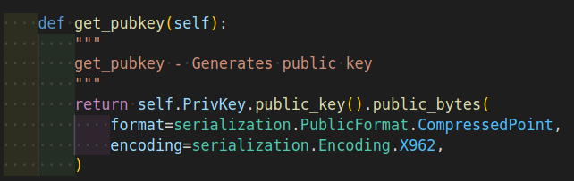

### UE Key Pair Generation

Source: <https://cybersecurityglossary.com/ephemeral-key-pair/>

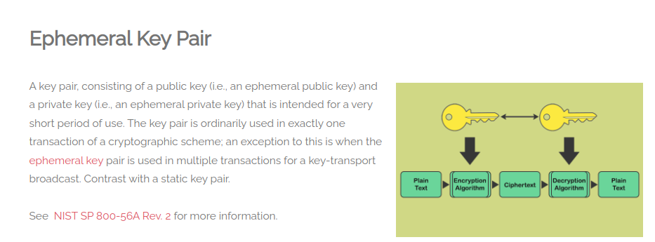

Source: <https://www.etsi.org/deliver/etsi_ts/133500_133599/133501/16.03.00_60/ts_133501v160300p.pdf>

Section: C.3.2

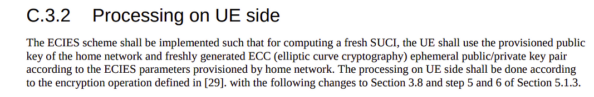

Source: <https://github.com/magma/magma/blob/6122b3a667/lte/gateway/python/scripts/test_supi_decrypt_imsi_cli.py#L49>

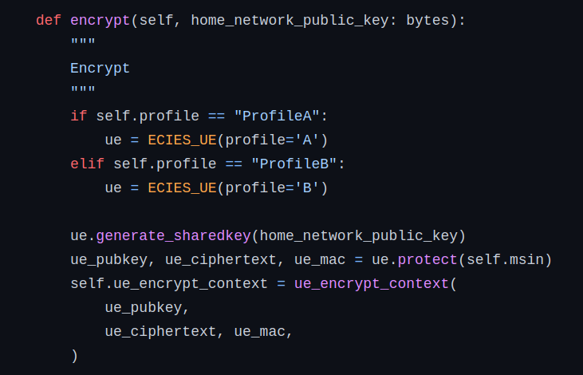

Source: <https://github.com/magma/magma/blob/6122b3a667/lte/gateway/python/magma/subscriberdb/crypto/ECIES.py#L87>

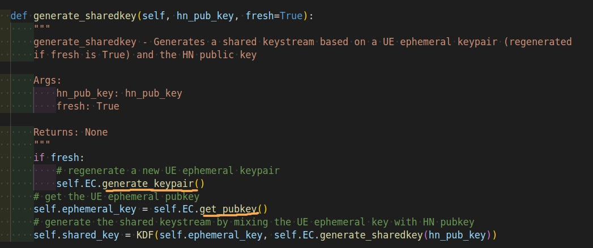

The HN and UE Public Key are shared publicly so that both UE and HN can fetch it.

### UE Shared Key Generation

The shared key is generated using the generate\_sharedkey() function which acts as a Shared Secret between UE and HN as a part of the Key Agreement Process. The EVP Key Agreement is used for this process.

UE Shared Key is generated using UE Private Key and HN Public Key.

Source: <https://wiki.openssl.org/index.php/EVP_Key_Agreement>

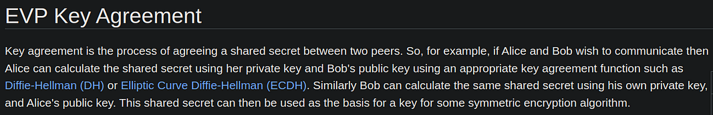

Source: <https://github.com/magma/magma/blob/6122b3a667/lte/gateway/python/magma/subscriberdb/crypto/ECIES.py#L104>

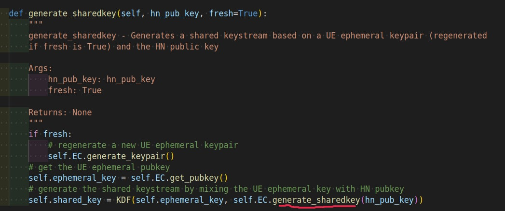

1. Using X25519

Source: <https://github.com/magma/magma/blob/6122b3a667/lte/gateway/python/magma/subscriberdb/crypto/EC.py#L103>

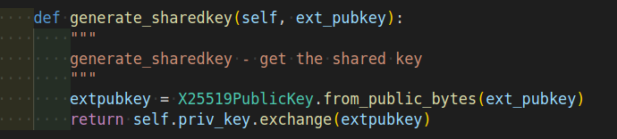

Source: <https://github.com/pyca/cryptography/blob/b70f16e9d8/src/cryptography/hazmat/backends/openssl/x25519.py#L80>

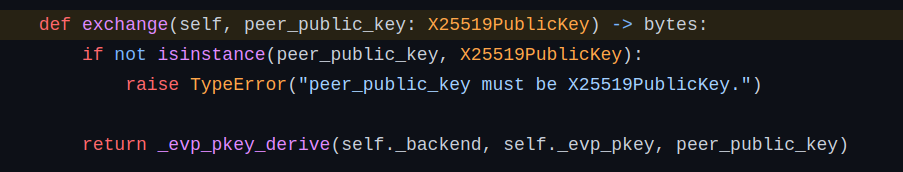

Source: <https://github.com/pyca/cryptography/blob/b70f16e9d8/src/cryptography/hazmat/backends/openssl/utils.py#L14>

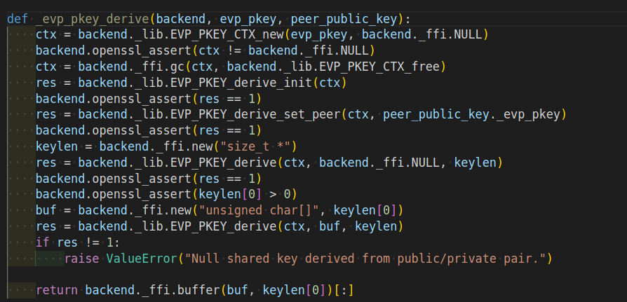

1. Using SECP256R1

Source: <https://github.com/magma/magma/blob/6122b3a667/lte/gateway/python/magma/subscriberdb/crypto/EC.py#L184>

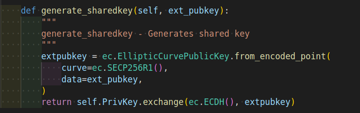

Source: <https://github.com/pyca/cryptography/blob/b70f16e9d8/src/cryptography/hazmat/backends/openssl/ec.py#L144>

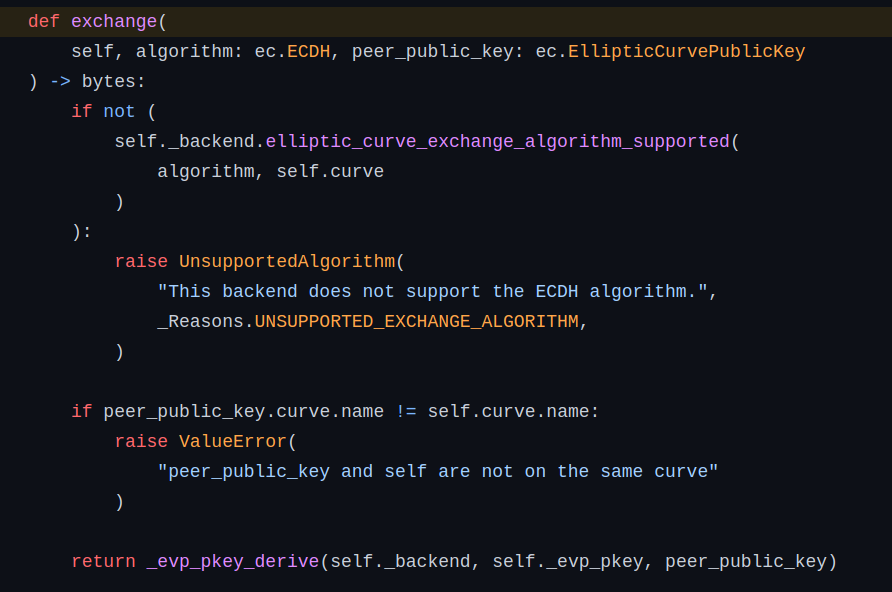

Source: <https://github.com/pyca/cryptography/blob/b70f16e9d8f15b05624fd1cfca29d44141f6aa9b/src/cryptography/hazmat/backends/openssl/utils.py#L14>

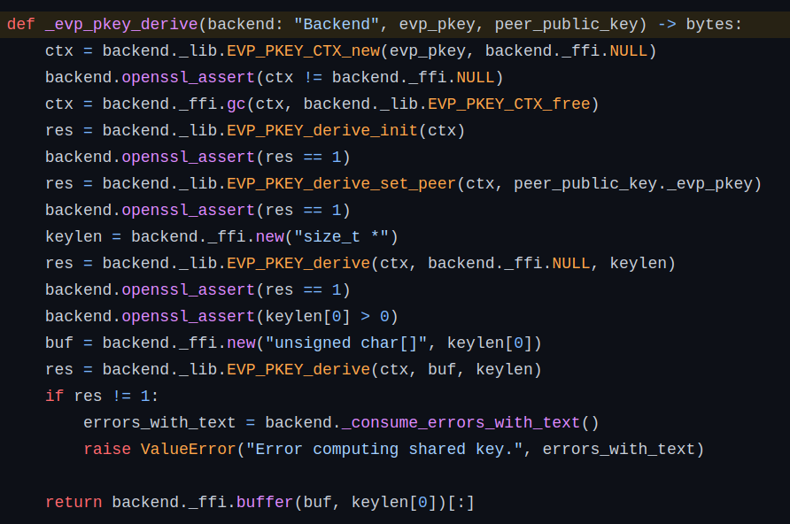

The Shared key cannot be used as an encryption key directly.

Source: <https://wiki.openssl.org/index.php/EVP_Key_Agreement>

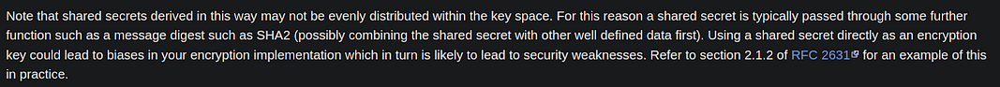

### HN Shared Key Generation

The HN Shared Key is generated in the same way as UE Shared Key is generated but this time, UE Public Key and HN Private Key will be used.

Source: <https://github.com/magma/magma/blob/6122b3a667/lte/gateway/python/magma/subscriberdb/crypto/ECIES.py#L162>

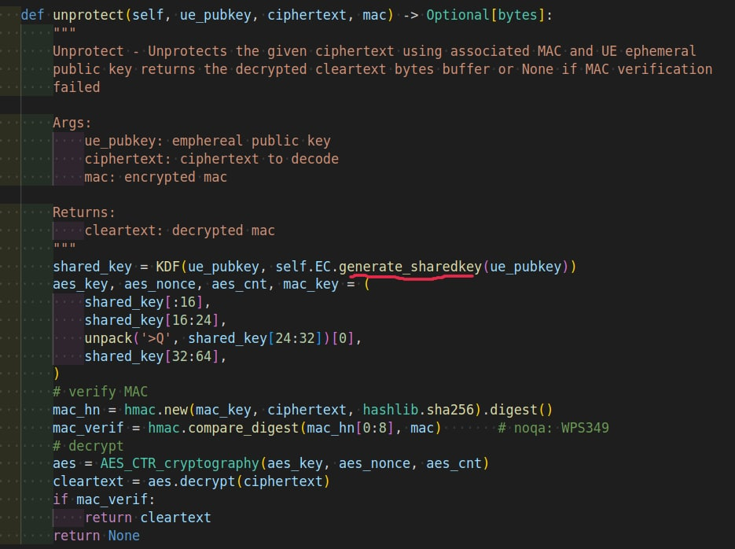

### UE AES Key and MAC Key Generation

UE AES key along with MAC key, AES Count and AES Nonce are generated through passing UE ephemeral public key and Shared Key through ANSI-X9.63 KDF.

Source: <https://github.com/magma/magma/blob/6122b3a667/lte/gateway/python/magma/subscriberdb/crypto/ECIES.py#L104>

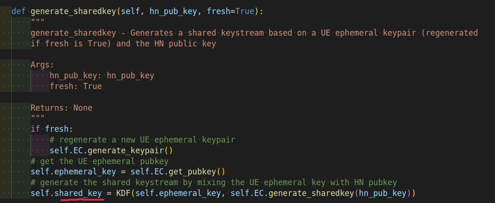

Source: <https://github.com/magma/magma/blob/6122b3a667/lte/gateway/python/magma/subscriberdb/crypto/EC.py#L34>

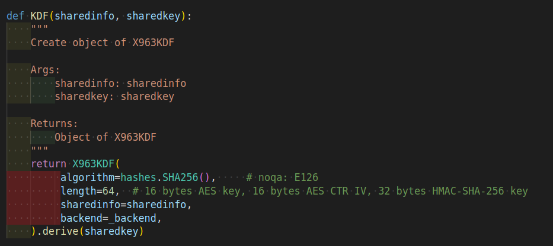

Source: <https://github.com/pyca/cryptography/blob/b70f16e9d8/src/cryptography/hazmat/primitives/kdf/x963kdf.py#L42>

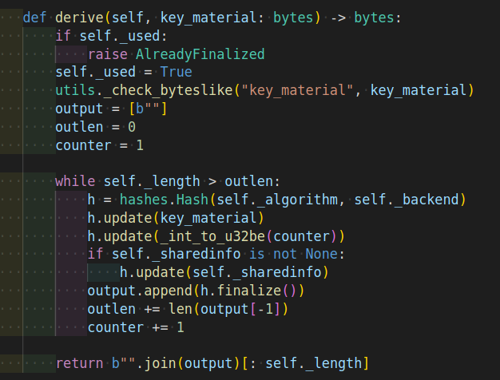

### HN Decrypting Key and MAC Key Generation

HN Decrypting key and MAC key are also obtained through passing UE ephemeral public key and Shared Key through ANSI-X9.63 KDF**.**

Source: <https://github.com/magma/magma/blob/6122b3a667/lte/gateway/python/magma/subscriberdb/crypto/ECIES.py#L162>

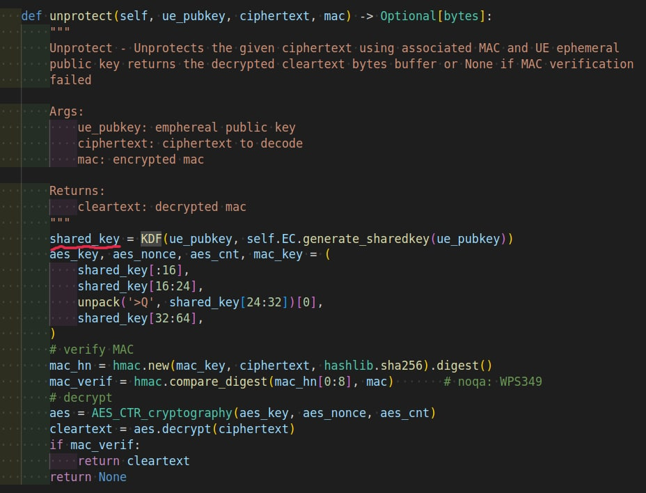

### SUPI Encryption at UE Side

Now, the MSIN(Mobile Subscriber Identification Number) part of the SUPI needs to be protected before sending it over to the Public Area.

Source: <https://github.com/magma/magma/blob/6122b3a667/lte/gateway/python/scripts/test_supi_decrypt_imsi_cli.py#L49>

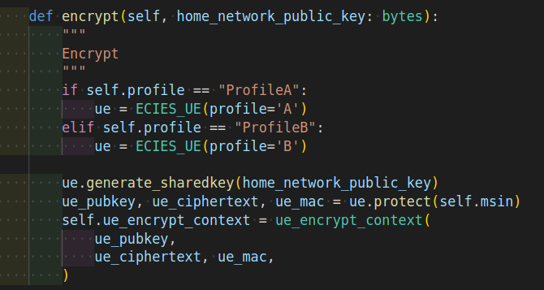

#### AES Encryption Key Generation

AES Key, AES Nonce, and AES Count are used to generate AES Encryption Key using AES in CTR(Counter) Mode cryptography to encrypt the plain text(MSIN).

Note: AES Encryption Algorithm is used for both encryption and decryption of a block of a message.

Source: <https://github.com/magma/magma/blob/6122b3a667/lte/gateway/python/magma/subscriberdb/crypto/ECIES.py#L119>

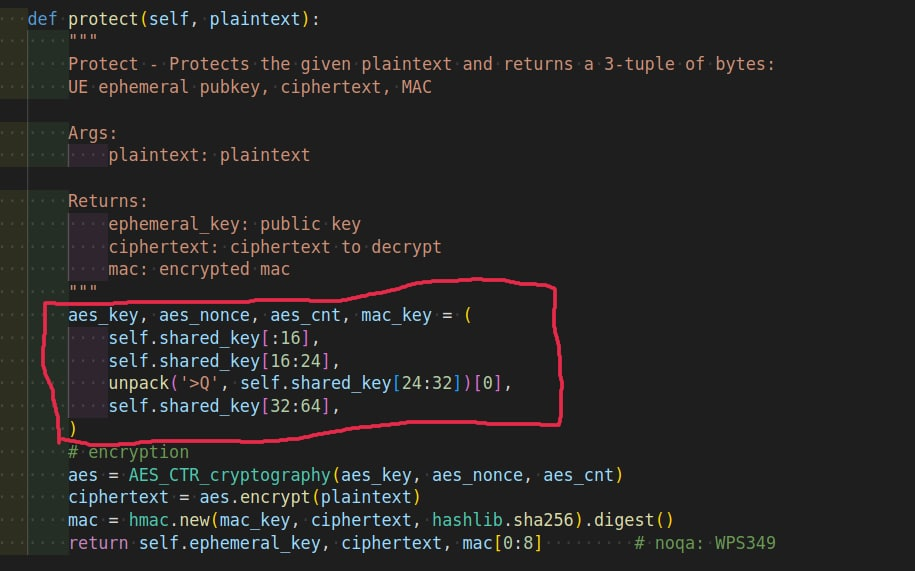

#### Encryption of Plaintext

Source: <https://github.com/magma/magma/blob/6122b3a667/lte/gateway/python/magma/subscriberdb/crypto/ECIES.py#L127>

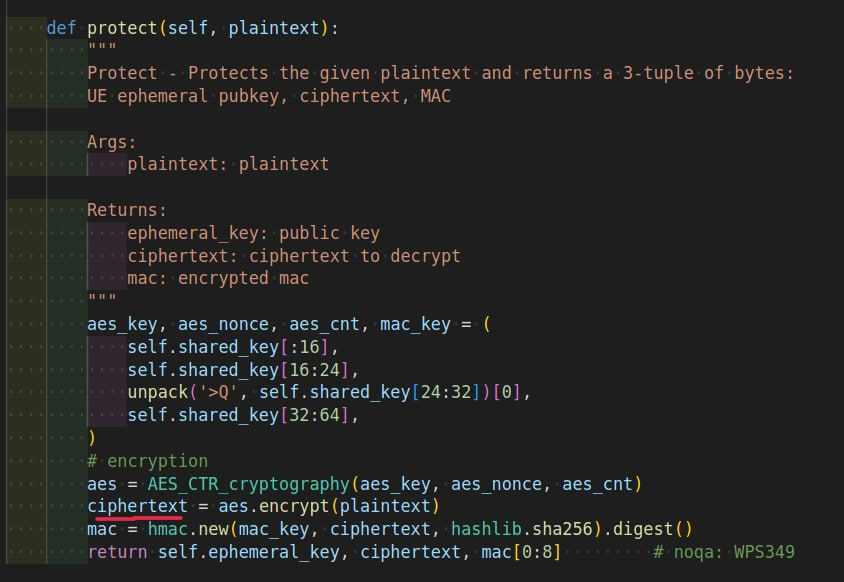

Source: <https://github.com/magma/magma/blob/6122b3a667/lte/gateway/python/magma/subscriberdb/crypto/ECIES.py#L65>

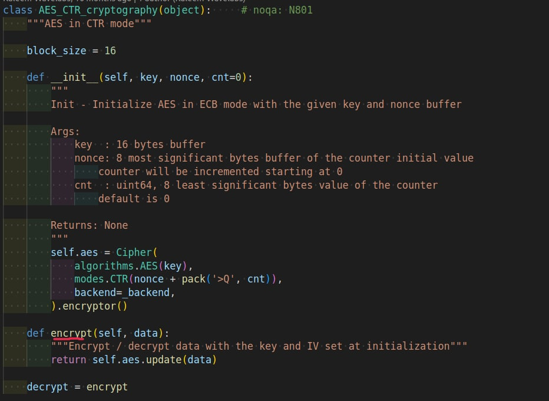

#### UE MAC Value Generation

Along with this, a new UE MAC Value is generated using a hashing algorithm(a kind of signature also called digest sometimes, unique to a message)(HMAC SHA-256), extracted MAC key, and add a ciphertext(SUCI) to it.

Source: <https://www.tutorialspoint.com/cryptography/message_authentication.htm>

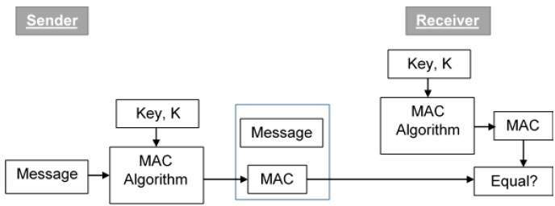

Source: <https://github.com/magma/magma/blob/6122b3a667/lte/gateway/python/magma/subscriberdb/crypto/ECIES.py#L128>

Source: <https://github.com/blackberry/Python/blob/master/Python-3/Lib/hmac.py#L118>

Now, the UE Public Key, Ciphertext message(SUCI), and UE MAC Value are made public.

### SUCI Decryption at HN Side

HN fetches UE Public Key, Ciphertext, and UE MAC Value. Now, HN tries to decrypt the ciphertext using AES Decryption Key, but before that, it first calculates its MAC Value and compares it with the UE MAC Value to verify that the message is from an intended user and it is not tempered.

Source: <https://github.com/magma/magma/blob/6122b3a667/lte/gateway/python/scripts/test_supi_decrypt_imsi_cli.py#L93>

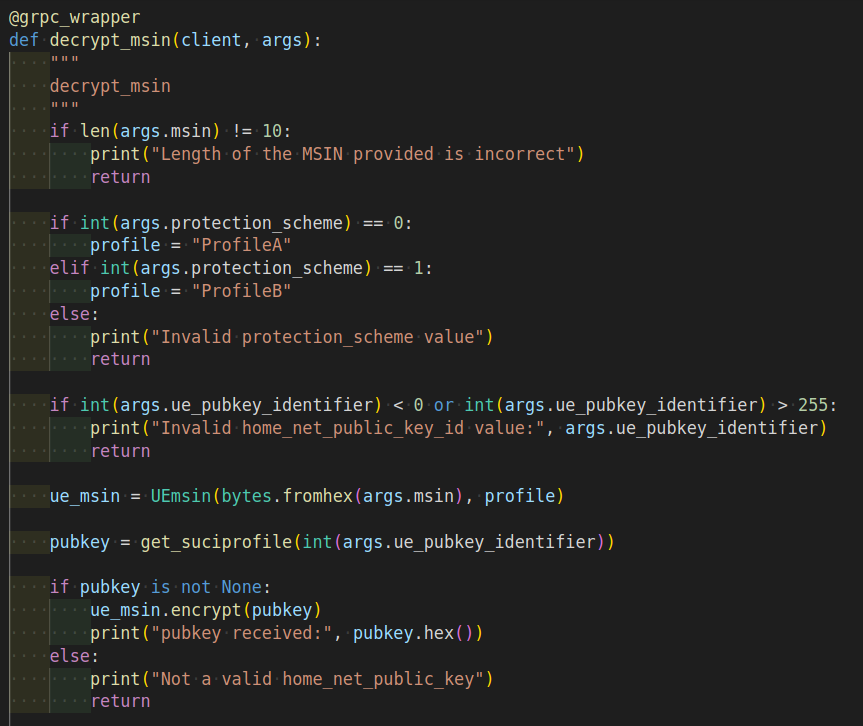
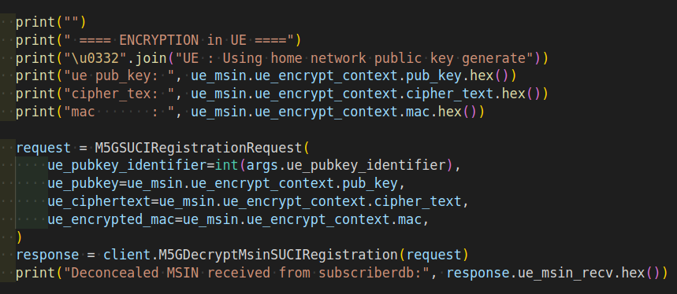

Source: <https://github.com/magma/magma/blob/6122b3a667/lte/gateway/python/scripts/test_supi_decrypt_imsi_cli.py#L76>

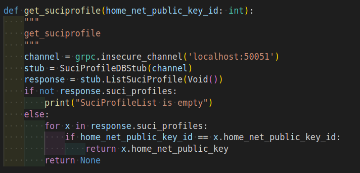

Source: <https://github.com/magma/magma/blob/6122b3a667/lte/gateway/python/magma/subscriberdb/protocols/m5g_auth_servicer.py#L152>

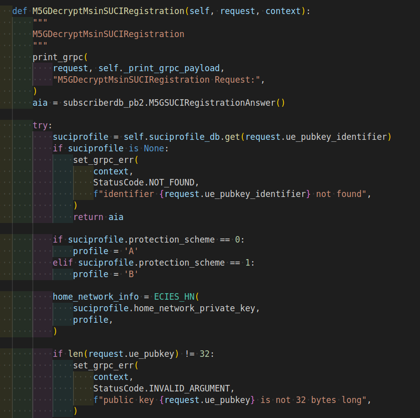
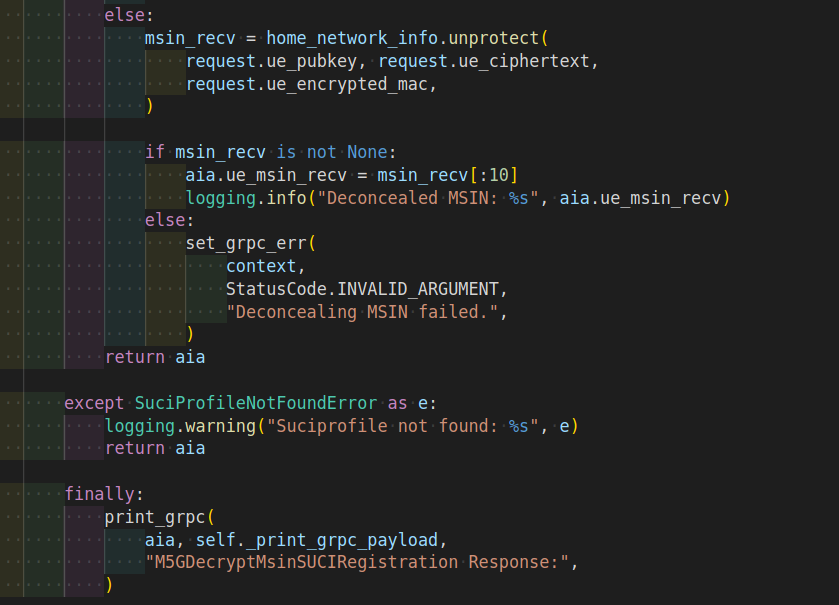

#### HN MAC Value Generation and Comparison with the UE MAC Value

Then HN MAC Value is created using MAC Key and the same hash algorithm(HMAC SHA-256) used by UE to generate the UE MAC Value and also added ciphertext obtained from the UE.

Source: <https://github.com/magma/magma/blob/6122b3a667/lte/gateway/python/magma/subscriberdb/crypto/ECIES.py#L148>

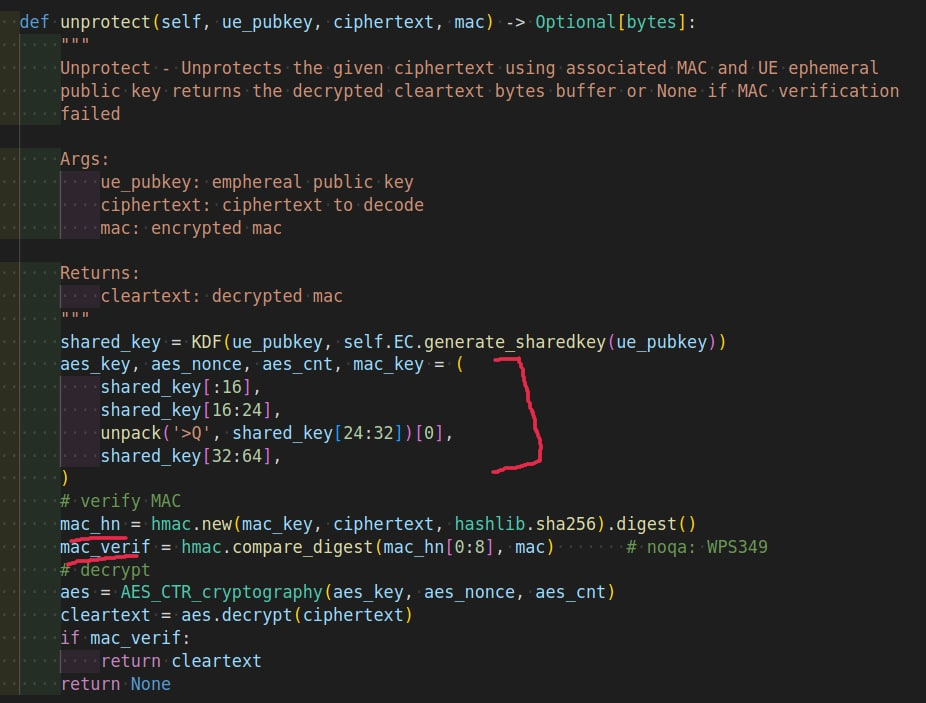

Source: <https://github.com/blackberry/Python/blob/master/Python-3/Lib/hmac.py#L118>

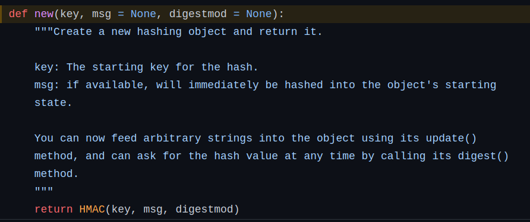

The HN MAC Value is compared with the obtained UE MAC Value and if it matches, HN confirms that the message is from a genuine user and starts the decryption process. But if it doesn't match it has been proven that the message is not the original one.

#### AES Decryption Key Generation

After the MAC Value verifies, HN generates the AES Decryption Key from the AES key, AES Count, and AES Nonce using AES in CTR Mode cryptography to decrypt the ciphertext containing the encrypted MSIN.

Source: <https://github.com/magma/magma/blob/6122b3a667/lte/gateway/python/magma/subscriberdb/crypto/ECIES.py#L173>

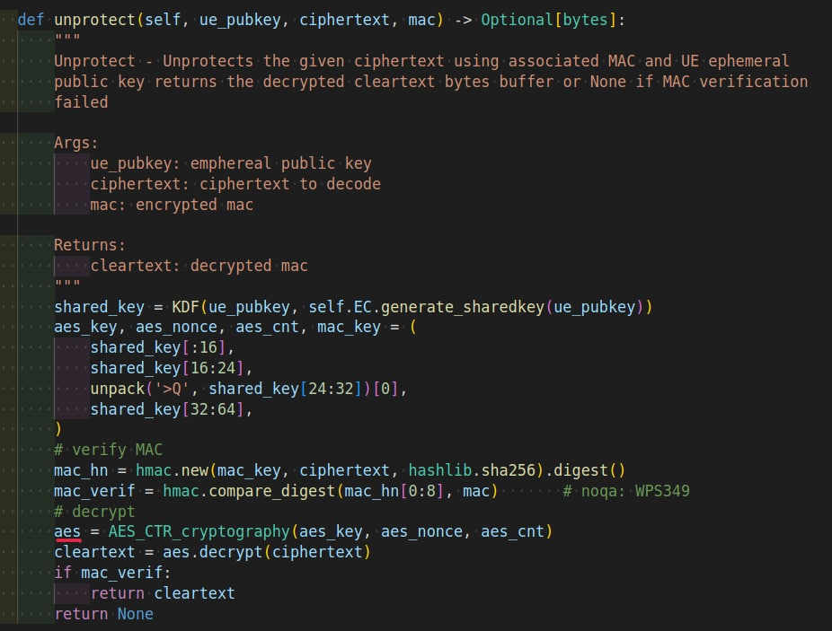

#### Decryption of Ciphertext

Source: <https://github.com/magma/magma/blob/6122b3a667/lte/gateway/python/magma/subscriberdb/crypto/ECIES.py#L174>

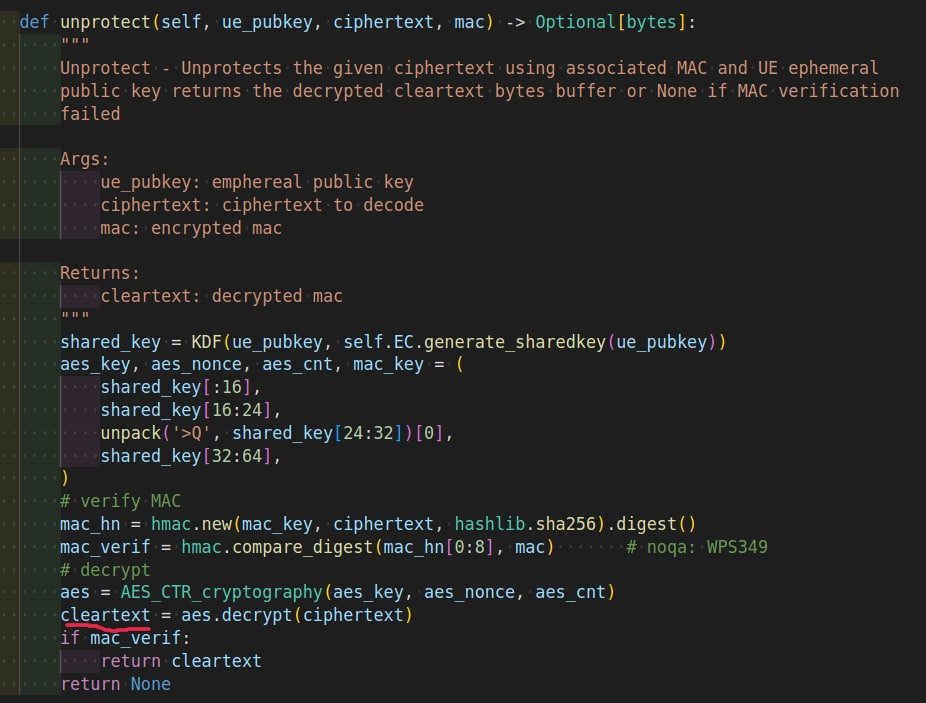

Source: <https://github.com/magma/magma/blob/6122b3a667ba8e0c29dda827261904c1efc963ed/lte/gateway/python/magma/subscriberdb/crypto/ECIES.py#L69>

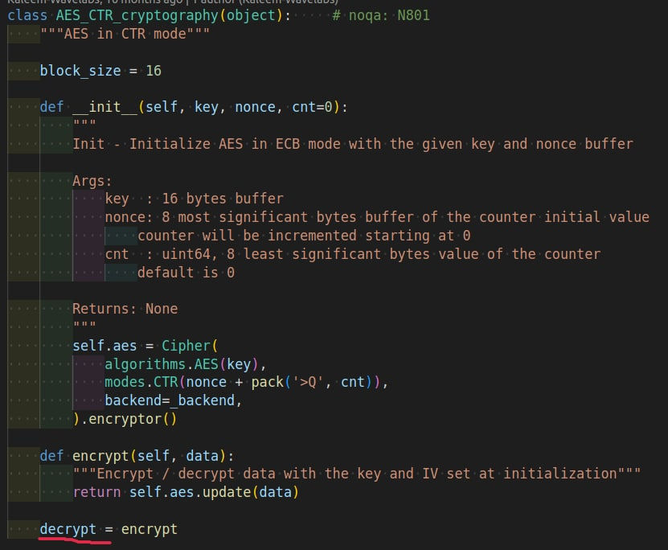
