# Magma HN Milenage

**Author:** [Shubham Kumar](https://www.linkedin.com/in/chmodshubham/)

**Published:** July 26, 2023

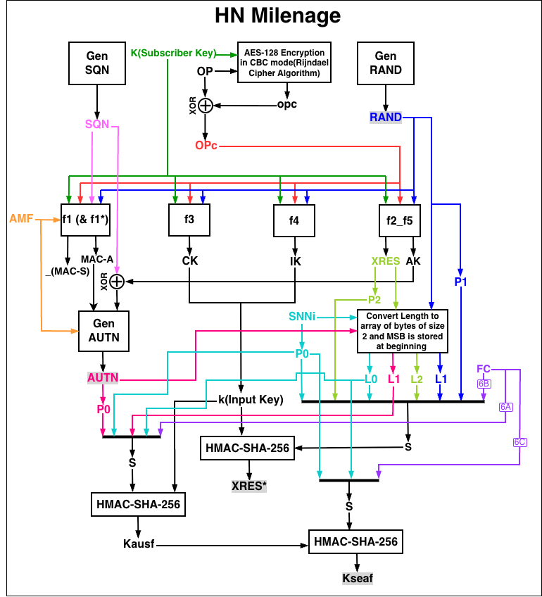

Source: <https://www.etsi.org/deliver/etsi_ts/133100_133199/133102/11.05.01_60/ts_133102v110501p.pdf>

Section 3.2

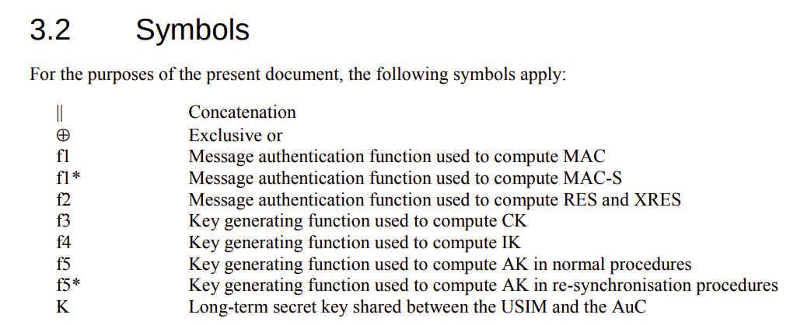

## Generating 5G Authentication Vectors

Source: <https://github.com/magma/magma/blob/6122b3a667ba8e0c29dda827261904c1efc963ed/lte/gateway/python/magma/subscriberdb/crypto/milenage.py#L56>

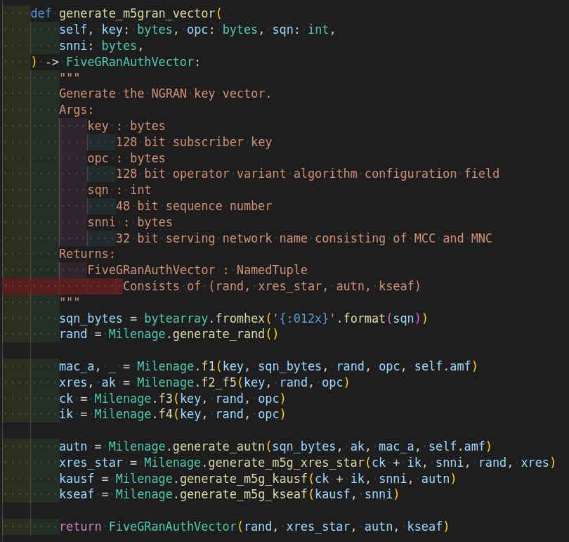

### Generating SQN

Source: <https://www.etsi.org/deliver/etsi_ts/133100_133199/133102/11.05.01_60/ts_133102v110501p.pdf>

Section: C.3.2, C.1.1.2 C.1.1.1

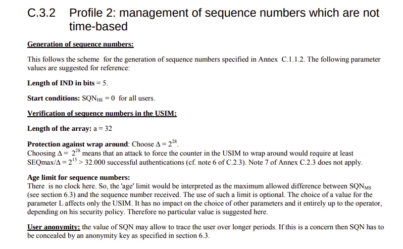
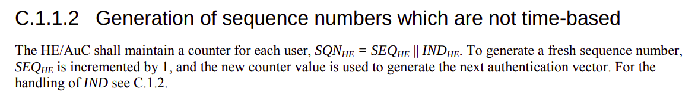
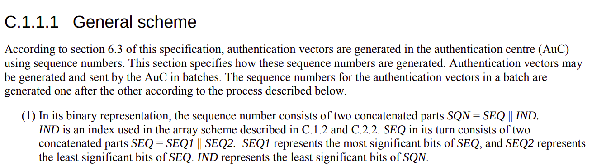
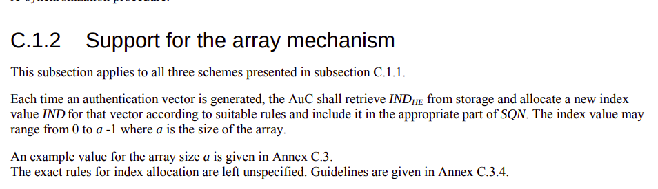

Source: <https://github.com/magma/magma/blob/master/lte/gateway/python/magma/subscriberdb/processor.py#L323>

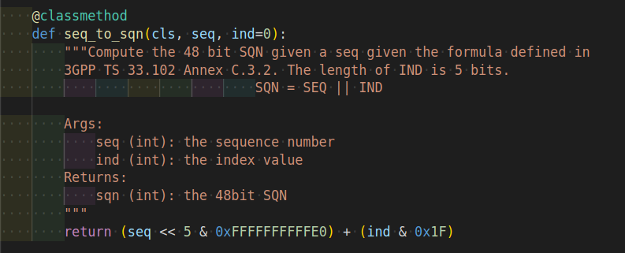

### Generating RAND

Source: <https://github.com/magma/magma/blob/6122b3a667ba8e0c29dda827261904c1efc963ed/lte/gateway/python/magma/subscriberdb/crypto/milenage.py#L292>

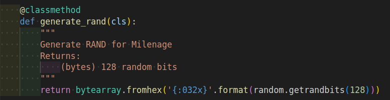

### Generating OPc

OPc(Derived operator code unique for each SIM) is derived from OP(Operator Code) and K(Secret Key). OP and K are first encrypted using AES-128 Encryption Algorithm in CBC(Cipher block Chaining) Mode and then the output(opc) and the OP are taken as input into the XOR function to derive OPc.

Source: <https://www.etsi.org/deliver/etsi_ts/135200_135299/135206/09.00.00_60/ts_135206v090000p.pdf>

Section 2.3

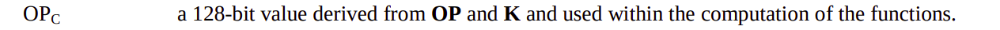

Source: <https://github.com/magma/magma/blob/6122b3a667ba8e0c29dda827261904c1efc963ed/lte/gateway/python/magma/subscriberdb/crypto/milenage.py#L301>

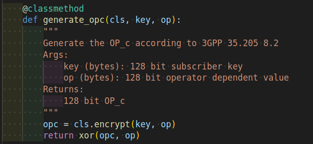

Source: <https://github.com/magma/magma/blob/6122b3a667ba8e0c29dda827261904c1efc963ed/lte/gateway/python/magma/subscriberdb/crypto/milenage.py#L342>

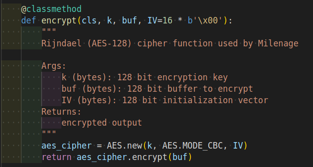

Source: <https://github.com/magma/magma/blob/6122b3a667ba8e0c29dda827261904c1efc963ed/lte/gateway/python/magma/subscriberdb/crypto/milenage.py#L431>

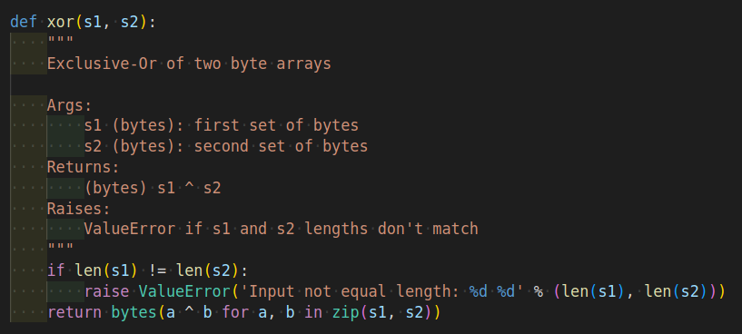

### Generating MAC-A and MAC-S

MAC-A(Network Authentication Code) and MAC-S(Resynchronisation Authentication Code) are generated from Secret Key, SQN, RAND, OPc, and AMF using f1 and f1\* cryptographic implementations through a single f1 function.

Source: <https://www.etsi.org/deliver/etsi_ts/135200_135299/135206/09.00.00_60/ts_135206v090000p.pdf>

Section 2.3

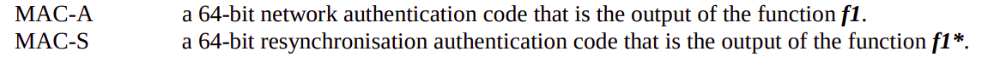

Source: <https://github.com/magma/magma/blob/6122b3a667ba8e0c29dda827261904c1efc963ed/lte/gateway/python/magma/subscriberdb/crypto/milenage.py#L47>

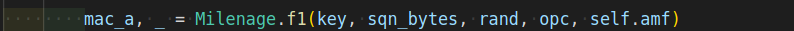

Source: <https://github.com/magma/magma/blob/6122b3a667ba8e0c29dda827261904c1efc963ed/lte/gateway/python/magma/subscriberdb/crypto/milenage.py#L130>

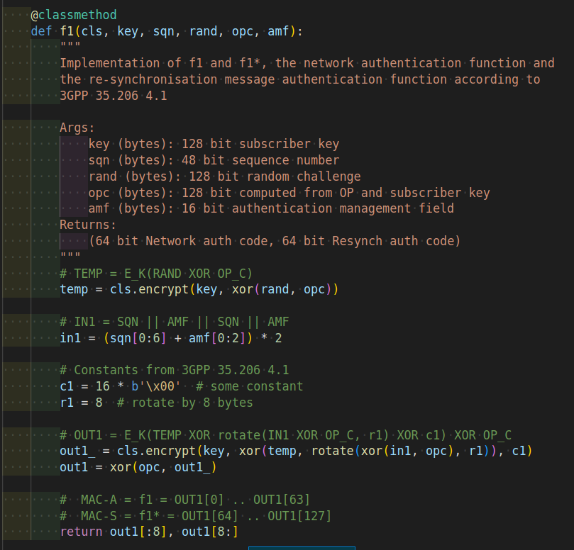

### Generating XRES and AK

The XRES(Expected Response), and AK(Anonymity Key) are derived from RAND, OPc, and K using f2 and f5(or f5\*) cryptography functions respectively. As the same inputs are used for deriving both parameters, a single operation is constructed for their implementation.

Source: <https://www.etsi.org/deliver/etsi_ts/135200_135299/135206/09.00.00_60/ts_135206v090000p.pdf>

Section 2.3

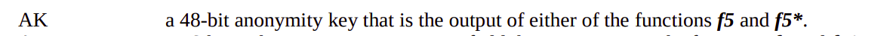

Source: <https://github.com/magma/magma/blob/6122b3a667ba8e0c29dda827261904c1efc963ed/lte/gateway/python/magma/subscriberdb/crypto/milenage.py#L79>

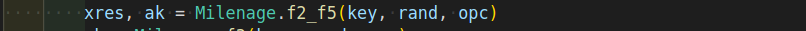

Source: <https://github.com/magma/magma/blob/6122b3a667ba8e0c29dda827261904c1efc963ed/lte/gateway/python/magma/subscriberdb/crypto/milenage.py#L164>

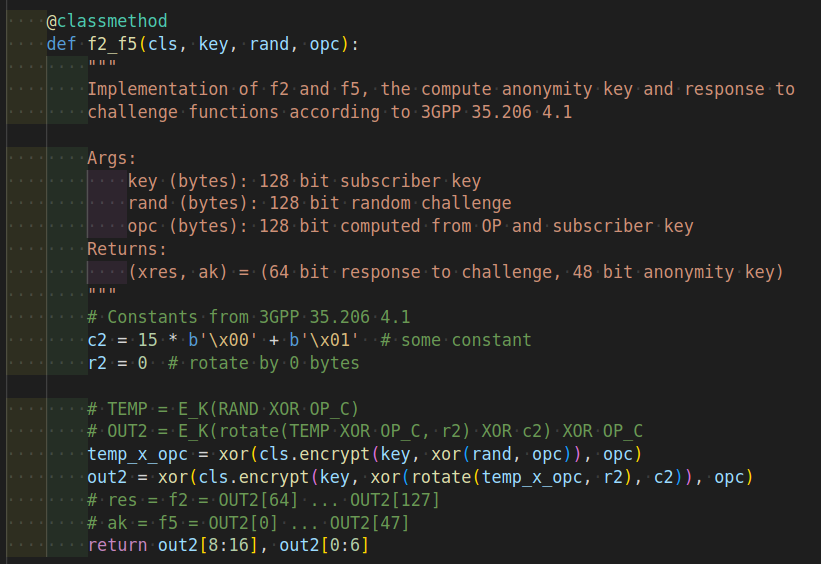

### Generating CK

CK(Ciphering Key) is derived from the Secret Key(K), RAND, and OPc using the f3 cryptography function.

Source: <https://github.com/magma/magma/blob/6122b3a667ba8e0c29dda827261904c1efc963ed/lte/gateway/python/magma/subscriberdb/crypto/milenage.py#L80>

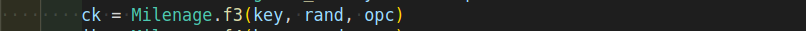

Source: <https://github.com/magma/magma/blob/6122b3a667ba8e0c29dda827261904c1efc963ed/lte/gateway/python/magma/subscriberdb/crypto/milenage.py#L189>

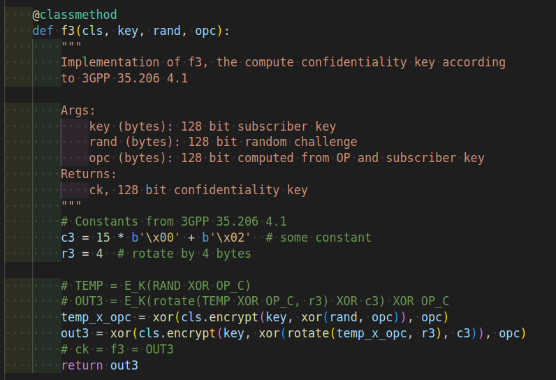

### Generating IK

IK(Integrity Key) is derived from the Secret Key(K), RAND, and OPc using the f4 cryptography function.

Source: <https://github.com/magma/magma/blob/6122b3a667ba8e0c29dda827261904c1efc963ed/lte/gateway/python/magma/subscriberdb/crypto/milenage.py#L81>

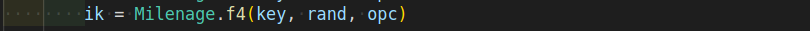

Source: <https://github.com/magma/magma/blob/6122b3a667ba8e0c29dda827261904c1efc963ed/lte/gateway/python/magma/subscriberdb/crypto/milenage.py#L213>

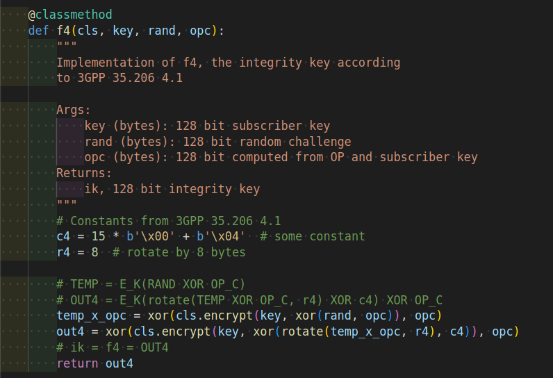

### Generating AUTN

An authentication Token(AUTN) is generated from the SQN, AK, MAC-A, and AMF. SQN and AK are inserted into the XOR function and the output is combined with the AMF and MAC-A.

Source: <https://github.com/magma/magma/blob/6122b3a667ba8e0c29dda827261904c1efc963ed/lte/gateway/python/magma/subscriberdb/crypto/milenage.py#L83>

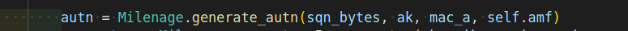

Source: <https://github.com/magma/magma/blob/6122b3a667ba8e0c29dda827261904c1efc963ed/lte/gateway/python/magma/subscriberdb/crypto/milenage.py#L314>

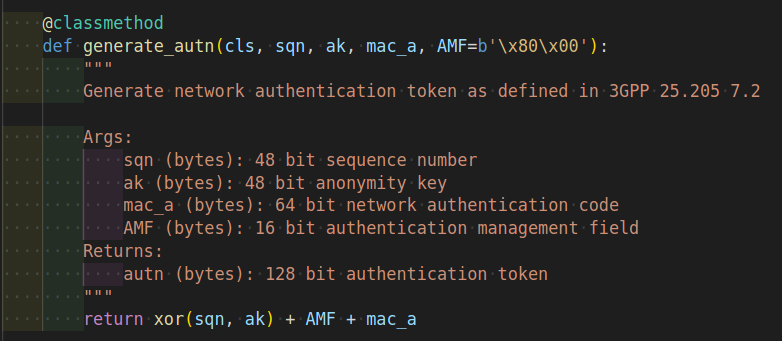

Source: <https://github.com/magma/magma/blob/6122b3a667ba8e0c29dda827261904c1efc963ed/lte/gateway/python/magma/subscriberdb/crypto/milenage.py#L431>

### Generating XRES\*

XRES\* is generated from CK, IK, SNNi(Serving Network Name Identity), RAND, and XRES. First, a key is obtained by combining CK and IK then SNNi, RAND, and XRES length are converted into an array of bytes of size 2 with the first element stored as MSB(Most Significant Bit). Outputs from these operations are stored independently in different variables which are further combined with FC(it contains a byte object which is obtained from converting a hexadecimal string 6B) to form another new variable 'S'.

Then, S and key are inserted as input into the HMAC-SHA-256 algorithm to obtain XRES\*.

Source: <https://www.etsi.org/deliver/etsi_ts/133500_133599/133501/16.03.00_60/ts_133501v160300p.pdf>

Section A.4

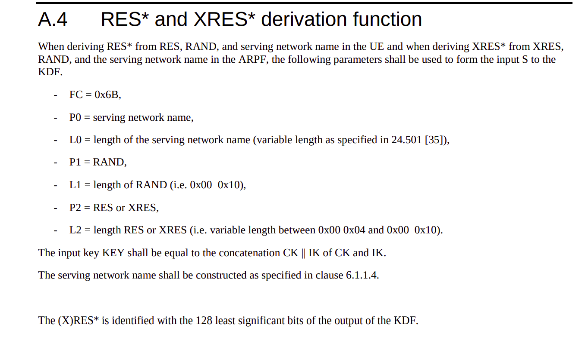

Source: <https://www.etsi.org/deliver/etsi_ts/133200_133299/133220/14.01.00_60/ts_133220v140100p.pdf>

Section B.2.0

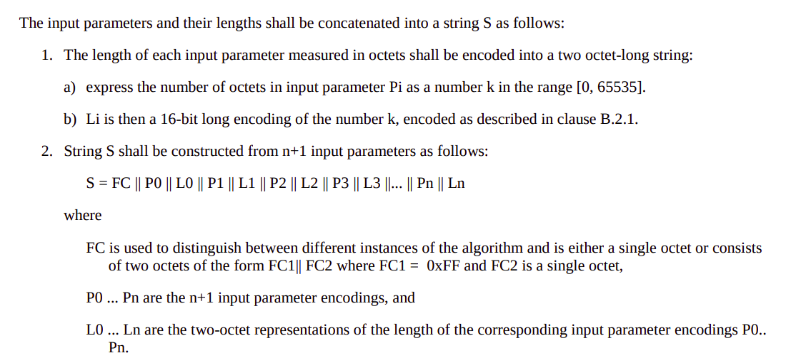

Source: <https://github.com/magma/magma/blob/6122b3a667ba8e0c29dda827261904c1efc963ed/lte/gateway/python/magma/subscriberdb/crypto/milenage.py#L84>

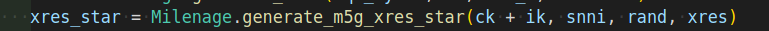

Source: <https://github.com/magma/magma/blob/6122b3a667ba8e0c29dda827261904c1efc963ed/lte/gateway/python/magma/subscriberdb/crypto/milenage.py#L357>

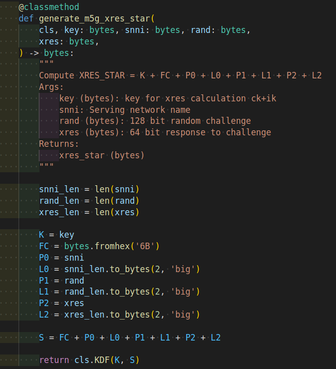

Source: <https://github.com/magma/magma/blob/6122b3a667ba8e0c29dda827261904c1efc963ed/lte/gateway/python/magma/subscriberdb/crypto/milenage.py#L329>

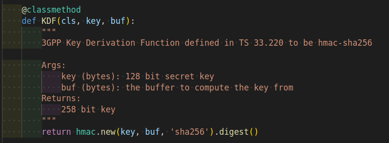

Source: <https://github.com/blackberry/Python/blob/master/Python-3/Lib/hmac.py#L118>

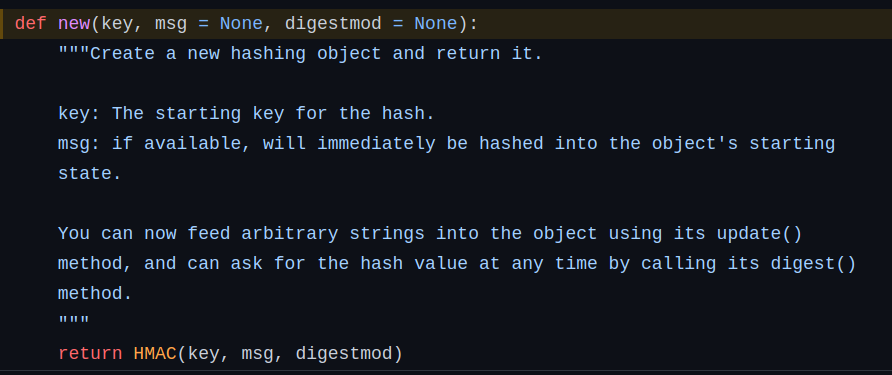

### Generating Kausf

CK, IK, SNNi, and AUTN are encrypted in such a way as to form Kausf(AUSF Key). Alike XRES\*, a key obtained from combining CK and Ik and stored into a variable k. Then, SNNi and RAND lengths are stored in an array of bytes using a Python library. Then, these outputs are combined with FC(it contains a byte object which is obtained from converting a hexadecimal string 6A) to form another temporary string variable 'S'.

S and k are hashed using KDF hashing algorithm HMAC-SHA-256 to form Kausf.

Source: <https://www.etsi.org/deliver/etsi_ts/133500_133599/133501/16.03.00_60/ts_133501v160300p.pdf>

Section A.2

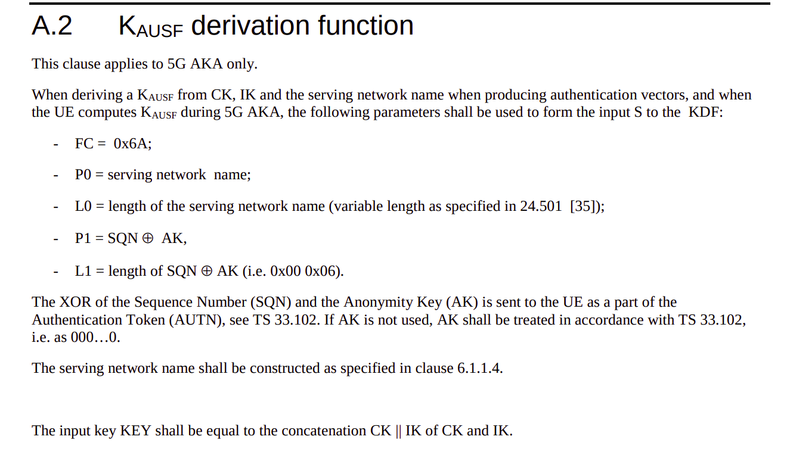

Source: <https://github.com/magma/magma/blob/6122b3a667ba8e0c29dda827261904c1efc963ed/lte/gateway/python/magma/subscriberdb/crypto/milenage.py#L85>

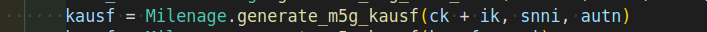

Source: <https://github.com/magma/magma/blob/6122b3a667ba8e0c29dda827261904c1efc963ed/lte/gateway/python/magma/subscriberdb/crypto/milenage.py#L390>

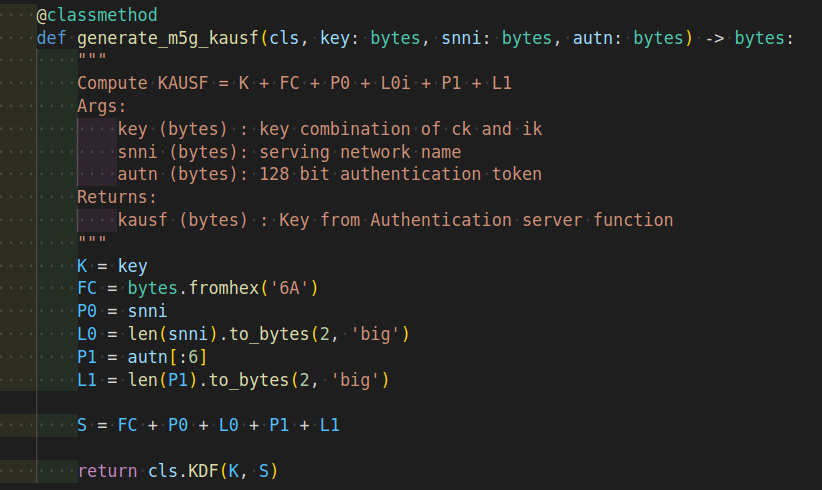

Source: <https://github.com/magma/magma/blob/6122b3a667ba8e0c29dda827261904c1efc963ed/lte/gateway/python/magma/subscriberdb/crypto/milenage.py#L329>

Source: <https://github.com/blackberry/Python/blob/master/Python-3/Lib/hmac.py#L118>

### Generating Kseaf

Kseaf(SEAF Key) is obtained by integrating Kausf and SNNi through a hashing algorithm. In this derivation, Kausf acts as key(k) whereas SNNi is still disintegrated into 2 forms, one stores the value, and the other stores the length of the SNNi in an array of bytes of size 2. The resultant output is assembled with the FC(it contains a byte object which is obtained from converting a hexadecimal string 6C) and stored in the variable 'S'.

Then, S and key(Kausf) undergo the HMAC-SHA-256 hashing algorithm to generate Kseaf.

Source: <https://www.etsi.org/deliver/etsi_ts/133500_133599/133501/16.03.00_60/ts_133501v160300p.pdf>

Section A.6

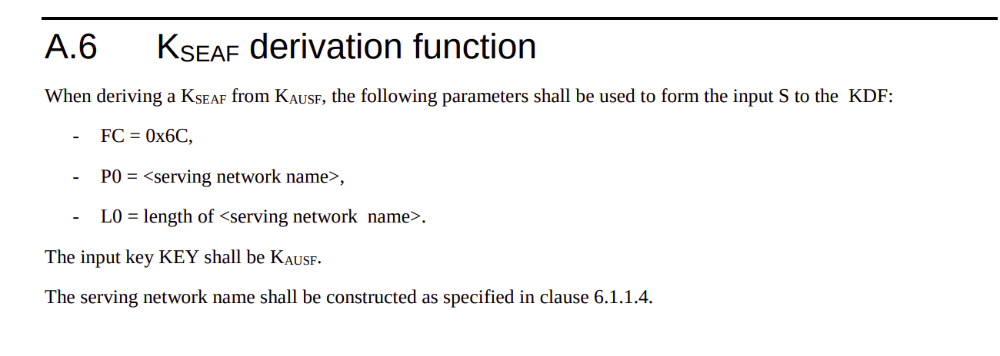

Source: <https://github.com/magma/magma/blob/6122b3a667ba8e0c29dda827261904c1efc963ed/lte/gateway/python/magma/subscriberdb/crypto/milenage.py#L86>

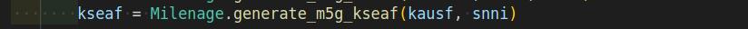

Source: <https://github.com/magma/magma/blob/6122b3a667ba8e0c29dda827261904c1efc963ed/lte/gateway/python/magma/subscriberdb/crypto/milenage.py#L412>

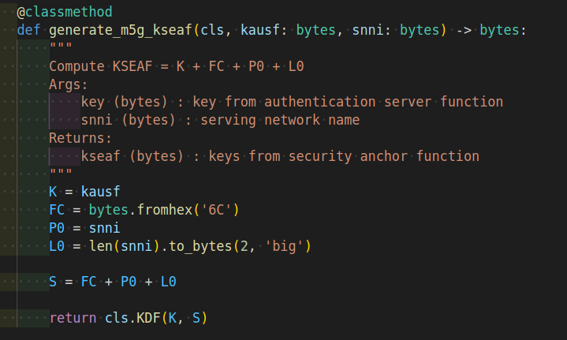

Source: <https://github.com/magma/magma/blob/6122b3a667ba8e0c29dda827261904c1efc963ed/lte/gateway/python/magma/subscriberdb/crypto/milenage.py#L329>

Source: <https://github.com/blackberry/Python/blob/master/Python-3/Lib/hmac.py#L118>

