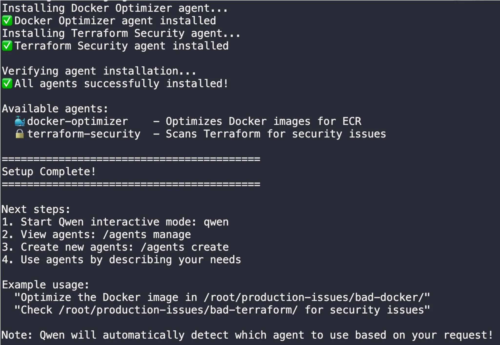
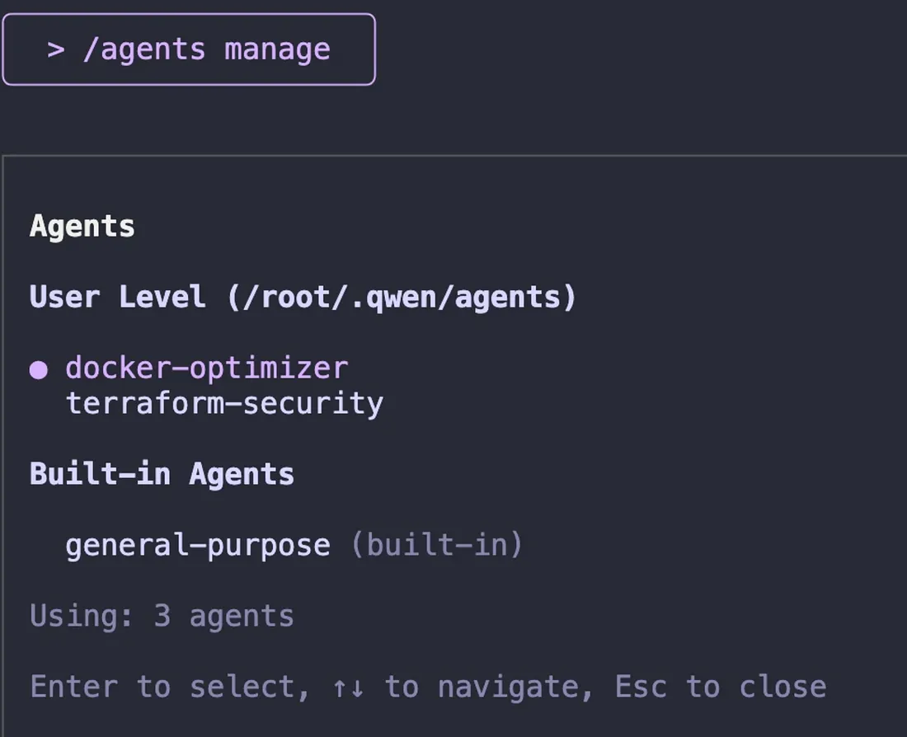
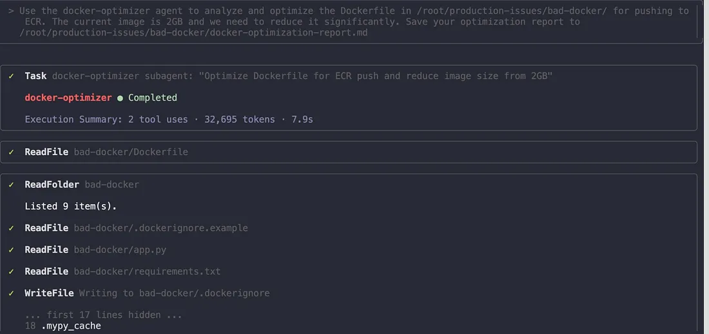
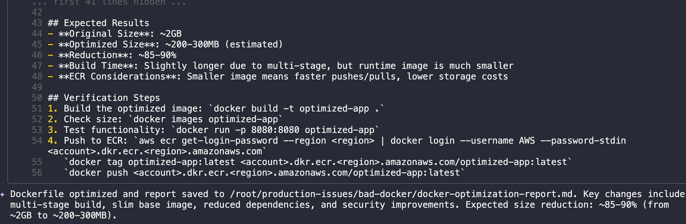
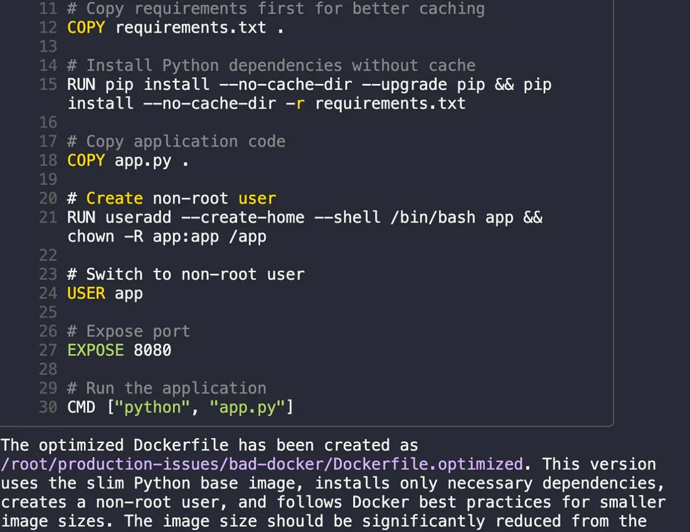
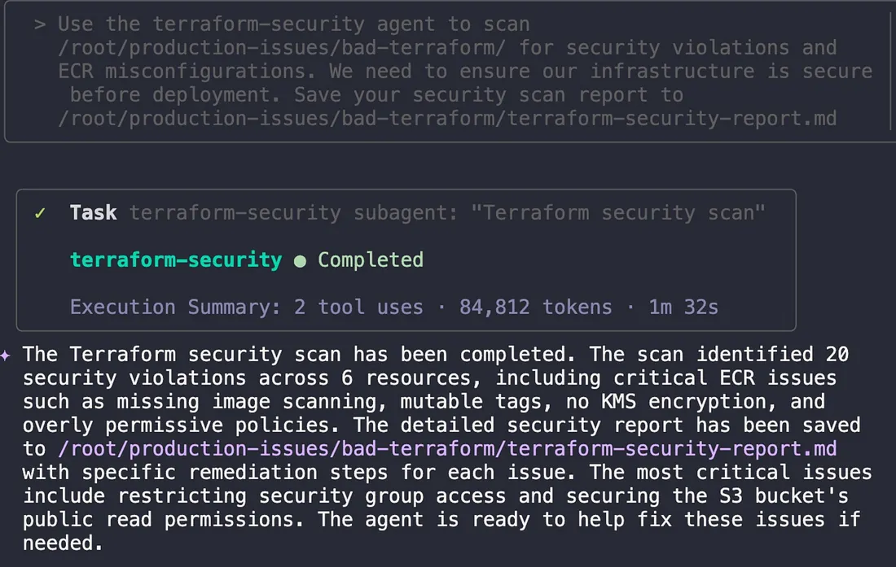

# AI Devops - Building a Virtual DevOps Team with Qwen Subagents
**Author:** [Megha](https://www.linkedin.com/in/megha-7aa3a0203/)

**Published:** Oct 25, 2025
After three intensive days of firefighting and automation, my perspective on AI in DevOps was already changing. We’d gone from fixing Kubernetes pods to optimizing RAG systems and automating AWS with MCP servers. But Day 4 of the KodeKloud AI course introduced a concept that felt like a true paradigm shift: what if you could build your own team of AI specialists?

The challenge was a classic DevOps bottleneck: a bloated 2GB Docker image was driving up ECR storage costs, and the security team had flagged critical vulnerabilities in our Terraform code. Our human team was swamped. Could we build an AI team to handle it?

The answer is *Qwen Subagents*.​

## **What are Qwen Subagents?**
Your analogy of a “virtual DevOps team” is spot on.Subagents are specialized, independent AI assistants that you can create to handle specific tasks.

*But what exactly is a subagent? Is it an app, a container, or something else?*

In the Qwen framework, a subagent is fundamentally a simple text file — specifically, a Markdown file (.md) with a special configuration header. This file does two things:​

1. It defines the agent’s identity: A YAML header at the top of the file gives the agent a name, a description of its purpose, and can specify which tools it is allowed to use.​
2. It gives the agent instructions: The body of the Markdown file contains a detailed “system prompt” that tells the AI how to behave. It defines its persona, its expertise, its constraints, and the specific best practices it should follow.

This means we are not building a complex application or spinning up a new container. We are simply creating a configuration file that instructs a powerful, general AI model to behave like a narrow specialist. This modular approach allows you to build a whole library of reusable AI expertise.For the challenges on Day 4, our virtual team consisted of two specialized subagents that were installed as .md files in our Qwen environment:

- Docker-optimizer: An expert in shrinking container images and applying security best practices.​
- Terraform Security : A specialist that scans Infrastructure-as-Code for vulnerabilities and suggests fixes.​
Each of these agents operates with its own isolated context, just like a real team member focusing on their specific job without getting distracted

## **Task 1: Assembling the Virtual DevOps Team**
The first step was to “hire” my new team members by installing their agent files. A simple setup script handled the installation

```shell
bash /root/setup-agents.sh
```
This copied the docker-optimizer.md and terraform-security.md agent files into the ~/.qwen/agents directory.

The script successfully installed both the Docker Optimizer and Terraform Security agents. To verify my new team was ready, I navigated to the production issues directory and ran /agents manage in Qwen:



Looking at the docker-optimizer agent file revealed how simple yet powerful these agents are:


This subagent is configured to be an expert in Docker optimization for ECR deployment, with a focus on reducing image sizes and implementing security best practices.

> **How to Use Subagents**
 The most impressive part is that Qwen handles the delegation automatically. You don’t need to explicitly call an agent. You just describe the problem, and Qwen intelligently selects the right specialist for the job. For example, a prompt about Docker optimization triggers the docker-optimizer, while a prompt about Terraform security routes to the terraform-security expert.

## **First Challenge: Optimizing a Bloated Docker Image**
Our first production issue was a massive 2GB Docker image that was costing us significantly on AWS ECR storage(The lab estimated this single image was costing $150/month) and slowing down deployment . I tasked the docker-optimizerwith fixing it using a simple prompt in Qwen:

```
"Use the docker-optimizer agent to analyze and 
optimize the Dockerfile in /root/production-issues/bad-docker/ for pushing 
to ECR. The current image is 2GB and we need to reduce it significantly. 
Save your optimization report to /root/production-issues/bad-docker/docker-optimization-report.md"
```


The agent immediately went to work. It read the existing Dockerfile, analyzed the structure, generated an optimized version, and prepared to create a comprehensive report. The execution summary showed 2 tool uses and took about 8 seconds to complete the analysis.



The generated report was impressive. The agent predicted a size reduction from approximately 2GB to 200–300MB — an estimated 85–90% reduction. It also provided detailed verification steps for building, testing, and pushing the optimized image to ECR.

The new Dockerfile used a multi-stage build, switched to a slim Python base image, copied only necessary dependencies, created a non-root user for security, and optimized the layer structure. These are all industry best practices for production Docker images.​

## **Verifying the Fix: Building the New Image**
With the docker-optimized agent's work complete, it was time for the moment of truth. I built the new, optimized Docker image using the agent-generated Dockerfile.optimized

```shell
docker build -f /root/production-issues/bad-docker/Dockerfile.optimized 
-t my-app:optimized /root/production-issues/bad-docker/
Press enter or click to view image in full size

```


The build completed successfully, installing only the necessary dependencies and creating a much leaner image.

When I checked the final image size:
```shell
docker images | grep my-app

```


The impact of the optimization was immediately clear: the image size plummeted from 2GB to 531MB. A 75% reduction like this has a direct, positive effect on the bottom line by cutting ECR storage costs and making our deployment pipeline significantly faster

## **Second Challenge : Securing the Infrastructure**
With the Docker image optimized and the deployment pipeline faster, my virtual team’s next assignment was to address the security vulnerabilities flagged in our Terraform code. This is where the terraform-security agent, our Infrastructure-as-Code specialist, stepped in.
```
"Use the terraform-security agent to scan /root/production-issues
/bad-terraform/ for security violations and ECR misconfigurations.
We need to ensure our infrastructure is secure before deployment. 
Save your security scan report to /root/production-issues/bad-terraform/terraform-security-report.md"
```


The agent performed a comprehensive static analysis of the code, a practice often called “shifting left” because it moves security checks to the earliest stages of development. In about 90 seconds, it identified 20 security violations across 6 resources. The issues ranged from critical problems, like overly permissive security group rules, to high-risk misconfigurations, such as S3 buckets without encryption and ECR repositories with image scanning disabled. The agent’s detailed report included specific remediation steps for each vulnerability, providing a clear path to a more secure infrastructure.​

## **A Virtual Team, A Real-World Impact**
Day 4 was a profound lesson in scaling expertise. Instead of being the sole expert trying to master every domain, I learned how to build and delegate to a team of specialized AI assistants. By encapsulating domain knowledge into reusable agents, we can automate the enforcement of best practices and ensure a consistent level of quality and security across all projects.

This hands-on lab demonstrated a clear and immediate impact:

- Cost Efficiency: A 75% reduction in Docker image size directly translates to lower cloud storage bills on AWS ECR.
- Enhanced Security: Proactive, automated scanning caught critical vulnerabilities before they could ever reach production.
- Increased Speed: What would have taken hours of manual analysis and remediation was accomplished in minutes.
- Reusable Expertise: The docker-optimizer and terraform-security agents are now part of my toolkit, ready to be deployed on any future project.
## **Key Learnings from Building an AI Team**
- Subagents are Specialists: They excel by focusing on one domain.
- Expertise is Code: Best practices can be codified into simple Markdown files.
- Automation is Delegation: Qwen intelligently routes tasks to the right AI expert, streamlining complex workflows.
- Independent Context is Power: Agents work without interfering, allowing for parallel, focused problem-solving.

This journey has progressed from using AI as a helper to truly orchestrating it as a team. We’ve built specialized agents to proactively improve our systems. Now, it’s time for the ultimate test. The final post in this series will tackle a live production crisis, demonstrating how an AI-powered team performs when the pressure is on.


