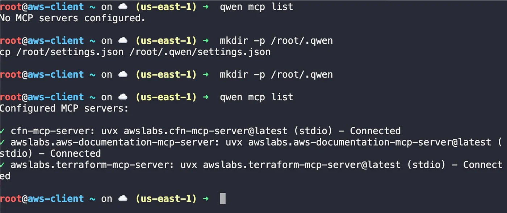
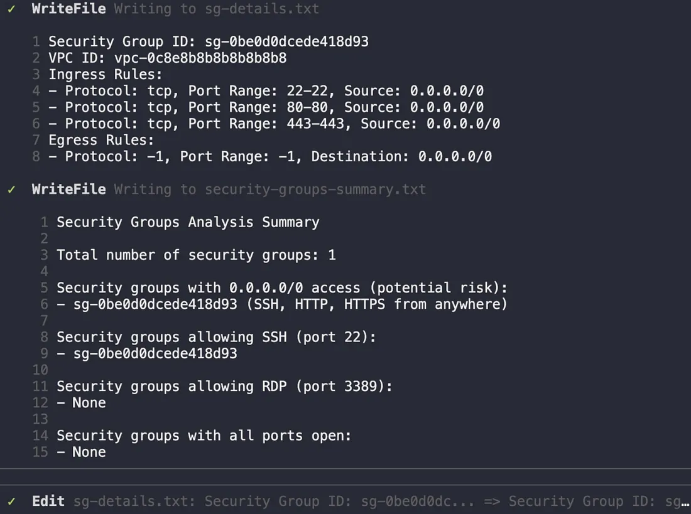
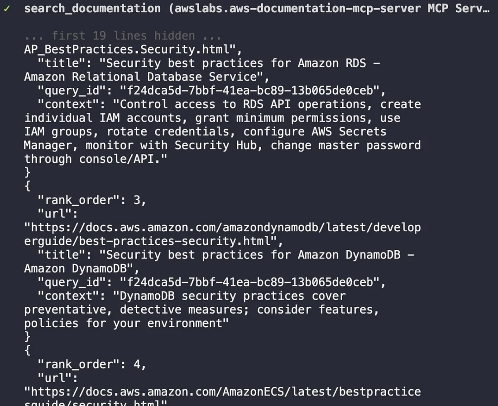
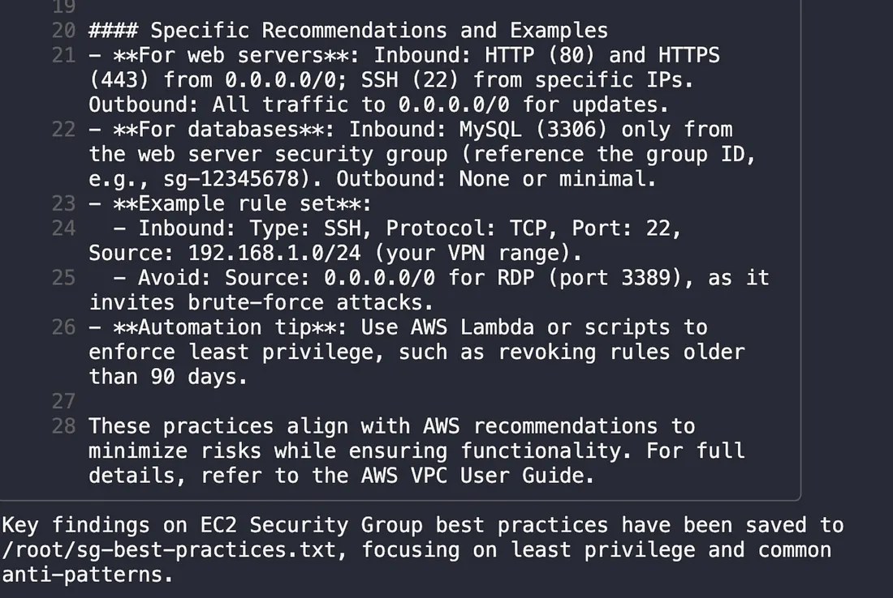
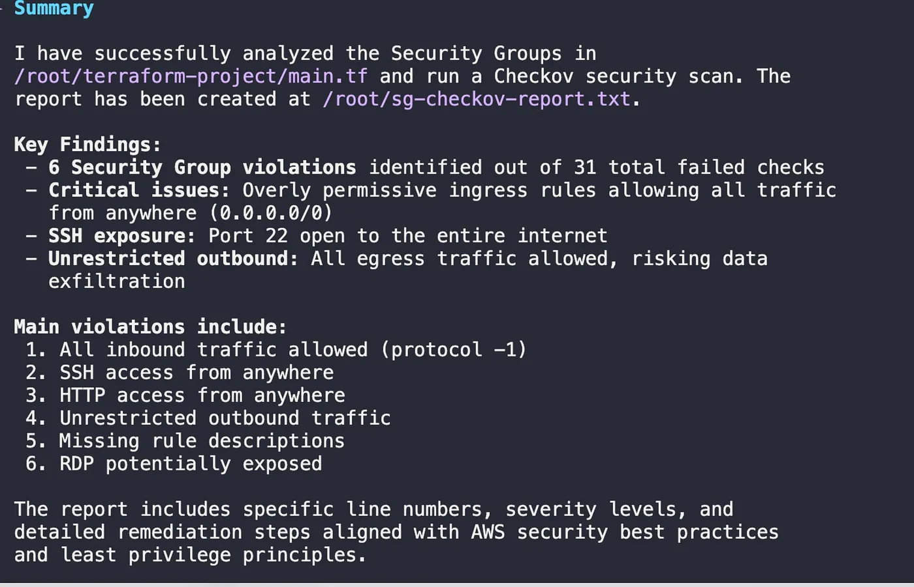
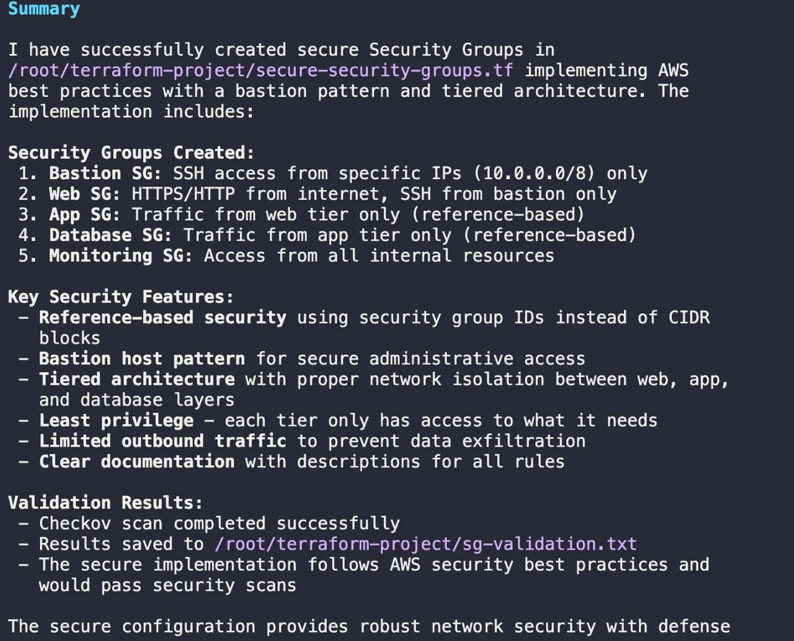

# AI DevOps — From Manual Clicks to AI Automation in AWS with MCP Servers

**Author:** [Megha](https://www.linkedin.com/in/megha-7aa3a0203/)

**Published:** Oct 16, 2025

After fixing a production outage on Day 1 and rescuing a failing RAG system on Day 2, the next challenge was clear: how do we move from targeted fixes to proactive, system-wide automation? Day 3 of my KodeKloud AI course delivered the answer: `Model Context Protocol (MCP)`.

The scenario was a common one in any cloud-native team. We needed to query live AWS resources, search thousands of pages of documentation, and validate our infrastructure-as-code for security flaws. Doing this manually means endless context-switching between the AWS console, documentation sites, and local scanner tools.

Our mission was to unify this fragmented workflow by connecting Qwen AI directly to AWS services using three specialized MCP servers.

## **Understanding the Architecture: What is MCP?**

Before diving in, it’s crucial to understand what MCP is and why it’s a game-changer. MCP (Model Context Protocol) is a standardized way for an AI model to discover and use external tools. Think of it as a universal adapter.

- The Qwen CLI is the MCP client.

- Each tool (like CloudFormation, AWS Docs, or Terraform) is wrapped in an MCP Server.

- The protocol itself, JSON-RPC 2.0, is the universal language they use to communicate.

This architecture means you can give Qwen a high-level goal in natural language, and it can discover the right tool, formulate the correct API call, and execute it — all without you writing a single line of integration code.

## **Task 1: Configure the MCP Servers**

The first step was to configure Qwen to use our three AWS-focused MCP servers. I started by checking the current setup.

```shell
qwen mcp list
```

As expected, it returned “No MCP servers configured.” I then applied a pre-configured settings file to connect Qwen to the servers.

```shell
mkdir -p /root/.qwen
cp /root/settings.json /root/.qwen/settings.json
```

Running `qwen mcp list` again confirmed the connection.



> From zero to three: the terminal shows the successful configuration of the CloudFormation, AWS Documentation, and Terraform MCP servers.

To see what tools each server provided, I launched Qwen in interactive mode (`qwen`) and ran `/mcp list`.


> each MCP server exposes a set of specific, powerful tools that Qwen can now use to execute tasks.

## **Task 2: Query Live AWS Security Groups**

With the servers configured, it was time to put the `cfn-mcp-server` to work. The goal was to analyze the security groups in our AWS account—a common and critical security task. Instead of manual aws-cli commands and jq parsing, I gave Qwen a single, comprehensive prompt.

```
Using the CloudFormation MCP server, analyze AWS Security Groups:

1. List all security groups (AWS::EC2::SecurityGroup) from us-east-1 and save to /root/aws-security-groups.txt
2. For each security group found, get detailed information including ingress/egress rules and associated VPC. Save details to /root/sg-details.txt
3. Create a security analysis summary at /root/security-groups-summary.txt that includes total count and flags any groups with risky rules (like 0.0.0.0/0 access).

Use the cfn-mcp-server tools to query these resources.
```

Qwen devised a plan, executed the `list_resources` and `get_resource` tool calls, and generated the requested analysis files.




> Qwen’s execution plan : Qwen generated detailed files listing the security groups and a summary highlighting potential risks, like SSH open to the world.

## **Task 3: Find Security Best Practices in Real-Time**

A good engineer doesn’t just find problems; they know how to fix them according to best practices. Instead of opening a browser, I used the `awslabs.aws-documentation-mcp-server` to get the official AWS guidance directly.

```
Using the AWS Documentation MCP server:
Search for 'EC2 Security Group best practices' and save key findings to /root/sg-best-practices.txt. Focus on least privilege and common anti-patterns.
```

Qwen used the `search_documentation` tool and instantly produced a summary emphasizing the principle of least privilege and common anti-patterns like allowing unrestricted `0.0.0.0/0` access.​




> Qwen searches AWS documentation in real-time, pulling relevant best practices for EC2 Security Groups.

## **Task 4: Scan Infrastructure-as-Code for Vulnerabilities**

The next logical step was to apply this knowledge to our IaC. Using the `awslabs.terraform-mcp-server`, which integrates the powerful open-source scanner Checkov, I tasked Qwen with analyzing a vulnerable Terraform project.

`
Using the Terraform MCP server:

1. Analyze Security Groups in /root/terraform-project/main.tf
2. Run Checkov to scan for violations
3. Create a report at /root/sg-checkov-report.txt with violations found, line numbers, and remediation steps.
`

Qwen used the `RunCheckovScan` tool and produced a detailed report identifying multiple critical security issues, such as unrestricted ingress and egress rules.



> a summary of the Checkov scan results, highlighting six critical security group violations found in the Terraform code.

## **Task 5: Remediate and Validate the Fix**

Finding problems is good; fixing them is better. In the final task, I asked Qwen to generate a new, secure Terraform configuration that fixed the issues identified by Checkov, following a secure, multi-tier architecture.

```
Using the Terraform MCP server:

1. Create /root/terraform-project/secure-security-groups.tf with fixed Security Groups.
2. Implement secure patterns: Web SG (HTTPS/HTTP only), Bastion SG (SSH from specific IPs), App SG (traffic from Web SG only), and DB SG (traffic from App SG only).
3. Run Checkov validation and save results to /root/terraform-project/sg-validation.txt.
```
Qwen generated the new HCL code, implementing security group chaining and least-privilege rules. The final validation scan confirmed that all previous violations were resolved.



> Qwen’s summary confirms that the new, secure Security Group configuration was created and passed all validation checks.

## **My Key Takeaway from Day 3**

Day 3 was a revelation. It demonstrated that the future of DevOps isn’t just about using AI to answer questions; it’s about giving AI the agency to use the same tools we do. The MCP architecture transforms the AI from a passive knowledge base into an active member of the team — one that can query live systems, scan code, and generate fixes, all within a unified, auditable framework.

By the end of Day 2, our RAG system had stopped guessing. By the end of Day 3, the AI had stopped just asserting; it was now verifying, backing every recommendation with live data and security scans.

Stay tuned for Day 4, where we’ll explore how to orchestrate multiple, specialized agents like these into even more complex enterprise workflows