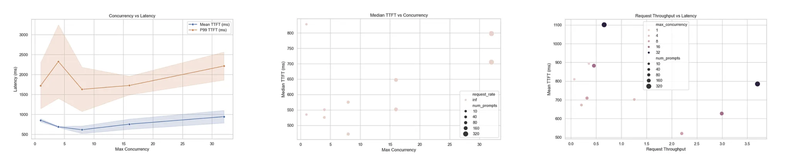
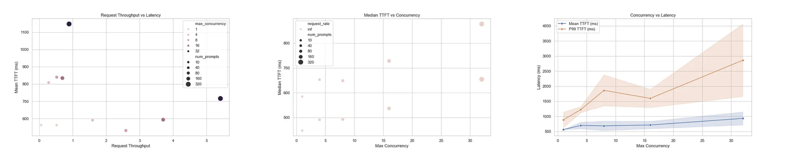
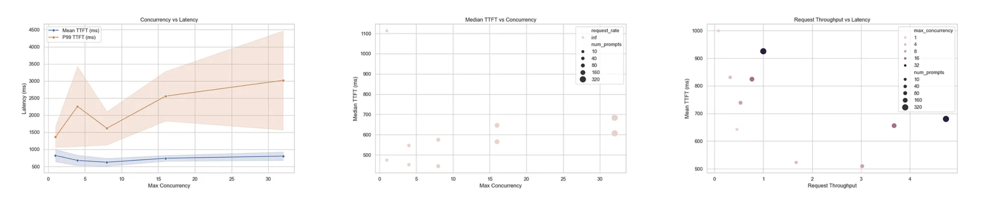
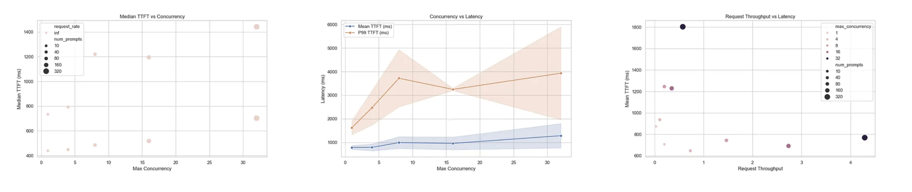

# Benchmarking LLModels with vLLM: A Comprehensive Guide

**Author:** [Shivank Chaudhary](https://www.linkedin.com/in/shivank1128/)

**Published:** December 10, 2025

## Understanding LLM Inference Performance at Scale

As large language models (LLMs) become increasingly central to production applications, understanding their inference performance characteristics is crucial. Whether you’re building a chatbot, a code assistant, or any AI-powered service, knowing how your model performs under different loads can make or break your user experience.

In this comprehensive guide, I’ll walk you through setting up a professional benchmarking environment using vLLM and share real-world performance data from testing four different models ranging from 20B to 120B parameters.

## Why Benchmark LLM Inference?

Before diving into the technical details, let’s understand what we’re measuring and why it matters:

## Key Performance Metrics

1. **Time to First Token (TTFT)**
   - How quickly users see the first response
   - Critical for perceived responsiveness
   - Typically ranges from 500ms to 2000ms in production
2. **Time Per Output Token (TPOT)**
   - Average time to generate each subsequent token
   - Affects the overall streaming experience
   - Lower is better for smooth text generation
3. **Inter-Token Latency (ITL)**
   - Time between consecutive tokens
   - Determines the “smoothness” of streaming
   - Inconsistent ITL creates a choppy user experience
4. **End-to-End Latency (E2EL)**
   - Total time from request to complete response
   - Includes TTFT + total generation time
   - The ultimate user-facing metric
5. **Throughput**
   - Tokens generated per second
   - Indicates system capacity under load
   - Essential for cost and scaling decisions

## Setting Up Your Benchmarking Environment

## Prerequisites

### System Requirements

- Linux/macOS environment
- Python 3.8+
- GPU with sufficient VRAM (recommended for large models)
- Running vLLM server instance

## Step 1: Clone the Repository

```bash
git clone https://github.com/Alt-Shivam/vllm-benchmarking-studio.git
cd vllm-benchmarking-studio
```

## Step 2: Install Dependencies

```bash
pip install -r requirements.txt
```

The requirements.txt includes:

- vllm - High-performance inference engine
- transformers - Model handling
- aiohttp - Async HTTP requests
- pandas - Data analysis
- datasets - Dataset management

## Step 3: Configure Your Benchmark

Edit combos.yaml to define your test parameters:

```yaml
# Model Configuration
model: "your-model-name"
base_url: "http://your-server:port"
tokenizer: "/path/to/tokenizer"

# Input/Output Token Combinations
input_output:
  - [256, 256]    # Short prompts
  - [2048, 2048]  # Long prompts

# Concurrency Levels
concurrency_prompts:
  - [1, 10]       # Serial processing
  - [4, 40]       # Low concurrency
  - [8, 80]       # Medium concurrency
  - [16, 160]     # High concurrency
  - [32, 320]     # Maximum concurrency
```

## Step 4: Run the Benchmark Suite

```bash
# Execute all test combinations
python3 run_sweep.py
# This will generate results in the results/ directory
```

## Step 5: Aggregate and Visualize

```bash
# Consolidate all results into a single CSV
python3 aggregate_result.py

# Generate performance charts
python3 visualize.py
```

## Real-World Benchmark Results

I tested four models under identical conditions to understand how model size affects performance. Here’s what I discovered:

## Test Configuration

* **Dataset**: Random synthetic prompts  
* **Input Lengths**: 256 and 2048 tokens  
* **Output Lengths**: 256 and 2048 tokens  
* **Concurrency Levels**: 1, 4, 8, 16, 32  
* **Request Pattern**: Burst mode (all requests sent simultaneously)

## Model Performance Analysis

### 1. Qwen/Qwen3-Omni-30B-A3B-Instruct

**Model Size**: 30 billion parameters  
**Architecture**: Multimodal (Omni) transformer



### Key Findings

**Short Prompts (256×256 tokens)**

**Best Case (Concurrency=1)**

- TTFT: 893ms (median: 535ms)
- TPOT: 7.3ms
- Throughput: 182 tokens/s

**High Load (Concurrency=32)**

- TTFT: 785ms (median: 705ms)
- TPOT: 53ms
- Throughput: 1,870 tokens/s
- **10× throughput improvement** with acceptable latency trade-off

**Long Prompts (2048×2048 tokens)**

**Best Case (Concurrency=1)**

- TTFT: 810ms (median: 828ms)
- TPOT: 6.8ms
- Throughput: 278 tokens/s

**High Load (Concurrency=32)**

- TTFT: 1,101ms (median: 798ms)
- TPOT: 49ms
- Throughput: 2,632 tokens/s
- P99 latency: 76s (note: some requests experience significant queuing)

### Verdict

**Solid performance** for a 30B parameter model  
**Linear throughput scaling** with concurrency  
**P99 latencies spike** at maximum concurrency (acceptable for batch workloads)

### 2. OpenAI/GPT-OSS-20B

**Model Size**: 20 billion parameters  
**Architecture**: GPT-style decoder-only transformer



### Key Findings

**Short Prompts (256×256 tokens)**

**Best Case (Concurrency=1)**

- TTFT: 562ms (median: 447ms)
- TPOT: 5.2ms
- Throughput: 264 tokens/s

**30% faster TTFT** than Qwen 30B

**High Load (Concurrency=32)**

- TTFT: 716ms (median: 654ms)
- TPOT: 19ms
- Throughput: 2,751 tokens/s

**Long Prompts (2048×2048 tokens)**

**Best Case (Concurrency=1)**

- TTFT: 563ms (median: 584ms)
- TPOT: 4.5ms
- Throughput: 235 tokens/s
- **Fastest TPOT** among all tested models

**High Load (Concurrency=32)**

- TTFT: 1,148ms (median: 878ms)
- TPOT: 16ms
- Throughput: 3,605 tokens/s

### Verdict

**Excellent low-latency performance**  
**Best-in-class throughput** at high concurrency  
**Smaller model size** = lower operational costs  
**P99 latencies** still high at extreme concurrency (103s)

### 3. OpenAI/GPT-OSS-120B

**Model Size**: 120 billion parameters  
**Architecture**: GPT-style decoder-only transformer (larger variant)



### Key Findings

**Short Prompts (256×256 tokens)**

**Best Case (Concurrency=1)**

- TTFT: 642ms (median: 474ms)
- TPOT: 5.7ms
- Throughput: 234 tokens/s

**High Load (Concurrency=32)**

- TTFT: 680ms (median: 606ms)
- TPOT: 23ms
- Throughput: 2,403 tokens/s

**Long Prompts (2048×2048 tokens)**

**Best Case (Concurrency=1)**

- TTFT: 999ms (median: 1,113ms)
- TPOT: 4.6ms
- Throughput: 329 tokens/s

**High Load (Concurrency=32)**

- TTFT: 925ms (median: 683ms)
- TPOT: 14ms
- Throughput: 4,076 tokens/s

### Verdict

**Competitive performance** despite 6× model size vs 20B  
**Strong throughput** at high concurrency  
**Higher TTFT variance** under load  
**P99 latencies** reach 88s at maximum concurrency

### 4. Google/Gemma-3–27B-IT

**Model Size**: 27 billion parameters  
**Architecture**: Gemma instruction-tuned transformer



### Key Findings

**Short Prompts (256×256 tokens)**

**Best Case (Concurrency=1)**

- TTFT: 707ms (median: 438ms)
- TPOT: 16.7ms
- Throughput: 103 tokens/s

**Higher TPOT** than other models

**High Load (Concurrency=32)**

- TTFT: 769ms (median: 702ms)
- TPOT: 25ms
- Throughput: 2,173 tokens/s

**Long Prompts (2048×2048 tokens)**

**Best Case (Concurrency=1)**

- TTFT: 874ms (median: 733ms)
- TPOT: 17.2ms
- Throughput: 114 tokens/s

**High Load (Concurrency=32)**

- TTFT: 1,803ms (median: 1,442ms)
- TPOT: 26ms
- Throughput: 2,323 tokens/s

### Verdict

**Most consistent latency distribution** (lowest std deviation)  
**Stable performance** across concurrency levels  
**Lower raw throughput** than GPT models  
**Excellent for latency-sensitive applications**

## Comparative Analysis

### TTFT Comparison (Short Prompts, Concurrency=1)

| Model          | Mean TTFT | Median TTFT | Winner |
| -------------- | --------- | ----------- | ------ |
| GPT-OSS-20B    | 562ms     | 447ms       | 🥇     |
| Gemma-3–27B    | 707ms     | 438ms       | 🥈     |
| GPT-OSS-120B   | 642ms     | 474ms       | 🥉     |
| Qwen-30B       | 893ms     | 535ms       | -      |

**Insight**: Smaller models (20B) provide the fastest initial response time.

### Throughput Comparison (Long Prompts, Concurrency=32)

| Model          | Throughput (tok/s) | Winner |
| -------------- | ------------------ | ------ |
| GPT-OSS-120B   | 4,076              | 🥇     |
| GPT-OSS-20B    | 3,605              | 🥈     |
| Qwen-30B       | 2,632              | 🥉     |
| Gemma-3–27B    | 2,323              | -      |

**Insight**: The 120B model achieves highest throughput despite its size, showcasing excellent optimization.

### Latency Consistency (Standard Deviation)

| Model          | TTFT Std Dev | Winner |
| -------------- | ------------ | ------ |
| Gemma-3–27B    | Lowest       | 🥇     |
| GPT-OSS-20B    | Low-Medium   | 🥈     |
| Qwen-30B       | Medium       | 🥉     |
| GPT-OSS-120B   | Highest      | -      |

**Insight**: Gemma-3–27B offers the most predictable latency for production workloads.

## Key Takeaways & Recommendations

### 1. Choose Based on Your Use Case

**For Real-Time Chat Applications**

- Use: **GPT-OSS-20B** or **Gemma-3–27B**
- Why: Low TTFT (< 600ms) provides responsive user experience
- Concurrency: Keep at 4–8 for optimal latency

**For Batch Processing**

- Use: **GPT-OSS-120B** or **Qwen-30B**
- Why: Highest throughput at scale
- Concurrency: Maximize at 32 for best token/s

**For Latency-Critical Systems**

- Use: **Gemma-3–27B**
- Why: Most consistent performance (lowest variance)
- Trade-off: Slightly lower throughput

### 2. Concurrency vs. Latency Trade-off

- Concurrency 1-4: Best latency, lower throughput
- Concurrency 8-16: Balanced performance
- Concurrency 32+: Maximum throughput, higher tail latencies

### 3. The P99 Problem

All models show significant P99 latency spikes at high concurrency:

- Qwen-30B: 76s
- GPT-OSS-20B: 103s
- GPT-OSS-120B: 88s
- Gemma-3–27B: 73s

**Solution**: Implement request queuing and load balancing at the application layer.

### 4. Token Length Matters

| Prompt Length | Impact on TTFT | Impact on Throughput           |
| ------------- | -------------- | ------------------------------ |
| 256 tokens    | Lower       | Higher per-token overhead   |
| 2048 tokens   | Higher      | Better GPU utilization      |

**Recommendation**: Batch similar-length requests together for optimal performance.

## Conclusion

Benchmarking LLM inference is not just about finding the “fastest” model — it’s about understanding the trade-offs and choosing the right tool for your specific use case.

**Key Insights from Our Testing**:

1. **GPT-OSS-20B** wins on raw speed and throughput  
2. **Gemma-3–27B** wins on consistency and predictability  
3. **GPT-OSS-120B** demonstrates impressive optimization despite size  
4. **Qwen-30B** offers balanced performance with multimodal capabilities

The benchmarking framework we’ve built is open-source and extensible. Use it to test your own models and configurations, and share your findings with the community!

## Resources

- **GitHub Repository**: [vllm-benchmarking-studio](https://github.com/Alt-Shivam/vllm-benchmarking-studio)
- **vLLM Documentation**: [docs.vllm.ai](https://docs.vllm.ai/)
- **Benchmark Datasets**: ShareGPT, MT-Bench, AIMO

