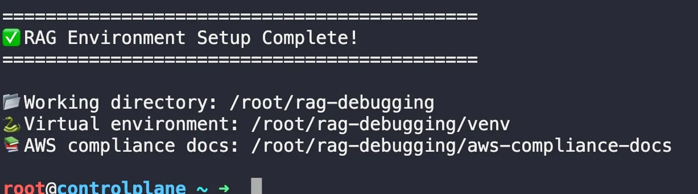
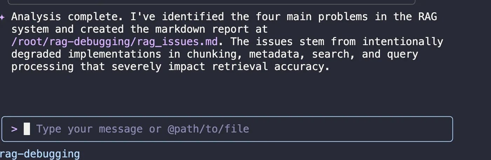

# Turning a 45% RAG Into an Audit-Ready System

**Author:** [Megha](https://www.linkedin.com/in/megha-7aa3a0203/)

**Published:** Oct 15, 2025

After the intensity of Day 1's production outage, I was ready for a new challenge. It arrived in the form of a crisis that is becoming all too familiar in the world of AI: a system that was confidently, consistently, and catastrophically wrong.

The scenario was a high-stakes emergency at the AWS Compliance Division. Their Retrieval-Augmented Generation (RAG) system — the tool that was supposed to be the single source of truth for critical audit questions — was failing. With a baseline accuracy of just 45%, it was giving wrong answers more often than right ones. With auditors arriving in one week and a $50 million government contract hanging in the balance, the pressure was on.

The goal wasn’t to swap models or add more compute. The course pushed a simpler, more powerful idea: fix how the system reads, organizes, and searches its own documents so the answers become precise, complete, and defensible. Using Qwen Code as my hands-on assistant, the plan was simple: measure honestly, fix the pipeline, and prove the gains.

## The Investigation: Quantifying the Failure

Before you can fix a problem, you have to understand it. The first step was to establish a clear, undeniable baseline. I set up the development environment, installing the necessary tools like ChromaDB for vector storage and Sentence Transformers for creating embeddings.



> Environment is ready: virtual env created and core RAG dependencies installed (ChromaDB, Sentence Transformers, Tiktoken, BM25, OpenAI).

Then, I ran the system’s built-in test suite to see the failure for myself. The results were stark.


An accuracy of 45.5% is dangerously misleading. It’s not just failing; it’s providing incorrect information with the same confidence as correct answers. This erodes trust and makes a system unusable. The problem wasn’t just a bug; it was a fundamental flaw in how the system understood its own data.

## The Diagnosis: Using AI to Interrogate AI

This is where the process got fascinating. Instead of manually digging through lines of Python, my strategy was to use one AI to debug another. I gave Qwen a carefully structured prompt, not just asking a question, but assigning it a mission: to analyze the RAG system’s code and identify the root causes of its failures.This is a powerful prompting technique. By providing a clear goal, context, and a set of instructions, you guide the AI toward a more insightful and actionable analysis. Here is the exact prompt I used:

```
Analyze the RAG system at /root/rag-debugging/rag-system/rag_system.py
The system is only achieving 45% accuracy on compliance queries.

1. Identify the 4 main problems causing poor accuracy
2. For each problem, explain:
   - What's wrong
   - Why it impacts accuracy
   - How to fix it
3. Create a markdown report and save it as /root/rag-debugging/rag_issues.md

Focus on:
- Document chunking strategy
- Metadata extraction
- Search methodology
- Query processing
```

Qwen quickly returned a detailed report, pinpointing four distinct “villains” in this story.



1. `Poor Chunking Strategy`: The system was splitting documents by a fixed character count, which often cut sentences in half and destroyed their meaning.

2. `No Metadata Filtering`: The documents weren’t tagged with metadata (like which AWS service or policy ID they referred to), so the system couldn’t narrow its search to the most relevant sources.

3. `Semantic Search Only`: The system relied exclusively on semantic (meaning-based) search, which can miss queries that depend on specific keywords or acronyms.

4. `No Query Enhancement`: The system took user questions literally, without expanding acronyms or considering synonyms, leading to missed results.

## The Solution: A Multi-Layered Optimization

With a clear diagnosis, the path forward was to systematically address each of these flaws. I tasked Qwen with creating an improved version of the RAG system, this time with a more intelligent data pipeline.


- To fix the chunking, we implemented a sentence-aware strategy that preserved the meaning of the text.

- To solve the metadata problem, we extracted key information for each chunk, allowing the search to be precisely filtered.

- To improve the search, we created a hybrid system that combined the strengths of both semantic and keyword-based (BM25) search.

- To address the query limitations, we added a layer that expanded acronyms and synonyms, helping the system understand what the user truly meant.

## A Dose of Reality: Encountering Real-World Errors

Of course, no real-world project is without its unexpected hurdles. During the lab, I encountered a ModuleNotFoundError: No module named 'rag_evaluator'. This is a classic Python dependency issue, a good reminder that even with advanced AI, the fundamentals of managing your environment are still critical.​ra


> Local module not found — activate venv, run from project root, or add to PYTHONPATH.

I also hit a recurring `API Error: 403 status code`, which typically points to an issue with an API key, permissions, or rate limits. While I couldn't fully resolve it in the lab, it was an important lesson in the practical complexities of working with external APIs. It’s a moment of humility that every developer knows well.


## The Verdict: A System Transformed

With the fixes in place, I ran the final test. The result was a testament to the power of a systematic, context-aware approach.


> Final RAG pipeline: all‑MiniLM‑L6‑v2 + sentence‑aware 512/50 chunking, ChromaDB with metadata, hybrid (semantic+BM25) retrieval, and a similarity floor to block noisy context — deployed via Flask.

The system’s accuracy skyrocketed from a dismal 45.5% to an audit-ready 90.9%. It was no longer a liability; it was a reliable source of truth.

## My Key Takeaway from Day 2

This lab was a profound lesson in the art and science of building effective AI systems. My “aha!” moment was the realization that the intelligence of a RAG system comes from its data pipeline, not just its language model. A brilliant AI can’t give a brilliant answer if it’s reading disorganized, ambiguous, and poorly contextualized information.

Day 2 taught me that the most significant gains in AI performance often come not from a bigger model, but from smarter chunking, richer metadata, and more sophisticated search strategies. The future of AI in DevOps isn’t just about building better AI; it’s about becoming better architects of the data that fuels it.

Day 2 made the model precise by fixing the pipeline; Day 3 makes it accountable — answers backed by live checks and proof.
