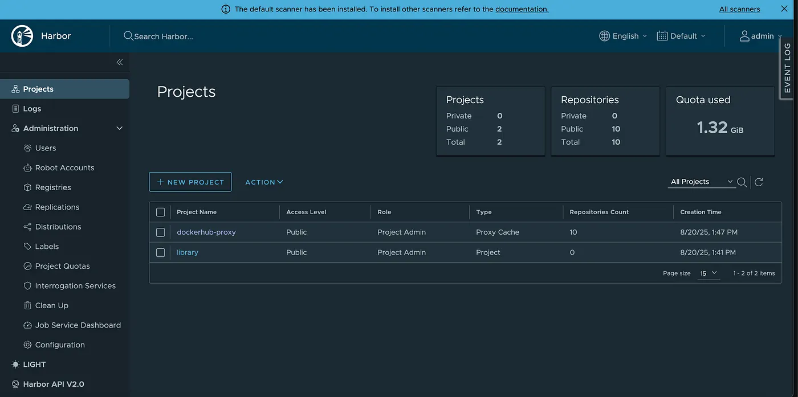

# Harbor Setup Guide for Proxy Mirror

**Author:** [Shivank Chaudhary](https://www.linkedin.com/in/shivank1128/)

**Published:** Aug 20, 2025

## Prerequisites

- VM with at least 4GB RAM, 2 CPUs, and 40GB storage
- Ubuntu 20.04 LTS or a similar Linux distribution
- Docker and Docker Compose are installed
- Domain name or IP address for Harbor
- Kubernetes cluster with containerd runtime

## Step 1: Prepare the OpenStack VM

### 1.1 Update the system

```bash
sudo apt update
```

### 1.2 Install required packages

```bash
sudo apt install -y curl wget git openssl ca-certificates
```

### 1.3 Install Docker

```bash
# Add Docker's official GPG key
curl -fsSL https://download.docker.com/linux/ubuntu/gpg | sudo gpg --dearmor -o /usr/share/keyrings/docker-archive-keyring.gpg

# Add Docker repository
echo "deb [arch=$(dpkg --print-architecture) signed-by=/usr/share/keyrings/docker-archive-keyring.gpg] https://download.docker.com/linux/ubuntu $(lsb_release -cs) stable" | sudo tee /etc/apt/sources.list.d/docker.list > /dev/null

# Install Docker
sudo apt update
sudo apt install -y docker-ce docker-ce-cli containerd.io

# Add user to docker group
sudo usermod -aG docker $USER
newgrp docker
```

### 1.4 Install Docker Compose

```bash
sudo curl -L "https://github.com/docker/compose/releases/latest/download/docker-compose-$(uname -s)-$(uname -m)" -o /usr/local/bin/docker-compose
sudo chmod +x /usr/local/bin/docker-compose
```

## Step 2: Generate SSL Certificates

### 2.1 Create certificate directory

```bash
mkdir -p /opt/harbor/certs
cd /opt/harbor/certs
```

### 2.2 Generate CA private key

```bash
openssl genrsa -out ca.key 4096
```

### 2.3 Generate CA certificate

```bash
openssl req -new -x509 -days 365 -key ca.key -out ca.crt -subj "/C=US/ST=CA/L=San Francisco/O=Harbor/CN=Harbor CA"
```

### 2.4 Generate server private key

```bash
openssl genrsa -out harbor.key 4096
```

### 2.5 Generate certificate signing request

```bash
openssl req -new -key harbor.key -out harbor.csr -subj "/C=US/ST=CA/L=San Francisco/O=Harbor/CN=internal.demo.io"
```

### 2.6 Create certificate extensions file

Replace `YOUR_VM_IP_ADDRESS` with your actual VM's IP address:

```bash
cat > harbor.ext << EOF
[req]
distinguished_name = req_distinguished_name
req_extensions = v3_req

[req_distinguished_name]

[v3_req]
authorityKeyIdentifier=keyid,issuer
basicConstraints=CA:FALSE
keyUsage = digitalSignature, nonRepudiation, keyEncipherment, dataEncipherment
subjectAltName = @alt_names

[alt_names]
DNS.1=internal.demo.io
DNS.2=localhost
IP.1=YOUR_VM_IP_ADDRESS
EOF
```

### 2.7 Generate server certificate

```bash
openssl x509 -req -in harbor.csr -CA ca.crt -CAkey ca.key -CAcreateserial -out harbor.crt -days 365 -extensions v3_req -extfile harbor.ext
```

### 2.8 Set proper permissions

```bash
sudo chown -R root:root /opt/harbor/certs
sudo chmod 600 /opt/harbor/certs/*.key
sudo chmod 644 /opt/harbor/certs/*.crt
```

## Step 3: Install and Configure Harbor

### 3.1 Download Harbor

```bash
cd /opt/harbor
wget https://github.com/goharbor/harbor/releases/download/v2.10.0/harbor-offline-installer-v2.10.0.tgz
tar xvf harbor-offline-installer-v2.10.0.tgz
cd harbor
```

### 3.2 Configure Harbor

```bash
cp harbor.yml.tmpl harbor.yml
```

Edit `harbor.yml`:

```yaml
# The IP address or hostname to access Harbor
hostname: internal.demo.io

# HTTP configuration
http:
  port: 80

# HTTPS configuration
https:
  port: 443
  certificate: /opt/harbor/certs/harbor.crt
  private_key: /opt/harbor/certs/harbor.key

# Harbor admin password
harbor_admin_password: Harbor1234

# Database configuration
database:
  password: root123
  max_idle_conns: 50
  max_open_conns: 1000

# Data volume
data_volume: /data

# Storage configuration
storage_service:
  ca_bundle:

# Log configurations
log:
  level: info
  local:
    rotate_count: 50
    rotate_size: 200M
    location: /var/log/harbor

# Proxy settings for pull-through cache
proxy:
  http_proxy:
  https_proxy:
  no_proxy:
  components:
    - core
    - jobservice
    - trivy

# Enable webhook
webhook:
  job_max_retry: 3
  job_retry_delay: 5s
```

### 3.3 Install Harbor

```bash
sudo ./install.sh --with-notary --with-trivy
```

## Step 4: Configure Harbor as Proxy Cache

### 4.1 Access Harbor Web UI

Navigate to `https://internal.demo.io`

- Username: `admin`
- Password: `Harbor1234`

### 4.2 Create Proxy Projects

1. Go to Projects → New Project
2. Create the following proxy projects:

**Docker Hub Proxy:**

- Project Name: `dockerhub-proxy`
- Access Level: `Public`
- Enable: `Proxy Cache`
- Provider: `Docker Hub`
- Endpoint URL: `https://registry-1.docker.io`

**Quay.io Proxy:**

- Project Name: `quay-proxy`
- Access Level: `Public`
- Enable: `Proxy Cache`
- Provider: `Quay`
- Endpoint URL: `https://quay.io`

**GCR Proxy:**

- Project Name: `gcr-proxy`
- Access Level: `Public`
- Enable: `Proxy Cache`
- Provider: `Google GCR`
- Endpoint URL: `https://gcr.io`



## Step 5: Configure Kubernetes to Use Harbor Proxy

### 5.1 Create containerd configuration

```bash
sudo mkdir -p /etc/containerd/certs.d/internal.demo.io
```

### 5.2 Configure registry mirror

```bash
sudo tee /etc/containerd/certs.d/internal.demo.io/hosts.toml << EOF
server = "https://internal.demo.io"

[host."https://internal.demo.io"]
  capabilities = ["pull", "resolve"]
  skip_verify = true
EOF
```

### 5.3 Restart containerd

```bash
sudo systemctl restart containerd
```

## Step 6: Test the Setup

### 6.1 Pull an image through Harbor proxy

```bash
# Pull from Docker Hub through Harbor
sudo crictl pull internal.demo.io/dockerhub-proxy/library/nginx:latest

# Pull from Quay through Harbor
sudo crictl pull internal.demo.io/quay-proxy/coreos/etcd:latest
```

### 6.2 Verify images in Harbor UI

1. Go to Projects → dockerhub-proxy → Repositories
2. You should see the nginx image cached
3. Check the same for other proxy projects

## Troubleshooting

### Common Issues

1. **SSL Certificate Issues**
   - Ensure certificates are properly generated
   - Check certificate permissions
   - Verify hostname matches certificate

2. **Docker Compose Issues**
   - Ensure Docker Compose is properly installed
   - Check Docker daemon is running

3. **Network Issues**
   - Verify firewall rules allow ports 80 and 443
   - Check DNS resolution for hostname

4. **Storage Issues**
   - Ensure sufficient disk space
   - Check data volume permissions

### Logs

```bash
# Harbor logs
sudo docker-compose -f /opt/harbor/harbor/docker-compose.yml logs

# System logs
sudo journalctl -u docker
sudo journalctl -u containerd
```

## Security Considerations

1. **Change default passwords** in production
2. **Use proper SSL certificates** from a trusted CA
3. **Configure firewall rules** appropriately
4. **Regular security updates** for Harbor and underlying system
5. **Monitor access logs** for suspicious activity

## Conclusion

This guide provides a complete setup for Harbor as a proxy mirror, enabling you to cache container images from various registries. This setup helps reduce bandwidth usage, improve pull speeds, and provides better control over your container image distribution.
