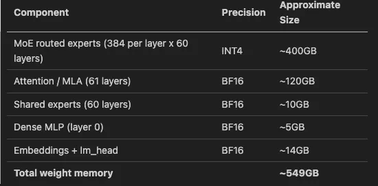
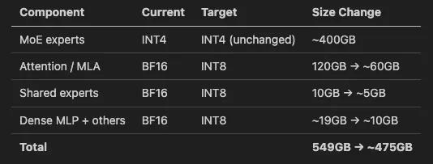
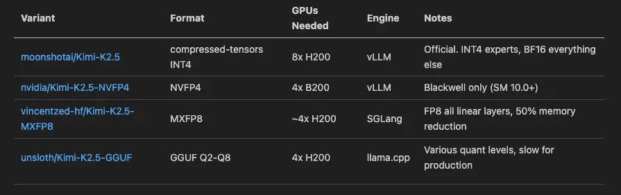

# Deploying Kimi K2.5 on H200 GPUs: The Real Story Nobody Tells You

**Author:** [Shivank Chaudhary](https://www.linkedin.com/in/shivank1128/)

**Published:** Feb 19, 2026

I spent the last few days deploying Moonshot AI's **Kimi K2.5** — a 1 trillion parameter Mixture-of-Experts model — on NVIDIA H200 GPUs using vLLM and llama.cpp. What was supposed to be a straightforward deployment turned into a deep dive through CUDA driver bugs, quantization rabbit holes, and some surprisingly tricky GPU memory math.

If you're planning to self-host Kimi K2.5 (or any large MoE model), this is the guide I wish I had before I started.

## What is Kimi K2.5 and Why Should You Care?

Kimi K2.5 is Moonshot AI's latest multimodal model. On paper, it's massive — 1 trillion parameters. But it's a Mixture-of-Experts (MoE) model, which means not all parameters are active at once. It has 384 routed experts per layer with only 8 selected per token, plus a shared expert. So while it has 1T total parameters, the active parameter count per token is much smaller.

Here's what makes it interesting for deployment:

- **256K context window** — great for long document processing
- **Built-in tool calling** — natively supports function calling with `kimi_k2` parser
- **Reasoning capabilities** — has a dedicated reasoning parser
- **Multimodal** — supports vision tasks via MoonViT (400M vision encoder)
- **Pre-quantized** — the official weights are already INT4 quantized (more on this later, because it's not what you think)

## The Quantization Lie: "Itss INT4" is Only Half the Story

Before we get into deployment, let me save you the headache I went through.

When you look at the [official Kimi K2.5 model card](https://huggingface.co/moonshotai/Kimi-K2.5), it says the model uses `compressed-tensors` with INT4 quantization. You'd naturally think: "Great, INT4 means roughly 0.5 bytes per parameter, so a 1T model should be around 500GB, maybe less."

**Wrong.**

If you dig into the `config.json`, you'll find this in the `quantization_config`:

```json
{
  "ignore": [
    "lm_head",
    "re:.*self_attn.*",
    "re:.*shared_experts.*",
    "re:.*mlp\\.(gate|up|gate_up|down)_proj.*"
  ]
}
```

That `ignore` list is doing a lot of heavy lifting. It means the following layers are **not quantized at all** and remain in full BF16 (2 bytes per parameter):

- **All attention layers** (the entire MLA mechanism across all 61 layers)
- **All shared expert layers** (one shared expert per MoE layer)
- **The dense MLP in layer 0** (the first layer is fully dense, not MoE)
- **The language model head** (`lm_head`)
- **Embeddings**

Only the **MoE routed expert weights** are INT4 quantized. Everything else is BF16.

This matters because the attention layers alone account for roughly **120GB** of VRAM. Add shared experts, the dense layer, embeddings, and lm\_head, and you're looking at **130–140GB of BF16 weights** on top of the INT4 expert weights.

The actual memory breakdown looks something like:




That's 549GB just for weights. No KV cache, no activations, no CUDA overhead. Just weights.

## First Hurdle: The CUDA 13.0 Driver Incompatibility (Error 803)

Before I even got to worry about model size, I hit something unexpected. My cluster nodes run CUDA 13.0 drivers (fairly recent). When the vLLM container (`vllm/vllm-openai:latest`, which was v0.15.1 at the time) tried to start, I got:

```console
RuntimeError: CUDA error: system not yet initialized
CUDA kernel errors might be asynchronously reported at some other API call,
so the stacktrace below might be incorrect.
```

The actual error code was **803** — `cudaErrorSystemNotYet`. Cryptic, right?

after some digging through GitHub issues before finding the root cause. vLLM 0.15.x's Dockerfile includes this line:

```bash
RUN ldconfig /usr/local/cuda-12.9/compat/
```

This bakes CUDA 12.9 compatibility libraries into the container's dynamic linker cache. When the container runs on a host with CUDA 13.0 drivers, these stale compatibility libraries conflict with the host driver. The container tries to use CUDA 12.9 compat libs instead of the host's 13.0 driver, and everything falls apart.

## The Fix

I tried the obvious thing first — setting `LD_LIBRARY_PATH` to prioritize the host driver:

```yaml
env:
  - name: LD_LIBRARY_PATH
    value: "/usr/lib/x86_64-linux-gnu:/usr/local/nvidia/lib64"
```

**Didn't work.** vLLM forks worker processes, and those workers use the `ldconfig` cache, not `LD_LIBRARY_PATH`. I was stuck for a while on this one.

The actual solution ended up being dumb but effective: **mount an empty directory over the problematic path** to hide the broken compat libs entirely.

```yaml
volumes:
  - name: cuda-compat-fix
    emptyDir: {}
volumeMounts:
  - name: cuda-compat-fix
    mountPath: /usr/local/cuda-12.9/compat
```

This creates an empty overlay at `/usr/local/cuda-12.9/compat`, so when `ldconfig` looks there, it finds nothing and falls back to the host's CUDA 13.0 driver. Problem solved.

This is a [known issue](https://github.com/vllm-project/vllm/issues/32373) and should be fixed in future vLLM releases, but if you're running vLLM 0.15.x on CUDA 13.0 hosts today, this is the workaround you need.

## Attempt 1: "Let's Try 4x H200, That Should Be Enough"

With the CUDA issue fixed, it was time to actually load the model. Each H200 has 141GB of HBM3e. Four of them give you 564GB total. The model weighs ~549GB. Simple math says it should fit, right?

I set up a Kubernetes deployment with vLLM, tensor parallelism of 4, and hit deploy.

```yaml
# Deployment config (simplified)
containers:
  - name: vllm
    image: vllm/vllm-openai:latest
    args:
      - "--model"
      - "moonshotai/Kimi-K2.5"
      - "--tensor-parallel-size"
      - "4"
      - "--trust-remote-code"
    resources:
      requests:
        nvidia.com/gpu: 4
```

The model started loading. Weights were distributing across the 4 GPUs. Then:

```console
torch.OutOfMemoryError: CUDA out of memory.
Tried to allocate 2.62 GiB. GPU 0 has a total capacity of 140.65 GiB,
of which 137.54 GiB is already allocated.
```

137GB allocated out of 140GB — and it still needed more. There was essentially **zero room left for KV cache**. With tensor parallelism of 4, each GPU was holding ~137GB of weights, leaving about 3GB free. You need KV cache for even a single request, and with MLA attention and 256K context, the KV cache isn't small.

The lesson: **549GB of weights / 4 GPUs = ~137GB per GPU**, which leaves just 3GB per GPU for everything else. That's not going to work.

## Attempt 2: 8x H200 with vLLM (The Production Setup)

With 8x H200 GPUs, you get 1,128GB of total VRAM. The model weighs ~549GB, leaving around **579GB free for KV cache, activations, and CUDA overhead**. That's plenty.

Here's the final working configuration:

```yaml
containers:
  - name: vllm
    image: vllm/vllm-openai:latest
    args:
      - "--model"
      - "moonshotai/Kimi-K2.5"
      - "--tensor-parallel-size"
      - "8"
      - "--trust-remote-code"
      - "--tool-call-parser"
      - "kimi_k2"
      - "--reasoning-parser"
      - "kimi_k2"
      - "--mm-encoder-tp-mode"
      - "data"
      - "--enable-prefix-caching"
      - "--kv-cache-dtype"
      - "fp8"
    resources:
      requests:
        cpu: "48"
        memory: "256Gi"
        nvidia.com/gpu: 8
    # The CUDA 13.0 compat fix
    volumeMounts:
      - name: cuda-compat-fix
        mountPath: /usr/local/cuda-12.9/compat
  volumes:
    - name: cuda-compat-fix
      emptyDir: {}
```

A few notes on the flags:

- `--kv-cache-dtype fp8`: This quantizes the KV cache to FP8, cutting cache memory usage in half. With 579GB free, we have headroom, but FP8 KV cache means more concurrent requests and longer context windows.
- `--enable-prefix-caching`: Caches common prompt prefixes across requests. Huge win if you're serving system prompts repeatedly.
- `--tool-call-parser kimi_k2` and `--reasoning-parser kimi_k2`: Enable native tool calling and chain-of-thought reasoning parsing. Kimi K2.5 has built-in support for both.
- `--mm-encoder-tp-mode data`: Distributes the vision encoder's data across tensor parallel ranks instead of replicating it.

The model loaded successfully, and we had a working OpenAI-compatible API:

```bash
curl http://<service-ip>:8000/v1/chat/completions \
  -H "Content-Type: application/json" \
  -d '{
    "model": "moonshotai/Kimi-K2.5",
    "messages": [
      {"role": "user", "content": "Explain quantum computing in simple terms"}
    ],
    "max_tokens": 512
  }'
```

Response times were solid — production-grade latency with vLLM's PagedAttention and continuous batching doing their thing. It honestly felt like a weight off my shoulders after all the debugging.

## Storage

The model weights are around 380GB on disk. I used a PersistentVolumeClaim to cache them so subsequent pod restarts don't re-download:

```yaml
volumeClaimTemplates:
  - metadata:
      name: model-storage
    spec:
      accessModes: ["ReadWriteOnce"]
      storageClassName: local-path
      resources:
        requests:
          storage: 400Gi
```

The HuggingFace token was stored in a Kubernetes Secret and injected as an environment variable:

```yaml
env:
  - name: HF_TOKEN
    valueFrom:
      secretKeyRef:
        name: model-secrets
        key: hf_token
```

## The llama.cpp Detour: Deploying the GGUF Version

While waiting for the 8-GPU node to become available, I tried a different approach — running the [unsloth/Kimi-K2.5-GGUF](https://huggingface.co/unsloth/Kimi-K2.5-GGUF) variant via llama.cpp. Specifically, the `UD-Q2_K_XL` quantization, which is a dynamic 2-bit quant that should fit on fewer GPUs.

The setup used `ghcr.io/ggml-org/llama.cpp:server-cuda` as the container image, with an init container to download the GGUF files:

```yaml
initContainers:
  - name: download-model
    image: python:3.11-slim
    command: ["sh", "-c"]
    args:
      - |
        pip install huggingface-hub &&
        python -c "
        from huggingface_hub import snapshot_download
        snapshot_download(
          'unsloth/Kimi-K2.5-GGUF',
          allow_patterns=['*UD-Q2_K_XL*'],
          local_dir='/data'
        )
        "
```

The main container ran llama-server with offloading all layers to GPU:

```yaml
containers:
  - name: llamacpp
    image: ghcr.io/ggml-org/llama.cpp:server-cuda
    command: ["/app/llama-server"]
    args:
      - "--model"
      - "/data/UD-Q2_K_XL/Kimi-K2.5-UD-Q2_K_XL-00001-of-00008.gguf"
      - "--n-gpu-layers"
      - "-1"
      - "--ctx-size"
      - "98304"
      - "--parallel"
      - "8"
      - "--flash-attn"
      - "on"
      - "--cont-batching"
      - "--metrics"
      - "--jinja"
      - "--override-tensor"
      - ".ffn_.*_exps.=CPU"
    resources:
      requests:
        nvidia.com/gpu: 4
```

This worked. The model loaded on 4x H200, with expert FFN layers offloaded to CPU via `--override-tensor .ffn_.*_exps.=CPU`. The server started, accepted requests on port 8080 (llama.cpp's default), and responded correctly.

**But it was slow.** Painfully slow.

The Q2\_K\_XL quantization is aggressive — you're cramming a 1T model into ~2 bits per weight. The quality takes a noticeable hit, and with expert offloading to CPU, every token generation involves shuffling data between GPU and system memory. I'm talking response times measured in minutes for anything beyond a couple sentences. For a model with 384 experts per layer, that's a LOT of CPU-GPU traffic on every single token.

**Verdict: useful for testing and validation, not for production.** If you just need to verify the model works or do some lightweight experiments, llama.cpp with GGUF is a valid path. But for serving real traffic, you need vLLM with enough GPUs.

## "Can We Squeeze It Into Fewer GPUs?" — The Quantization Deep Dive

After seeing the OOM on 4 GPUs, my first thought was: can we quantize the BF16 layers to INT8? Keep the expert weights at INT4 (they're already there), but compress the attention, shared experts, and other BF16 layers to INT8. That would roughly look like:



475GB / 4 = ~119GB per GPU, leaving ~22GB per GPU for KV cache. Tight, but potentially workable.

### The Bad News: You Can't Do This at Runtime

vLLM doesn't support mixed or layered quantization at inference time. The `--quantization` flag selects a single method, and since the model already declares `compressed-tensors` as its quant method, you can't stack `bitsandbytes` or `fp8` on top. There is no `--quantize-bf16-layers int8` flag.

The `compressed-tensors` format itself **does** support per-layer quantization configs (multiple `config_groups` with different bit-widths), but that requires creating a new checkpoint offline using [llm-compressor](https://github.com/vllm-project/llm-compressor). Nobody has published a mixed INT4/INT8 variant for Kimi K2.5 yet.

## What About NVIDIA's NVFP4?

NVIDIA has published [nvidia/Kimi-K2.5-NVFP4](https://huggingface.co/nvidia/Kimi-K2.5-NVFP4) — a variant that uses their NVFP4 (4-bit floating point) format. NVFP4 is a microscaled FP4 data type that uses per-block scaling factors, and it achieves much better accuracy than naive INT4 at the same bit width.

The NVFP4 variant runs on just **4 GPUs with tensor parallelism of 4**, which is exactly what we wanted. It's deployed with vLLM:

```bash
python3 -m vllm.entrypoints.openai.api_server \
  --model nvidia/Kimi-K2.5-NVFP4 \
  --tensor-parallel-size 4 \
  --tool-call-parser kimi_k2 \
  --reasoning-parser kimi_k2 \
  --trust-remote-code
```

**The catch?** NVFP4 requires **NVIDIA Blackwell GPUs** (compute capability 10.0 and above). That means B200, GB200, or newer. The Blackwell architecture's 5th-generation Tensor Cores have native FP4 support — they can execute mixed-precision operations with FP4 weights and FP16 accumulation directly in hardware.

H200 GPUs are Hopper architecture (compute capability 9.0). They simply don't have the FP4 tensor core hardware. So if you're on H200s like me, NVFP4 is not an option today — which was frustrating to discover after getting excited about the 4-GPU possibility. But if you're planning new infrastructure or have access to Blackwell nodes, the NVFP4 variant is the most GPU-efficient way to deploy Kimi K2.5 — half the GPUs, same model quality.

## Other Pre-Quantized Variants Worth Knowing



## Probes and Health Checks: Don't Skip These

One thing I want to call out — if you're deploying any large model on Kubernetes, your probe configuration matters a lot. A 1T model doesn't load in 30 seconds. Here's what worked:

```yaml
startupProbe:
  httpGet:
    path: /health
    port: 8000
  initialDelaySeconds: 60
  periodSeconds: 30
  failureThreshold: 60    # 60 x 30s = 30 minutes to start
livenessProbe:
  httpGet:
    path: /health
    port: 8000
  initialDelaySeconds: 30
  periodSeconds: 30
  failureThreshold: 3
readinessProbe:
  httpGet:
    path: /health
    port: 8000
  initialDelaySeconds: 30
  periodSeconds: 10
  failureThreshold: 3
```

The key is the **startup probe** with a high `failureThreshold`. The model download alone can take 20+ minutes on a decent connection, and then loading 380GB of weights into GPU memory takes another several minutes. I set `failureThreshold: 60` with `periodSeconds: 30`, giving the pod up to 30 minutes to become healthy before Kubernetes kills it.

## Lessons Learned

1. **"INT4 quantized" doesn't mean the whole model is INT4.** Always check the `ignore` list in the quantization config. For Kimi K2.5, the attention layers, shared experts, and several other components are full BF16.
2. **Do the memory math before requesting GPUs.** The formula is: `total_weight_memory / num_gpus + kv_cache + cuda_overhead`. If that exceeds your per-GPU VRAM, you'll OOM.
3. **vLLM + CUDA driver version mismatches are real.** If you're on CUDA 13.0 hosts with vLLM 0.15.x containers, you'll hit Error 803. The emptyDir volume mount trick works today; check if newer vLLM releases have fixed this.
4. **llama.cpp is great for experimentation, not production.** The GGUF format and CPU offloading give you flexibility, but the performance cost of aggressive quantization and CPU-GPU data movement is significant.
5. **NVFP4 is the future for dense deployment**, but you need Blackwell GPUs. If you're budgeting for new hardware and want to run Kimi K2.5 on 4 GPUs, B200s with NVFP4 is the play.
6. Use `--kv-cache-dtype fp8` when you can. It halves KV cache memory usage with minimal quality impact, and the extra headroom lets you serve longer contexts or more concurrent requests.

## Final Architecture

```text
                    ┌─────────────────────┐
                    │   Kubernetes Service │
                    │    (ClusterIP:8000)  │
                    └──────────┬──────────┘
                               │
                    ┌──────────▼──────────┐
                    │   vLLM Deployment    │
                    │                      │
                    │  Image: vllm-openai  │
                    │  Model: Kimi-K2.5    │
                    │  TP: 8               │
                    │  GPUs: 8x H200       │
                    │                      │
                    │  Volumes:            │
                    │  - PVC (400Gi)       │
                    │  - emptyDir (compat) │
                    │                      │
                    │  Env:                │
                    │  - HF_TOKEN (Secret) │
                    └──────────┬──────────┘
                               │
                    ┌──────────▼──────────┐
                    │   8x NVIDIA H200     │
                    │   141GB HBM3e each   │
                    │   Total: 1,128GB     │
                    │   Used: ~549GB       │
                    │   Free: ~579GB       │
                    └─────────────────────┘
```

The model is live, serving requests, and handling tool calls and reasoning natively. Was it straightforward? No. Was it worth it? Absolutely. Kimi K2.5 is genuinely impressive — the quality you get from a self-hosted 1T MoE model with native tool calling, reasoning, and 256K context is hard to beat.


*Deployed on bare-metal Kubernetes with NVIDIA H200 GPUs. All configurations tested on Ubuntu with CUDA 13.0 drivers and vLLM v0.15.1.*
