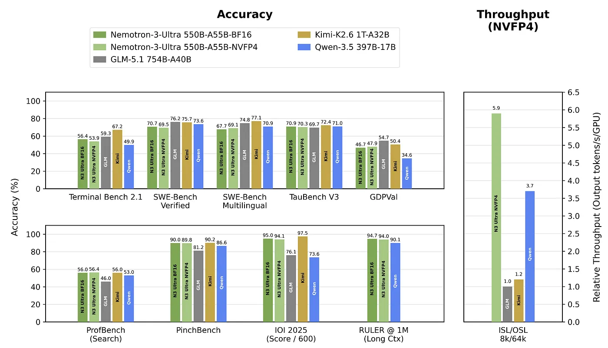
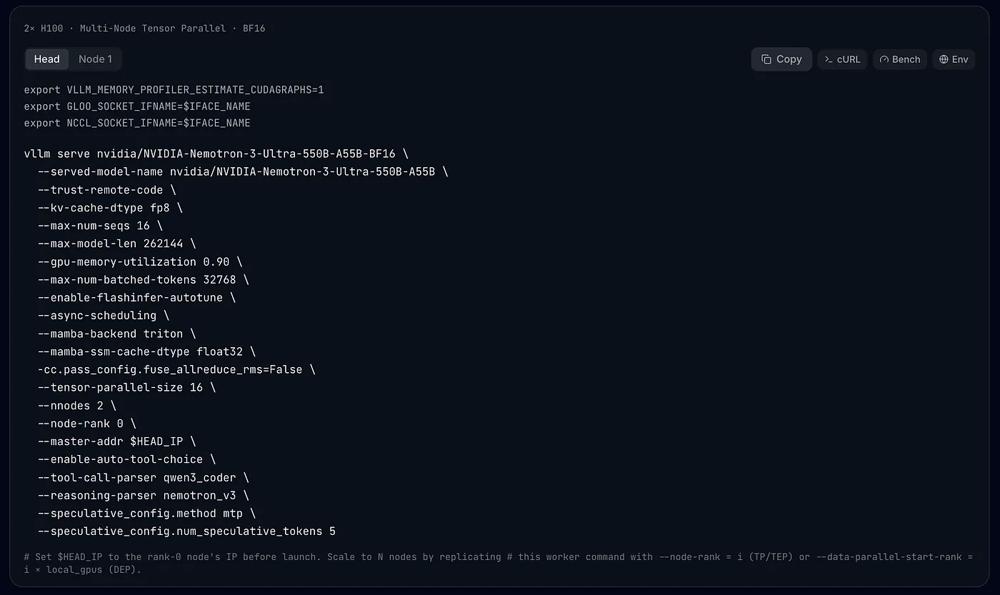
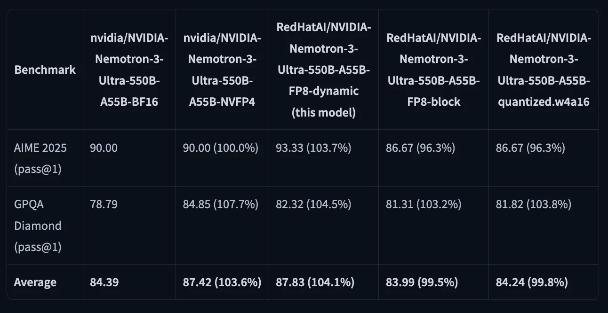
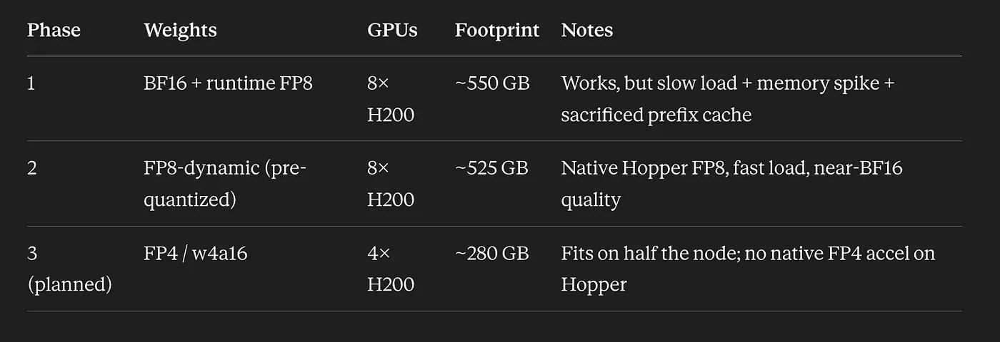

# Squeezing a 550B Model onto a Single Node: Our Nemotron-3-Ultra Journey on 8× H200

**Author:** [Shivank Chaudhary](https://www.linkedin.com/in/shivank1128/)

**Published:** June 10, 2026



We wanted to serve **NVIDIA Nemotron-3-Ultra-550B-A55B** in production. It’s a beast:

- **550B total parameters / 55B active** — a Mixture-of-Experts model
- A hybrid **Mamba-2 + Attention + MoE** architecture with **Multi-Token Prediction (MTP)** speculative decoding
- A native **256K context window**

Our hardware was a single GPU node: **8× NVIDIA H200**, ~140 GiB each, for **~1,123 GiB of total HBM**.

The official recipe for the BF16 checkpoint uses tensor-parallel-size 16 across 2 nodes — because BF16 weights alone are ~1.1 TB (550B × 2 bytes), which leaves no room for caches and activations on one node. We didn't have a second node. So: **can we make this fit on one 8-GPU box?**

Ref: [recipes.vllm.ai — NVIDIA-Nemotron-3-Ultra-550B-A55B-BF16](https://recipes.vllm.ai/nvidia/NVIDIA-Nemotron-3-Ultra-550B-A55B-BF16)



Before the memory fight, it helps to understand what this model actually is — because its architecture is exactly why the memory story plays out the way it does.

## A quick primer: Transformers, Mamba, and MoE

If you've only ever heard "it's a transformer," this model has two more tricks worth knowing.

### Transformers and the KV cache problem

A Transformer processes a sequence using self-attention: every token looks at every other token. That's what makes them so good at recall and in-context reasoning — but it has a cost. Attention is quadratic in sequence length, and at inference time the model caches the keys/values of every past token (the "KV cache") so it doesn't recompute them. The longer your context, the bigger that KV cache grows — and at a 256K context window, that's a lot of memory.

### Mamba: constant-size state instead of a growing cache

Mamba is a State Space Model (SSM). Instead of attending to all past tokens, it carries a fixed-size recurrent state that it updates token by token — closer to how an RNN works, but designed to be parallelizable and hardware-efficient. The payoff:

- Linear scaling with sequence length (not quadratic)
- A constant-size state per sequence, no matter how long the context — no ever-growing KV cache

The downside: a pure SSM can be weaker at precise long-range recall (the thing attention is great at).

### The hybrid: best of both

Nemotron-3-Ultra is a hybrid (the "Nemotron-H" lineage): it's mostly Mamba-2 layers with a few attention layers sprinkled in. You get Mamba's cheap, long-context efficiency for the bulk of the network, plus attention's sharp recall where it matters most. This is why the model has both a "Mamba cache" (the SSM state) and a small KV cache (for the attention layers) — and why both show up as memory knobs later.

### MoE: 550B of knowledge, 55B of compute

Finally, the Mixture-of-Experts (MoE) part. Instead of one giant dense feed-forward block per layer, an MoE layer has many smaller "expert" blocks and a router that sends each token to just a few of them. That's the "550B total / 55B active" split: the model holds 550B parameters, but any single token only activates ~55B of them.

Here's the crucial infra consequence: **MoE saves compute, not memory.** Every expert's weights must still live in HBM, because any token might need any expert. So the full 550B of weights occupy GPU memory regardless — which makes the weight footprint the dominant cost, and weight quantization the single biggest lever for fitting on fewer/smaller GPUs.

And MTP (Multi-Token Prediction): the model can predict several future tokens at once, which vLLM uses for speculative decoding to speed up generation.

Keep three things in mind as we go:

1. All 550B weights sit in HBM → quantize the weights to fit.
2. Mamba layers keep per-sequence state small → long context is cheap-ish.
3. A few attention layers still need a KV cache → shrinking it (FP8) buys headroom.

The manifests below are plain Kubernetes — no operator, no Helm. They assume the NVIDIA device plugin is installed and a storage class that supports ReadWriteMany (we use `nfs-csi`).



## Phase 1: Brute-force it onto one node with runtime FP8 + VRAM tricks

If BF16 is too big, quantize the weights. vLLM can do on-the-fly FP8 weight quantization — you still hand it the BF16 checkpoint, but it converts weights to FP8 (1 byte/param) at load. That's ~1.1 TB → ~550 GB, which fits on 8× H200… if you claw back memory everywhere else.

### The VRAM-saving tricks

- `--quantization fp8` — on-the-fly FP8 weight quantization. The biggest win: ~1.1 TB → ~550 GB.
- `--no-enable-prefix-caching` — on this hybrid, prefix caching forces the Mamba cache into a memory-heavy "all" mode that OOM'd us. Disabling it shrinks the persistent cache.
- `--max-num-batched-tokens 8192` — reduced from 32768. This was the allocation that tipped us into OOM; the activation buffer scales with it. Smaller buffer fits, at the cost of long-prompt prefill throughput.
- `--mamba-ssm-cache-dtype float16` — keep the Mamba SSM state in fp16, not fp32, to halve it.
- `--gpu-memory-utilization 0.90` — use 90% of each card.
- `--tensor-parallel-size 8` + `--enable-expert-parallel` — shard across all 8 GPUs, with expert parallelism for the MoE layers.

### Phase 1 manifest (complete)

```yaml
apiVersion: v1
kind: Secret
metadata:
  name: hf-token
  namespace: vllm
type: Opaque
stringData:
  token: "hf_REPLACE_ME"          # HF token;

apiVersion: v1
kind: PersistentVolumeClaim
metadata:
  name: nemotron-550b-bf16-cache
  namespace: vllm
spec:
  accessModes: ["ReadWriteMany"]
  storageClassName: nfs-csi
  resources:
    requests:
      storage: 1200Gi

apiVersion: apps/v1
kind: Deployment
metadata:
  name: nemotron-550b-bf16
  namespace: vllm
spec:
  replicas: 1
  strategy:
    type: Recreate                 # single-node, whole-node GPUs: never surge a 2nd pod
  selector:
    matchLabels:
      app: nemotron-550b
  template:
    metadata:
      labels:
        app: nemotron-550b
    spec:
      affinity:
        nodeAffinity:
          requiredDuringSchedulingIgnoredDuringExecution:
            nodeSelectorTerms:
              - matchExpressions:
                  - key: kubernetes.io/hostname
                    operator: In
                    values: ["ihc-gpu-compute-05"]
      containers:
        - name: vllm
          image: vllm/vllm-openai:v0.22.0
          command: ["vllm", "serve", "nvidia/NVIDIA-Nemotron-3-Ultra-550B-A55B-BF16"]
          args:
            - "--served-model-name"
            - "nvidia/NVIDIA-Nemotron-3-Ultra"
            - "--trust-remote-code"
            - "--tensor-parallel-size"
            - "8"
            - "--enable-expert-parallel"
            - "--dtype"
            - "bfloat16"
            - "--quantization"
            - "fp8"                         # on-the-fly weight quantization to fit
            - "--max-model-len"
            - "262144"
            - "--max-num-seqs"
            - "16"
            - "--max-num-batched-tokens"
            - "8192"                        # reduced from 32768 to dodge the OOM allocation
            - "--gpu-memory-utilization"
            - "0.90"
            - "--enable-chunked-prefill"
            - "--no-enable-prefix-caching"  # avoid Mamba "all"-mode cache OOM
            - "--mamba-ssm-cache-dtype"
            - "float16"
            - "--mamba-backend"
            - "flashinfer"
            - "--reasoning-parser"
            - "nemotron_v3"
            - "--enable-auto-tool-choice"
            - "--tool-call-parser"
            - "qwen3_coder"                 # yes — the official tool parser for Nemotron-3
            - "--speculative-config"
            - '{"method": "nemotron_h_mtp", "num_speculative_tokens": 5}'
          ports:
            - containerPort: 8000
          env:
            - name: HF_HOME
              value: /data
            - name: HF_TOKEN
              valueFrom:
                secretKeyRef:
                  name: hf-token
                  key: token
          resources:
            limits:
              nvidia.com/gpu: 8
            requests:
              cpu: "64"
              memory: 512Gi
              nvidia.com/gpu: 8
          volumeMounts:
            - name: cache
              mountPath: /data
            - name: shm
              mountPath: /dev/shm
          startupProbe:                     # ~3h budget: 1.1TB download + quantize + load
            httpGet: { path: /health, port: 8000 }
            initialDelaySeconds: 120
            periodSeconds: 60
            failureThreshold: 180
          readinessProbe:
            httpGet: { path: /health, port: 8000 }
            periodSeconds: 10
          livenessProbe:                    # generous: a restart reloads 550B
            httpGet: { path: /health, port: 8000 }
            periodSeconds: 30
            timeoutSeconds: 10
            failureThreshold: 6
      volumes:
        - name: cache
          persistentVolumeClaim:
            claimName: nemotron-550b-bf16-cache
        - name: shm
          emptyDir:
            medium: Memory
            sizeLimit: 16Gi

apiVersion: v1
kind: Service
metadata:
  name: nemotron-550b
  namespace: vllm
spec:
  selector:
    app: nemotron-550b
  ports:
    - name: http
      port: 80
      targetPort: 8000
```

It worked — but Phase 1 had an ugly underbelly: we downloaded the full ~1.1 TB BF16 checkpoint, quantized it at load time (a load-time memory spike as BF16 weights are materialized then converted), suffered slow cold starts, and gave up prefix caching and prefill batch size just to fit. A working hack, not a clean answer.

## Phase 2: Stop quantizing at runtime — use pre-quantized FP8 weights

On the Hugging Face Hub, RedHatAI publishes pre-quantized variants:

- `RedHatAI/NVIDIA-Nemotron-3-Ultra-550B-A55B-FP8-dynamic`
- `RedHatAI/NVIDIA-Nemotron-3-Ultra-550B-A55B-quantized.w4a16`

The FP8-dynamic checkpoint changed the game. vLLM loads weights that are already FP8 (auto-detected — you don't even pass `--quantization`). That fixes every Phase 1 pain point:

- Smaller download (~525 GB vs ~1.1 TB)
- No load-time quantization spike — weights land in HBM already FP8
- Faster cold starts
- H200-native FP8 tensor cores do the math directly — Hopper's fast path
- Near-BF16 quality, via dynamic per-token activation scaling

And the parsers are quantization-independent: `qwen3_coder` + `nemotron_v3` are unchanged, because quantization touches weights, not the chat template.

### The zero-downtime trick: pre-warm the weights with a 0-GPU Job

The old pod holds all 8 GPUs on our only GPU node. If a new 8-GPU deployment starts before the old one dies, it sits Pending forever — and then suffers a slow 525 GB cold download. So we pull the weights ahead of time, in parallel, with a Job that requests zero GPUs. It schedules anywhere, touches no GPU, and just downloads into the new PVC while production keeps serving.

### Phase 2a manifest — 0-GPU pre-warm Job (complete)

```yaml
apiVersion: v1
kind: PersistentVolumeClaim
metadata:
  name: nemotron-550b-fp8-cache
  namespace: vllm
spec:
  accessModes: ["ReadWriteMany"]
  storageClassName: nfs-csi
  resources:
    requests:
      storage: 1200Gi

apiVersion: batch/v1
kind: Job
metadata:
  name: nemotron-550b-fp8-prewarm
  namespace: vllm
spec:
  backoffLimit: 4
  template:
    spec:
      restartPolicy: OnFailure
      # No GPU requested -> schedules off the GPU node; the PVC is RWX/NFS so the
      # GPU node can read these weights later. This pod only downloads.
      containers:
        - name: weight-puller
          image: vllm/vllm-openai:v0.22.0
          command: ["/bin/sh", "-c"]
          args:
            - >-
              set -eu;
              pip install -q hf_transfer 2>/dev/null || true;
              export HF_HUB_ENABLE_HF_TRANSFER=1;
              echo "Downloading ${MODEL_ID} into ${HF_HOME} ...";
              huggingface-cli download "${MODEL_ID}" --repo-type model;
              echo "DOWNLOAD COMPLETE: ${MODEL_ID}";
          env:
            - name: HF_HOME
              value: /data
            - name: MODEL_ID
              value: "RedHatAI/NVIDIA-Nemotron-3-Ultra-550B-A55B-FP8-dynamic"
            - name: HF_TOKEN
              valueFrom:
                secretKeyRef:
                  name: hf-token
                  key: token
          resources:
            requests:
              cpu: "16"
              memory: 32Gi
          volumeMounts:
            - name: cache
              mountPath: /data
      volumes:
        - name: cache
          persistentVolumeClaim:
            claimName: nemotron-550b-fp8-cache
```

When the Job logs `DOWNLOAD COMPLETE`, the weights are warm on the PVC.

### Phase 2b manifest — promote to serving, then sunset the old one (complete)

> *⚠️ **Sequencing:** both deployments pin the same node and want 8 GPUs. Delete/scale the old deployment first to free the GPUs, then apply this. The warm PVC means it starts fast.*

```yaml
apiVersion: apps/v1
kind: Deployment
metadata:
  name: nemotron-550b-fp8
  namespace: vllm
spec:
  replicas: 1
  strategy:
    type: Recreate
  selector:
    matchLabels:
      app: nemotron-550b
  template:
    metadata:
      labels:
        app: nemotron-550b              # same label -> reuses the existing Service
    spec:
      affinity:
        nodeAffinity:
          requiredDuringSchedulingIgnoredDuringExecution:
            nodeSelectorTerms:
              - matchExpressions:
                  - key: kubernetes.io/hostname
                    operator: In
                    values: ["ihc-gpu-compute-05"]
      containers:
        - name: vllm
          image: vllm/vllm-openai:v0.22.0
          command: ["vllm", "serve", "RedHatAI/NVIDIA-Nemotron-3-Ultra-550B-A55B-FP8-dynamic"]
          args:
            - "--served-model-name"
            - "nvidia/NVIDIA-Nemotron-3-Ultra"   # keep old name -> transparent cutover
            - "--trust-remote-code"
            - "--tensor-parallel-size"
            - "8"
            - "--kv-cache-dtype"
            - "fp8"                               # FP8 KV cache -> more headroom
            - "--max-model-len"
            - "262144"
            - "--max-num-seqs"
            - "16"
            - "--max-num-batched-tokens"
            - "32768"                             # back to recipe value; we have room now
            - "--gpu-memory-utilization"
            - "0.90"
            - "--enable-chunked-prefill"
            - "--no-enable-prefix-caching"
            - "--enable-flashinfer-autotune"
            - "--async-scheduling"
            - "--mamba-backend"
            - "triton"
            - "--mamba-ssm-cache-dtype"
            - "float32"
            - "--reasoning-parser"
            - "nemotron_v3"
            - "--enable-auto-tool-choice"
            - "--tool-call-parser"
            - "qwen3_coder"
            - "--speculative_config.method"
            - "mtp"
            - "--speculative_config.num_speculative_tokens"
            - "5"
          # NOTE vs Phase 1: no --quantization (auto-detected), no --dtype, and the
          # flashinfer/float16 Mamba survival-hacks are gone — the FP8 checkpoint
          # freed enough memory that we don't need them.
          ports:
            - containerPort: 8000
          env:
            - name: HF_HOME
              value: /data
            - name: HF_TOKEN
              valueFrom:
                secretKeyRef:
                  name: hf-token
                  key: token
          resources:
            limits:
              nvidia.com/gpu: 8
            requests:
              cpu: "64"
              memory: 512Gi
              nvidia.com/gpu: 8
          volumeMounts:
            - name: cache
              mountPath: /data
            - name: shm
              mountPath: /dev/shm
          startupProbe:
            httpGet: { path: /health, port: 8000 }
            initialDelaySeconds: 60
            periodSeconds: 30
            failureThreshold: 60            # warm PVC -> much faster than Phase 1
          readinessProbe:
            httpGet: { path: /health, port: 8000 }
            periodSeconds: 10
          livenessProbe:
            httpGet: { path: /health, port: 8000 }
            periodSeconds: 30
            timeoutSeconds: 10
            failureThreshold: 6
      volumes:
        - name: cache
          persistentVolumeClaim:
            claimName: nemotron-550b-fp8-cache
        - name: shm
          emptyDir:
            medium: Memory
            sizeLimit: 16Gi
```

## Phase 3 (planned): FP4 weights to run on 4× H200

Phase 2 is clean, but we want to free up GPUs — run on 4× H200 and use the other four elsewhere. That means 4-bit weights:

- `RedHatAI/...quantized.w4a16` — INT4 weight-only
- `nvidia/NVIDIA-Nemotron-3-Ultra-550B-A55B-NVFP4` — NVIDIA's FP4 format

The math is compelling: 4-bit weights are ~280 GB, which fits on 4× H200 (~561 GiB total, ~505 GiB usable at 0.9), leaving ~225 GiB for caches. FP8 (~525 GB) can't fit on 4 cards; FP4 can.

### The catch: NVFP4 is not hardware-accelerated on H200

NVFP4's native tensor-core acceleration requires Blackwell (B200 / GB200). Our H200s are Hopper — native FP8, but no native FP4 math units. So on H200, NVFP4 (or w4a16) runs via dequantization kernels: the 4-bit weights are unpacked to higher precision for the matmul. You get the memory savings (the whole reason to drop to 4 GPUs) but not the FP4 compute speedup Blackwell would give you. In compute-bound regimes, FP4-on-Hopper can even be slower than FP8-on-Hopper, because FP8 hits the silicon directly while FP4 pays a dequant tax.

So Phase 3 is a deliberate trade: fit on 4 GPUs (FP4, no native accel) vs. peak throughput on 8 GPUs (FP8, native Hopper accel).

### Phase 3 manifest (complete)

```yaml
apiVersion: v1
kind: PersistentVolumeClaim
metadata:
  name: nemotron-550b-fp4-cache
  namespace: vllm
spec:
  accessModes: ["ReadWriteMany"]
  storageClassName: nfs-csi
  resources:
    requests:
      storage: 600Gi                  # ~280 GB of 4-bit weights

apiVersion: apps/v1
kind: Deployment
metadata:
  name: nemotron-550b-fp4
  namespace: vllm
spec:
  replicas: 1
  strategy:
    type: Recreate
  selector:
    matchLabels:
      app: nemotron-550b-fp4
  template:
    metadata:
      labels:
        app: nemotron-550b-fp4
    spec:
      affinity:
        nodeAffinity:
          requiredDuringSchedulingIgnoredDuringExecution:
            nodeSelectorTerms:
              - matchExpressions:
                  - key: kubernetes.io/hostname
                    operator: In
                    values: ["ihc-gpu-compute-05"]
      containers:
        - name: vllm
          image: vllm/vllm-openai:v0.22.0
          command: ["vllm", "serve", "RedHatAI/NVIDIA-Nemotron-3-Ultra-550B-A55B-quantized.w4a16"]
          args:
            - "--served-model-name"
            - "nvidia/NVIDIA-Nemotron-3-Ultra"
            - "--trust-remote-code"
            - "--tensor-parallel-size"
            - "4"                         # half the node now
            - "--kv-cache-dtype"
            - "fp8"
            - "--max-model-len"
            - "262144"
            - "--max-num-seqs"
            - "16"
            - "--gpu-memory-utilization"
            - "0.90"
            - "--enable-chunked-prefill"
            - "--no-enable-prefix-caching"
            - "--mamba-backend"
            - "triton"
            - "--reasoning-parser"
            - "nemotron_v3"
            - "--enable-auto-tool-choice"
            - "--tool-call-parser"
            - "qwen3_coder"
            - "--speculative_config.method"
            - "mtp"
            - "--speculative_config.num_speculative_tokens"
            - "5"
          ports:
            - containerPort: 8000
          env:
            - name: HF_HOME
              value: /data
            - name: HF_TOKEN
              valueFrom:
                secretKeyRef:
                  name: hf-token
                  key: token
          resources:
            limits:
              nvidia.com/gpu: 4
            requests:
              cpu: "48"
              memory: 256Gi
              nvidia.com/gpu: 4
          volumeMounts:
            - name: cache
              mountPath: /data
            - name: shm
              mountPath: /dev/shm
          startupProbe:
            httpGet: { path: /health, port: 8000 }
            initialDelaySeconds: 60
            periodSeconds: 30
            failureThreshold: 60
          readinessProbe:
            httpGet: { path: /health, port: 8000 }
            periodSeconds: 10
          livenessProbe:
            httpGet: { path: /health, port: 8000 }
            periodSeconds: 30
            timeoutSeconds: 10
            failureThreshold: 6
      volumes:
        - name: cache
          persistentVolumeClaim:
            claimName: nemotron-550b-fp4-cache
        - name: shm
          emptyDir:
            medium: Memory
            sizeLimit: 16Gi
```

(Use the same 0-GPU pre-warm Job from Phase 2 — just point `MODEL_ID` at the w4a16 or NVFP4 repo and a fresh PVC.)

## Lessons learned

- **Architecture drives the memory story.** MoE keeps all 550B weights in HBM (it saves compute, not memory), so weight quantization is the master lever. The Mamba layers keep per-sequence state tiny; the few attention layers still need a KV cache you can shrink with FP8.
- **Runtime quantization is a survival hack, not a strategy.** It fits the model, but you pay in download size, a load-time spike, and slow cold starts. Pre-quantized checkpoints are strictly better when they exist.
- **Match the quantization to the silicon.** H200 = Hopper = native FP8. FP4 buys you memory (fewer GPUs), not speed on Hopper — native FP4 is a Blackwell feature.
- **Quantization is orthogonal to parsers.** Tool-calling and reasoning parsers key off the chat template, not the weights.
- **Pre-warm with a 0-GPU Job.** Downloading into a PVC while the old model keeps serving turns a terabyte-scale migration into a near-zero-downtime cutover.

PhaseWeightsGPUsFootprintNotes:



From "this needs two nodes" to "this runs on half of one" — that's the power of picking the right quantization for your hardware.

Running large hybrid MoE models on constrained GPU fleets? The checkpoint format is as much an infrastructure decision as a model decision.
