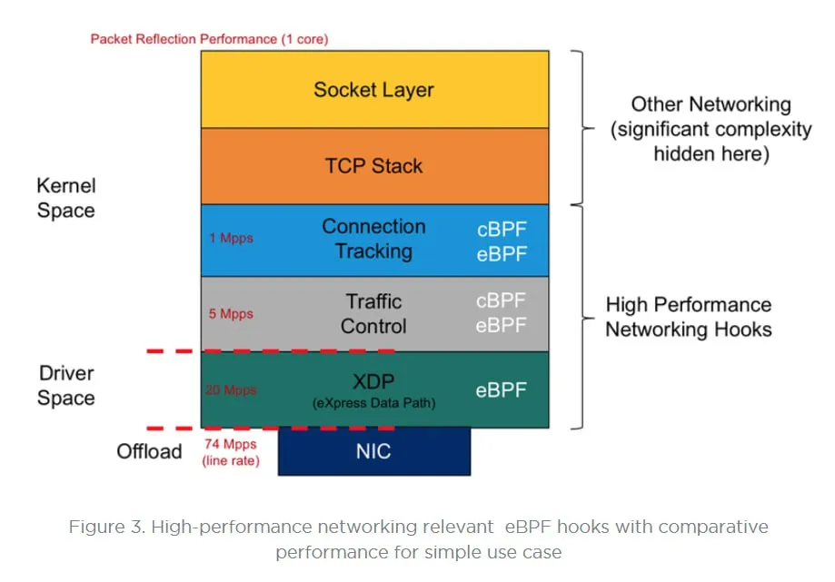
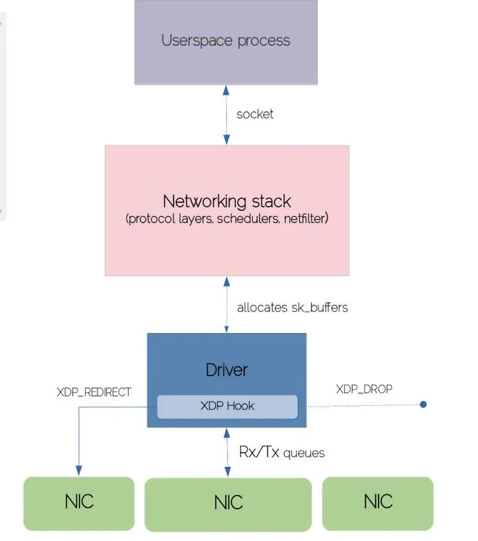

# Unlocking Network Performance with XDP and eBPF

**Author:** [Khushi Chhillar](https://www.linkedin.com/in/kcl17/)

**Published:** June 22, 2023

XDP, eXpress Data Path, is a high-performance networking technology in the Linux kernel that enables fast and efficient packet processing at the earliest stage of the network stack. Operating within kernel space, XDP provides a programmable interface for handling incoming packets directly at the network interface card (NIC), effectively bypassing large portions of the traditional networking stack.

## Why XDP?

XDP (eXpress Data Path) is a Linux kernel technology that empowers developers to attach eBPF programs directly to network device driver hooks, as well as to generic hooks accessible after the device driver processes a packet.

By leveraging kernel bypass, XDP enables high-performance packet processing architectures. It allows eBPF programs to intercept and operate on packets at the earliest possible stage, prior to the kernel network stack, thus minimizing overhead such as context switching, network layer processing, and software interrupts. The eBPF program assumes direct, fine-grained control of the network interface card (NIC), unlocking optimal performance at high network speeds (e.g., 10 Gbps and above).

While XDP delivers industry-leading performance, it introduces certain challenges:

- eBPF programs must independently manage packet parsing and processing, without relying on later kernel features.
- Some functionality may require additional effort when compared to higher-layer kernel hooks.

XDP simplifies the creation of high-speed, programmable networking solutions by enabling direct, low-latency read and write access to packet data, as well as custom forwarding or dropping logic—all before packets enter the traditional kernel network stack.

XDP programs can be attached to a network interface using several models:

- **Generic XDP**: The eBPF program is loaded into the kernel's ordinary path and operates independently of specific NIC hardware support. It provides lower performance but high compatibility—useful for testing or for hardware without XDP driver support.
- **Native XDP**: The program is loaded directly by the supported network card driver as part of its initial receive processing path, unlocking maximum performance for compatible hardware.
- **Offloaded XDP**: The XDP program is loaded onto and executed by the NIC itself, allowing completely CPU-independent packet handling provided the hardware is capable.

## XDP Hooks

XDP programs provide a small but powerful set of verdicts:

- **XDP_DROP**: Immediately drops the packet (ideal for DDoS mitigation and firewall features)
- **XDP_PASS**: Forwards packet into the traditional networking stack (can modify first)
- **XDP_TX**: Forwards (possibly modified) packet back out the same interface
- **XDP_REDIRECT**: Sends the packet directly to another NIC/interface, bypassing the stack

## AF_XDP

AF_XDP sockets allow user-space programs to receive redirected packets and flexibly distribute the traffic to backend processes, servers, or applications. This provides scalable, user-controlled load balancing and traffic processing strategies.

## TC and eBPF

When a packet reaches the Traffic Control (TC) subsystem, it is represented within kernel memory as an `sk_buff` structure—a data structure central to the Linux network stack. eBPF programs attached in TC receive a pointer to this `sk_buff` as the context object and can operate on both inbound (ingress) and outbound (egress) network data.

 

Unlike XDP, where one eBPF program typically runs per interface, TC allows chaining and sequencing of multiple eBPF programs (classifiers) to process packets incrementally. Traffic control is organized into:

- **Classifiers**: Identify and categorize packets based on specified rules.
- **Actions**: Execute specific processing or forwarding operations dependent on classification outcomes.

A series of classifiers and actions are defined as part of a queuing discipline (qdisc). eBPF programs are usually attached as classifiers but can also embed the action directly, with the program's return value determining the next step per Linux `pkt_cls.h` conventions:

- **`TC_ACT_SHOT`**: Drop the packet.
- **`TC_ACT_UNSPEC`**: Behave as if the eBPF program was not executed; proceed to the next classifier if present.
- **`TC_ACT_OK`**: Pass the packet to the subsequent layer in the stack.
- **`TC_ACT_REDIRECT`**: Route the packet to the ingress or egress path of an alternate network interface.

## Use Cases for XDP

**DDoS Mitigation and Firewalling**

- Drop traffic at the earliest point with `XDP_DROP`
- Use eBPF for adaptive, programmable firewall policies
- Deploy standalone (network appliance) or distributed (host node) defender setup

**Load Balancing, Packet Steering, and Analytics**

- XDP in conjunction with AF_XDP is ideal for scalable, programmable load balancers
- Perfect for microsecond latency scenarios and traffic scaling

**Performance Optimization**

- Offloaded XDP pushes the cost of packet processing from CPU to NIC, further maximizing throughput in data centers and edge environments

> XDP in eBPF represents a paradigm shift in networking, offering unprecedented performance, flexibility, and programmability. With its ability to offload packet processing to the NIC level and execute custom eBPF programs, XDP enables new possibilities in terms of speed, efficiency, and network control. From enhancing network performance in data centers to securing network infrastructure and enabling real-time analytics, XDP in eBPF is transforming the way we build and operate networks.
