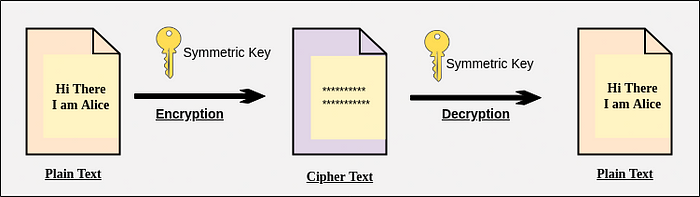

# Introduction To Post-Quantum Cryptography

## WHY POST-QUANTUM CRYPTOGRAPHY??

Before moving to the part WHAT is post-quantum cryptography, let's directly jump into the part WHY post-quantum cryptography and that will be sufficient for you to know the answers to both the questions. So, we have been using symmetric and asymmetric key cryptography for a long time now. But suddenly, why is there a need for post-quantum cryptography, a term that sounds so complicated. Well, you might be thinking that as it contains the word 'quantum' so it must have some connection with 'quantum computers'. And yes you are absolutely correct and for those who don't know what a quantum computer is then a quantum computer is a computer that works on the properties of quantum physics which is on a whole different level when compared with a classical computer, the computer that we use right now, and quantum computers could vastly outperform even our best supercomputers that have been made till now. They can perform very big computations in just a few seconds as they are made of 'qubits'. Think of it in this way: A classical computer is a candle and a quantum computer is a light bulb. You can observe how big the difference is. Quantum computers can perform several things such as searching huge amounts of data in just a few minutes or seconds, can also be used in the medical field and there are many more such examples. BUT there are some side-effects of quantum computers like they can break the current cryptography system which usually uses key-pair for encrypting and decrypting the data. This is when post-quantum cryptography comes into the picture. So, post-quantum cryptography, also known as quantum-safe cryptography, refers to cryptographic algorithms that are thought to be secure against the attack of a quantum computer. We'll take a deep dive into this topic further, but before that let's know more about cryptography, encryption and decryption, and its types.

## CRYPTOGRAPHY AND ITS TYPES

Cryptography is the technique of securing information and communications through the use of codes so that only those persons for whom the information is intended can understand it and process it. Thus preventing unauthorized access to information. The prefix "crypt" means "hidden" and the suffix graphy means "writing".

Let's try to understand it more clearly with the help of the types of cryptography.

There are two types of cryptography that we use currently — Symmetric key cryptography and Asymmetric key cryptography. The main features of cryptography are confidentiality, integrity, and authentication.

### SYMMETRIC KEY CRYPTOGRAPHY (private key cryptography)

It is an encryption system where the sender and receiver of a message use a single common key called shared key/ symmetric key/ shared secret to encrypt and decrypt

messages. Encryption systems like AES and DES are commonly used in symmetric cryptography and they are considered to be secured right now. The problem in this cryptography is that the sender and receiver have to somehow exchange key in a secure manner. When we encrypt any data with a key then the data is converted into ciphered data and now no one will be able to read this ciphered data as it will be converted into nonreadable form and then we use the same key to decrypt this ciphered data into the original data which was in a readable form.

### ASYMMETRIC KEY CRYPTOGRAPHY (public-key cryptography)

In this cryptography instead of using a single key, we now use key pairs. Now both the sender and receiver will carry two-two keys i.e. Public key and the Secret Key(Private key) on both sides, which means now there will be a total of four numbers of keys. As the name suggests public key will be known to everyone and the secret key or private key will remain secret i.e. will be known only to the person carrying it. The sender will now use the public key of the receiver to encrypt the data and since the data is encrypted with the public key of the receiver, only the secret key of the receiver will be able to decrypt it.

Asymmetric key cryptography uses RSA and ECC for encryption and decryption purposes which is now really vulnerable against quantum computers. Quantum computers performing Shor's Algorithm can easily break such methods. Although AES(that we used in symmetric cryptography) is still considered to be secure, there are many fields where we use asymmetric key cryptography as it has some special features such as digital signatures. BLOCKCHAIN also uses asymmetric key cryptography. So, now we need a solution for this problem. Here's when POST-QUANTUM CRYPTOGRAPHY comes into the picture.

## POST-QUANTUM CRYPTOGRAPHY

NIST (National Institute Of Standards and Technology) started its Post-Quantum Cryptography Standardization program with 69 selected algorithms in its first round, which after the third round is now left with only 7 finalists and 8 alternate algorithms.

The main algorithms were lattice-based, code-based, multivariate, hash-based, and Isogeny based cryptography. The final seven algorithms consist of 4 key encapsulation mechanisms(KEM) and 3 signature algorithms. Out of 4 algorithms of KEM, 3 are from the lattice-based family: Kyber, NTRU, and SABER whereas McEliece is from the code-based family. Currently, Kyber is amongst the top contenders. Let's see what happens in its Key Encapsulation Mechanism:

Firstly the key generation process is performed which creates a public key and a secret key. Then the sender performs the ENCAPSULATION process and takes the receiver's public key which then creates two different things: a SHARED SECRET(ss1) and a CIPHER TEXT(ct). Now the receiver takes this ciphertext and DECAPSULATES it with his/her own secret key and this process also creates a Shared Secret(ss2). If both the shared secrets are equal i.e. ss1 = ss2 then the verified process has been done. This is how the key encapsulation mechanism is performed.

There are also some other processes that are performed in this whole Kyber mechanism and will definitely look into that in some other articles. We'll also see some other lattice-based algorithms and signature algorithms in some other articles.