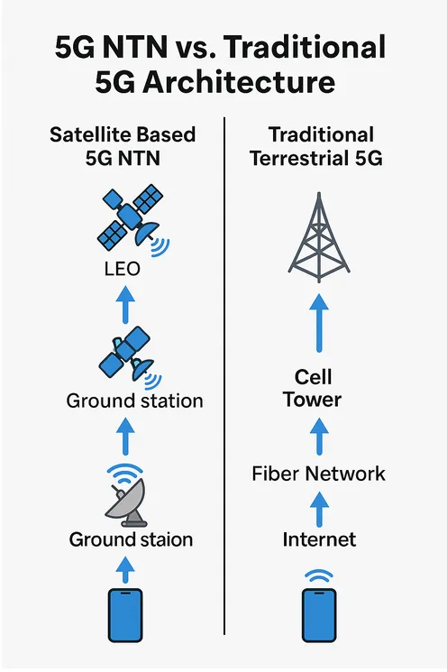
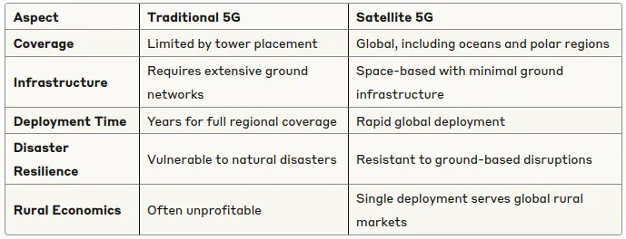

# LEO Satellites Powering the Future of Global 5G Connectivity

**Author:** [Khushi Chhillar](https://www.linkedin.com/in/kcl17/)

**Published:** June 19, 2025

> *Part 1 of 5: Space Internet Series*

## Overview

Satellite-based 5G networks represent a fundamental shift in telecommunications infrastructure, utilizing Low Earth Orbit (LEO) satellites to provide global connectivity. This transformation addresses the coverage limitations of terrestrial networks while enabling direct device communication through space-based infrastructure.

## The Great Connectivity Divide

A significant portion of the global population remains digitally isolated despite widespread reference to the “connected age.” In the United States, for example, the rural-urban gap for 5G availability widened to 10.3 percentage points in Q2 2023.

Traditional cell towers face inherent physical limitations with a typical coverage radius of 1 to 4 miles, leading to cell coverage of 3 to 50 square miles. While dense urban and suburban areas benefit from this infrastructure, rural regions, mountainous locations, and remote territories are left with persistent coverage gaps, primarily due to the high costs and logistical challenges of terrestrial deployments.

Rather than compensating for these gaps by proliferating ground-based towers across vast terrains, the innovative approach is to deploy them in orbit, creating coverage footprints that stretch across thousands of square miles per satellite.

## Enter the Space-Based Internet Revolution

A new generation of satellites is changing the paradigm of internet connectivity. Unlike traditional satellite internet relying on ground equipment with high latency, modern systems utilize satellites functioning as space-borne cell towers.

A key advancement is the adoption of **Low Earth Orbit (LEO) satellite technology**. If current commercial satellite plans materialize within the next decade, over 65,000 satellites could circle Earth, compared to fewer than 10,000 today. These advanced, compact satellites integrate with existing mobile devices, enabling seamless connections without significant alterations to user equipment.

## What Makes LEO Satellites Game-Changers?

### Altitude Advantage

Conventional satellite services utilize geostationary satellites positioned 35,786 kilometers above Earth, resulting in high latency and weaker signals. LEO satellites, by operating at distances of 550 to 1,200 kilometers, dramatically reduce communication latency and increase signal strength due to proximity.

### Network Coverage Revolution

Operating as a constellation, LEO satellites enable global network coverage by maintaining continuous revolutions around Earth. This creates a “moving mesh” of connectivity — with multiple satellites available at all times to any given location, including over oceans and during flights.

### Direct Device Connection

LEO satellites are capable of enabling direct communication with standard mobile devices. This direct-to-device feature eliminates dependence on terrestrial towers in hard-to-reach locations, significantly enhancing accessibility for unserved and underserved populations.

## How Satellite 5G Actually Works

Satellite-based 5G is distinct from conventional implementations in three main aspects:

### 1. The Signal Path

- **Traditional 5G**: Phone → Cell tower → Fiber network → Internet  
- **Satellite 5G**: Phone → LEO satellite → Ground station → Internet

### 2. The Technology Stack

Satellite 5G leverages 5G New Radio (NR) standards. However, satellites use adaptive beamforming antennas that scan dynamically across the Earth’s surface, adapting resource allocation in real-time based on demand.

### 3. The Coverage Model

LEO constellations form global “edge” locations, positioning computation and connectivity within a millisecond hop of any user, creating dynamic and wide-ranging coverage maps rather than static terrestrial cells.

## The Economic Impact Driving the Revolution

The Low Earth Orbit (LEO) satellite market is projected to accelerate rapidly, with estimates indicating the market will reach $20.69 billion by 2030, up from $11.81 billion in 2025. The shift from building local ground towers toward deploying global satellite infrastructure is driving greater efficiency and exponential scalability.

## Three Types of Satellite Orbits: Understanding the Differences

A technical foundation for the satellite internet era involves understanding satellite orbits:

- **Geostationary Earth Orbit (GEO):** 35,786 km altitude; stationary position, high latency (250–500 ms), mainly used for TV and weather.
- **Medium Earth Orbit (MEO):** 2,000–35,786 km altitude; medium latency (70–100 ms), often used for GPS.
- **Low Earth Orbit (LEO):** 200–2,000 km altitude; very low latency (6–50 ms), strong signal strength, suitable for high-speed internet. Requires large constellations to ensure continuous coverage.

## Real-World Applications: Beyond Just Internet

The application scope of satellite 5G spans many industries, such as:

- **Emergency Services:** Reliable connectivity in disaster-stricken or remote areas
- **Maritime Operations:** High-speed connections for enterprises and travelers at sea
- **Aviation:** Internet access throughout passenger flights
- **Remote Work:** Access for professionals in virtually any location
- **Agricultural IoT:** Real-time monitoring for crops and livestock away from major networks

## The Traditional vs. Satellite 5G Paradigm Shift

## What’s Coming Next in This Series

Upcoming parts of this series will cover:

- **Part 2:** Key industry players — SpaceX Starlink, Amazon’s Project Kuiper, and others pioneering the space internet race  
- **Part 3:** Performance, economics, and deployment: satellite 5G vs. terrestrial internet  
- **Part 4:** Technology and policy challenges of space-based internet  
- **Part 5:** User adoption and preparing for the age of satellite broadband

## The Revolution Has Already Begun

Numerous LEO constellations are in active deployment, bringing reliable high-speed internet to previously unserved populations and revolutionizing the world’s digital backbone. The world is witnessing the start of a paradigm shift from cable and fiber to orbital satellite infrastructure.

The pace, scope, and ultimate impact of this global transformation will be shaped by technological, regulatory, and business factors — but there is no denying that the internet is truly moving to space.

## References

- [LEO Satellite Market Size, Share & Trends, 2025 To 2030 – MarketsandMarkets](https://www.marketsandmarkets.com/Market-Reports/leo-satellite-market-252330251.html)
- [Low Earth Orbit Satellites Market Outlook 2025-2034 – Research and Markets](https://www.researchandmarkets.com/reports/6092920/low-earth-orbit-satellites-market-outlook)
- [The role of satellites in the future of 5G – AccelerComm](https://www.accelercomm.com/news/satellites-role-in-the-future-of-5g)
- [Best Satellite Internet Providers for 2025 – RSINC](https://www.rsinc.com/best-satellite-internet-providers-for-2025.php)
- [Project Kuiper – Amazon's Satellite Internet Initiative](https://www.aboutamazon.in/news/devices/amazon-project-kuiper-satellite-network)
- [Starlink - Wikipedia](https://en.wikipedia.org/wiki/Starlink)
- [5G from space - The role of satellites in 5G | Nokia.com](https://www.nokia.com/thought-leadership/articles/5g-space-satellites/)
