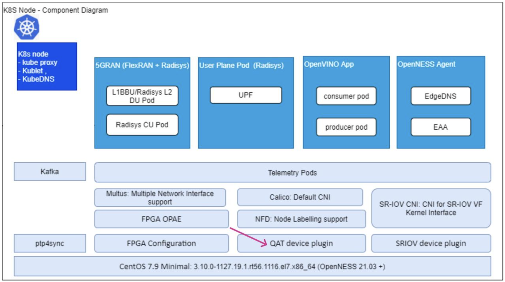
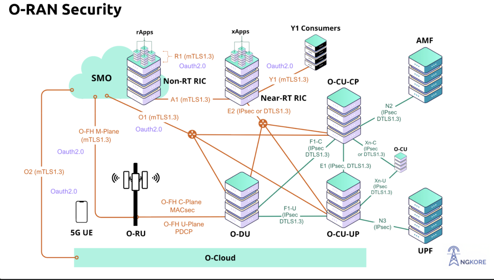
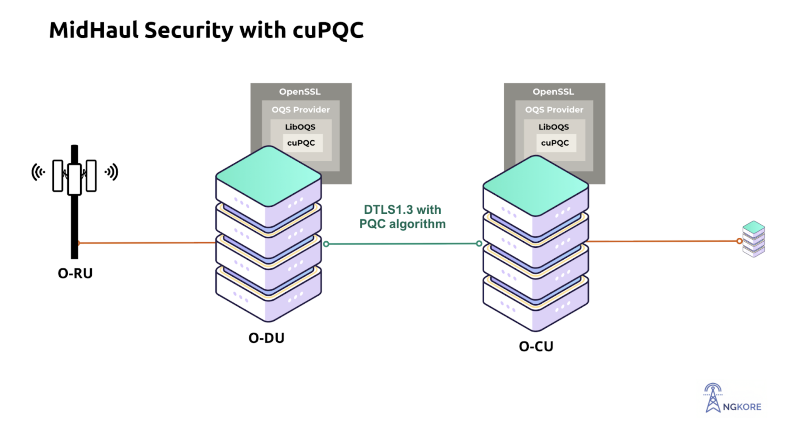

# Making AI-RAN Quantum Safe

**Author:** [Aditya Koranga](https://www.linkedin.com/in/aditya-koranga/), [Megha](https://www.linkedin.com/in/megha-7aa3a0203/), [Shubham Kumar](https://www.linkedin.com/in/chmodshubham/)

**Published:** December 02, 2025

Anyone in telecom is familiar with RAN, and its open and interoperable evolution known as O-RAN or Open RAN. The momentum is accelerating fast. [Recent reports](https://www.mordorintelligence.com/industry-reports/open-ran-market?utm_source=chatgpt.com) estimate the Open RAN market at about **4 to 6.5 billion dollars this year**, with forecasts reaching **20 to 41 billion dollars by 2030**. Its share of the total RAN market, currently 5 to 10 percent, could rise to 30 percent by 2028 according to Dell’Oro Group. Reflecting this confidence, **AT&T is committing 14 billion dollars to shift 70 percent of its wireless traffic to Open RAN by 2026.**

## The Rise of Open RAN

With the rise of Open RAN, workloads that once ran on proprietary hardware began moving to standard COTS servers powered by Intel x86 CPUs. But CPUs alone could not handle everything, especially heavy tasks like Forward Error Correction. To solve this, the industry introduced L1 accelerator cards that offload the most demanding functions, leaving the CPU to manage the rest. A common example is Intel FlexRAN working alongside the ACC100 accelerator. Intel has since introduced several more innovations in L1 acceleration, though those deserve a separate discussion.

 

> **Note for the first time readers who are new to O-RAN:** it's a new, open approach to building mobile networks like 5G. Instead of a single vendor providing all the hardware and software for a cellular site, O-RAN uses open standards to allow different companies to supply interchangeable parts. O-RAN consists of several components and out of them, 3 major ones are - O-RU, O-DU and O-CU.

## The Growing Importance of Security in Open RAN

As Open RAN has gained value over the years, vendors have also turned their attention to its security. In many deployments, you may notice an extra cryptographic accelerator added to protect O-RAN interfaces. For example, in the [Radisys deployment](https://builders.intel.com/docs/networkbuilders/radisys-5g-connect-open-ran-adds-intel-edge-software-for-private-5g-1663890127.pdf) shown below, an Intel QAT accelerator is used for IPsec workloads. QAT delivers powerful cryptographic acceleration, [boosting](https://infohub.delltechnologies.com/nl-nl/p/intel-4th-gen-xeon-featuring-qat-2-0-technology-delivers-massive-performance-uplift-in-common-cipher-suites/) the performance of common cipher suites, and is often integrated with OpenSSL for maximum efficiency.

_Figure: [Radisys 5G Software deployment on Intel Smart Edge Open Environment](https://builders.intel.com/docs/networkbuilders/radisys-5g-connect-open-ran-adds-intel-edge-software-for-private-5g-1663890127.pdf)_

## GPU-Powered RAN: Nvidia Aerial and AI-RAN

Competition in Open RAN has also drawn Nvidia into the field with its Aerial framework. Aerial offers a GPU based alternative to Intel FlexRAN, and it is gaining momentum with the rise of AI-RAN, or Artificial Intelligence Radio Access Network. The shift toward GPUs is driven by the increasing use of AI and machine learning within networks. By running both AI and RAN tasks on a single, shared GPU cloud infrastructure, mobile network operators (MNOs) can significantly improve hardware utilization, reduce capital expenditure (CapEx), and create new revenue streams. This is commonly referred to as "AI-RAN”

### Nvidia AI-Aerial

NVIDIA AI Aerial is a suite of accelerated computing platforms, software, and services for designing, simulating, and operating wireless networks. NVIDIA AI-Aerial contains hardened RAN software libraries for telcos, cloud service providers (CSPs), and enterprises building commercial 5G networks. Academic and industry researchers can access Aerial on cloud or on-premises setups for advanced wireless and AI and machine learning (ML) research for 6G.

## Shifting Security Workloads to GPUs

The growing demand for AI enabled RAN workloads means more processing power is moving to GPUs. In reference Aerial deployments, GPUs like the GH200 handle embedded AI and ML algorithms at L1(cuPHY), along with some Layer 2 functions such as the accelerated scheduler (cuMAC).

 

With RAN becoming faster and smarter on GPUs, it begs the question: if the main RAN workloads are shifting to GPUs, why not move security tasks there too, instead of relying on separate accelerators like Intel QAT?

How can we make AI-RAN or Open RAN secure using GPUs, not just for today’s threats but also against future quantum attacks? The answer lies in GPU accelerated post-quantum cryptography. Does such a solution exist? NVIDIA has stepped in with exactly that, introducing NVIDIA [cuPQC](https://developer.nvidia.com/blog/introducing-nvidia-cupqc-for-gpu-accelerated-post-quantum-cryptography/) to meet this emerging need.

> **Note for the first time readers who don’t know cuPQC:** NVIDIA cuPQC is an SDK of optimized libraries for implementing GPU-accelerated Post-Quantum Cryptography (PQC) workflows—especially crucial in high-throughput data environments.

Now we are ready. All that remains is to analyze the cryptography needs of your AI RAN deployments and integrate the **cuPQC** library in line with Open RAN security specifications. To illustrate, here is a cuPQC backed Quantum Safe MidHaul.

## Implementing Quantum Safe MidHaul using cuPQC

The two most critical components of RAN are the O-DU (Distributed Unit) and O-CU (Central Unit). Securing the interface between them is essential, as any compromise could allow attackers to intercept or manipulate sensitive data. This interface can be protected using either IPsec or DTLS, and for our implementation, we began with DTLS.

 

In this post-quantum setup, **cuPQC** serves as the backend for **liboqs**, which is integrated into OpenSSL via **oqsprovider**. Using a branch of OpenSSL that supports basic functionality of **DTLS 1.3**, cuPQC through liboqs provides accelerated post-quantum algorithms such as **ML-KEM** and **ML-DSA** for a Quantum Safe DTLS.

Behind the scenes, several key processes take place:

- **Quantum-resistant key exchange:** ML-KEM replaces classical elliptic curve cryptography, enabling secure key exchange between the CU and DU even against quantum attacks.

- **Authentication:** ML-DSA, a module-lattice-based digital signature algorithm, generates post-quantum digital signatures to verify identities.

- **CU-DU encryption:** DTLS 1.3 secures communication, preventing eavesdropping and Quantum-in-the-Middle attacks.

- **GPU acceleration:** NVIDIA GH200 handles post-quantum cryptographic operations, reducing handshake latency and encryption overhead, while cuPQC’s integration with liboqs ensures efficient post-quantum performance.

This is just one simple example in RAN to illustrate the concept of GPU accelerated post-quantum cryptography in Open RAN and AI RAN deployments. The broader RAN ecosystem, and future 6G networks, rely on a wide range of security protocols and cryptography.

## Performance and Takeaways

These are not just basic ML-KEM or ML-DSA operations. They are highly secure, performance-oriented PQC algorithms. In fact, our independent benchmarking across various PQC libraries showed that cuPQC consistently delivered the best performance in terms of operations per second.

### ML-KEM Performance

| Algorithm   | Key Generation (Million ops/sec) | Encapsulation (Million ops/sec) | Decapsulation (Million ops/sec) |
| ----------- | -------------------------------- | ------------------------------- | ------------------------------- |
| ML-KEM 512  | 20                               | 18.5                            | 18                              |
| ML-KEM 768  | 13                               | 9                               | 8                               |
| ML-KEM 1024 | 10                               | 7.5                             | 7.5                             |

### ML-DSA Performance

| Algorithm | Key Generation | Signing | Verification |
| --------- | -------------- | ------- | ------------ |
| ML-DSA 44 | 8              | 7.5     | 5.5          |
| ML-DSA 65 | 6.3            | 5.7     | 3.9          |
| ML-DSA 87 | 4.3            | 5.4     | 2.9          |

_[Watch Benchmarking video on Youtube](https://youtu.be/mdnXKroR1wo?si=HAUVmfXIbaJB8dPa)_

 

In the next article, we will dive deeper into telecom security interfaces and protocols, complete with benchmarking numbers for TLS handshakes and more. Stay tuned to see how cutting-edge post-quantum solutions are reshaping the future of secure mobile networks.
