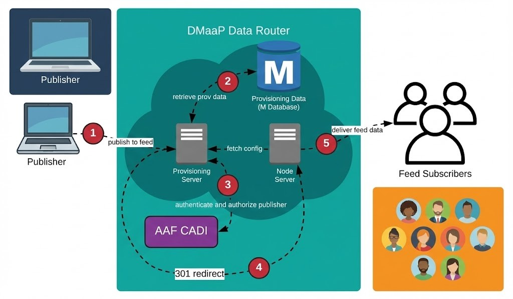
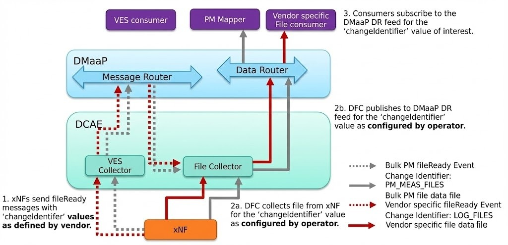
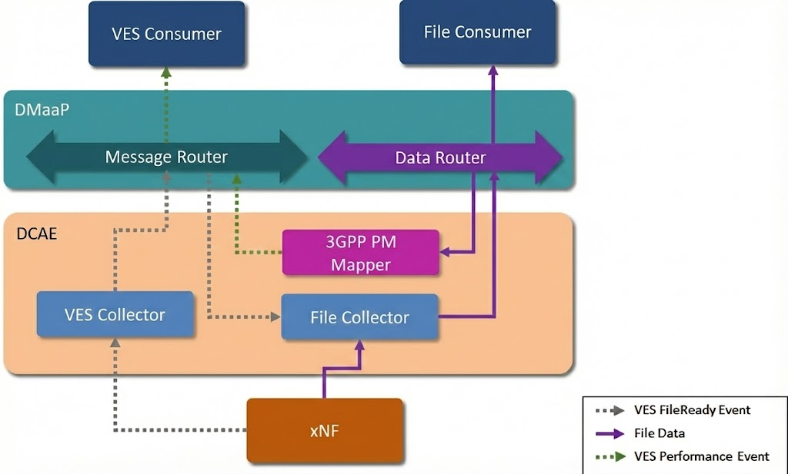
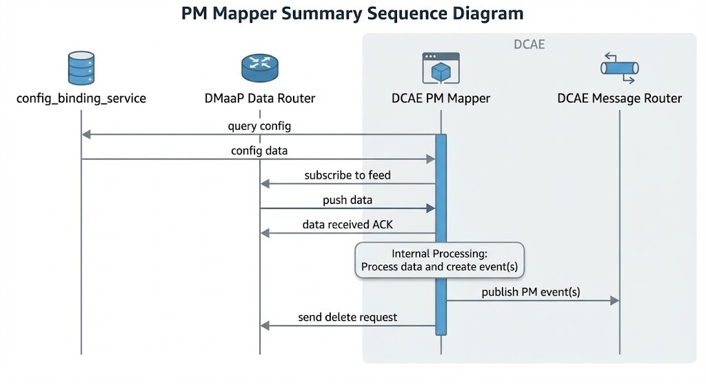
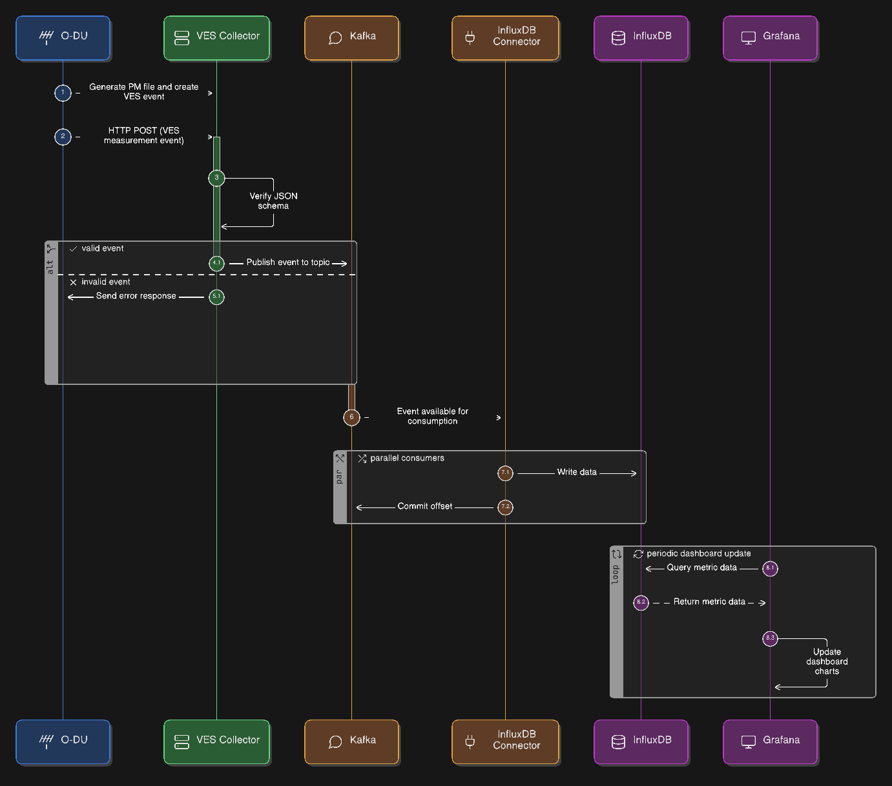
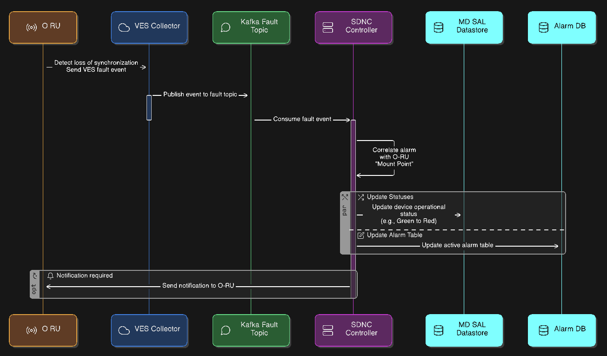
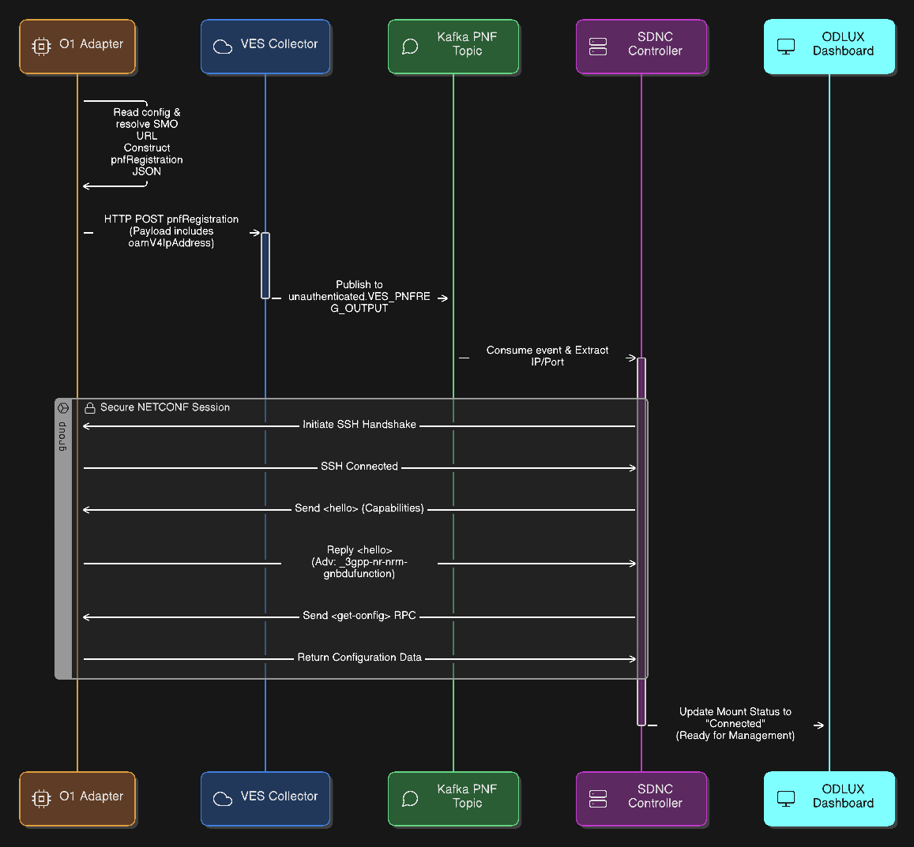
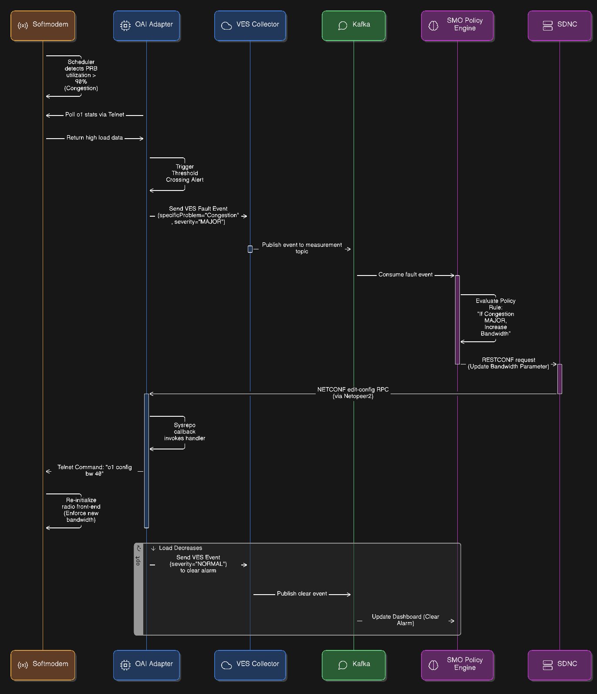

# O-RAN Software Community (OSC) SMO/OAM

**Author:** [Shubham Kumar](https://www.linkedin.com/in/chmodshubham/)

**Published:** December 24, 2025

The O-RAN architecture decomposes the RAN into three distinct functional entities: the Open Central Unit (O-CU), the Open Distributed Unit (O-DU), and the Open Radio Unit (O-RU). While this disaggregation fosters innovation and vendor diversity, it introduces significant complexity in management and orchestration.The Service Management and Orchestration (SMO) framework is designed to handle this complexity. It provides lifecycle management, configuration control, performance monitoring, fault handling, and automation for all RAN components deployed across the O-Cloud.

The [O-RAN Software Community (OSC)](https://o-ran-sc.org/) serves as the open-source implementation arm of the [O-RAN Alliance](https://www.o-ran.org/). Within OSC, the OAM project plays a critical role. It provides the reference software for the administrative and operator functions of the O-RAN architecture. The project does not strictly build from scratch; rather, it integrates and extends mature open-source components from the ONAP (Open Network Automation Platform) ecosystem, specifically the SDN Controller (SDNC) and the Virtual Event Streaming (VES) collector, to create a compliant O1 interface termination point.

However, the OSC OAM goal is not just about connectivity between SMO and RAN elements. The real objective is to enable closed-loop automation, where network telemetry (Performance Management - PM, and Fault Management - FM) flows up to the SMO using VES/HTTP, and intelligent decisions flow down as configuration updates (Configuration Management - CM) via the NETCONF/YANG protocol. This bi-directional control loop is the foundation of the "Intelligent RAN".

## ONAP Components in OSC OAM

The OSC OAM architecture is a distributed system composed of loosely coupled microservices. It heavily utilizes specific ONAP components to create a compliant termination point for the O1 Interface.

<br>

The O1 interface represents the primary management component in the O-RAN architecture. It connects the SMO to the O-CU, O-DU, and Near-RT RIC. It operates in the management plane using standard Internet protocols:

- NETCONF/YANG for synchronous configuration (CM) and
- HTTP/VES for asynchronous notifications (FM, PM) to ensure interoperability between SMO and RAN functions from diverse vendors.

> **Note:**
> Follow this repository ([github/ngkore/OSC-OAM](https://github.com/ngkore/OSC-OAM)) to setup the OSC-OAM on your system.

Below is a snapshot of the kubernetes pods that together form a functional SMO/OAM in a simplified Kubernetes environment (with simpler authentication mechanisms that means no Keycloak and Traefik).


```bash
ubuntu@ubuntu:~/o1-adapter$ kubectl get pods -A
NAMESPACE          NAME                                                READY   STATUS      RESTARTS       AGE
cert-manager       cert-manager-5bd57786d4-vcdxb                       1/1     Running     0              3h32m
cert-manager       cert-manager-cainjector-57657d5754-94vl4            1/1     Running     0              3h32m
cert-manager       cert-manager-webhook-7d9f8748d4-j956r               1/1     Running     0              3h32m
ingress-nginx      ingress-nginx-admission-create-f8wnm                0/1     Completed   0              3h32m
ingress-nginx      ingress-nginx-admission-patch-crqqj                 0/1     Completed   3              3h32m
ingress-nginx      ingress-nginx-controller-65d6d978b-87kpg            1/1     Running     0              3h32m
kube-system        calico-kube-controllers-6b78c44475-v86sb            1/1     Running     0              3h32m
kube-system        canal-wvvb7                                         2/2     Running     0              3h32m
kube-system        coredns-5cd5577cc9-7gq6t                            1/1     Running     0              3h32m
kube-system        coredns-5cd5577cc9-tcr26                            1/1     Running     0              3h32m
kube-system        etcd-ubuntu                                         1/1     Running     0              3h33m
kube-system        kube-apiserver-ubuntu                               1/1     Running     0              3h33m
kube-system        kube-controller-manager-ubuntu                      1/1     Running     0              3h32m
kube-system        kube-proxy-x7brv                                    1/1     Running     0              3h32m
kube-system        kube-scheduler-ubuntu                               1/1     Running     0              3h33m
kube-system        metrics-server-74fbf9b9b4-xcd5j                     1/1     Running     0              3h32m
kube-system        node-local-dns-gf7t6                                1/1     Running     0              3h32m
mariadb-operator   mariadb-operator-844954c944-pnclh                   1/1     Running     0              3h25m
mariadb-operator   mariadb-operator-cert-controller-769886898b-fqxc2   1/1     Running     0              3h25m
mariadb-operator   mariadb-operator-webhook-6768b6799d-2sgxz           1/1     Running     0              3h25m
onap               mariadb-galera-0                                    1/1     Running     0              3h22m
onap               onap-chartmuseum-7bc565d46-jnt47                    1/1     Running     0              3h21m
onap               onap-dcae-datafile-collector-54fb56f757-ckfmf       1/1     Running     0              3h21m
onap               onap-dcae-ms-healthcheck-d7cf866bb-2ntqz            1/1     Running     0              3h21m
onap               onap-dcae-pm-mapper-9f5b6fc74-qggjd                 1/1     Running     0              3h21m
onap               onap-dcae-ves-collector-5f57dcb588-9f4d8            1/1     Running     0              3h21m
onap               onap-dcae-ves-mapper-5dcc6dd778-h2fr2               1/1     Running     0              3h21m
onap               onap-dmaap-dr-mariadb-init-config-job-vrrd7         0/1     Completed   0              3h21m
onap               onap-dmaap-dr-node-0                                1/1     Running     0              3h21m
onap               onap-dmaap-dr-prov-66bf788f8-8scnn                  1/1     Running     0              3h21m
onap               onap-message-router-0                               2/2     Running     0              111m
onap               onap-robot-5c748c57d9-5dp5m                         1/1     Running     0              3h21m
onap               onap-sdnc-0                                         1/1     Running     0              3h21m
onap               onap-sdnc-sdnrdb-init-job-p4bjt                     0/1     Completed   0              3h21m
onap               onap-sdnc-web-6cf9547dbd-hlqdd                      1/1     Running     0              3h21m
onap               onap-strimzi-entity-operator-5b46c475d4-ln8nb       2/2     Running     0              3h22m
onap               onap-strimzi-kafka-0                                1/1     Running     0              3h22m
onap               onap-strimzi-zookeeper-0                            1/1     Running     0              3h23m
strimzi-system     strimzi-cluster-operator-585f6fd995-dfts5           1/1     Running     2 (119m ago)   3h26m
```

The pods described above can be logically grouped into functional layers:

- **Ingress Layer:** `ingress-nginx-controller`, `cert-manager`.
- **Control Layer:** `onap-sdnc` (SDN Controller), `onap-sdnc-web` (ODLUX Dashboard), `mariadb-galera` (Database).
- **DCAE Layer (Data Collection):** `onap-dcae-ves-collector`, `onap-dcae-ves-mapper`, `onap-dcae-datafile-collector`, `onap-dcae-pm-mapper`, `onap-dcae-ms-healthcheck`.
- **DMaaP / Messaging Layer:** `onap-strimzi-entity-operator`, `onap-strimzi-kafka`, `onap-strimzi-zookeeper`, `onap-dmaap-dr-node`, `onap-dmaap-dr-prov`, `onap-message-router`.
- **Support Layer:** `onap-robot` (Testing), `onap-chartmuseum` (Helm Repo).

### SDN Controller (SDNC)

The heart of the configuration management capability in the SMO is the SDN Controller. In the OSC distribution, this is a specific instantiation of the ONAP SDNC, which is itself built upon the OpenDaylight (ODL) platform.

- The primary function of the SDNC in the O1 context is to act as the **NETCONF Client**. It maintains persistent Secure Shell (SSH) or TLS connections to the southbound managed elements (O-DUs, O-CUs). Through these connections, it performs the following critical operations:

  - **Capability Discovery**: During the NETCONF "Hello" exchange, the SDNC discovers which YANG modules are supported by the device.
  - **Configuration Push**: It translates high-level network intents into `edit-config` RPC calls to modify the device's (DU, CU) running configuration.
  - **Synchronization**: It periodically issues `get-config` calls to ensure its internal view of the network matches the actual device state.

- OpenDaylight utilizes the Model-Driven Service Abstraction Layer (MD-SAL) to maintain two logical data stores: the "Config" datastore representing the desired state and the "Operational" datastore representing the actual state reported by the device. Any divergence between these two MD-SAL stores often signals a synchronization failure or a device malfunction.

- To ensure survival across restarts, a MariaDB database container is deployed alongside the SDNC to provide persistent storage for topological data, device credentials, and historical configuration states.

**ODLUX (SDNC Dashboard)**

The `onap-sdnc-web` pod hosts **ODLUX**, the User Experience framework from the LFN OpenDaylight project, serving as the primary graphical dashboard for the SMO. It functions as the visual front-end for the SDN Controller, allowing operators to visualize and manage the network without relying solely on API calls.

Through this interface, operators can perform critical tasks such as managing mount points to connect or disconnect devices like O-DUs via NETCONF, inspecting the MD-SAL datastores to compare desired versus actual device states, and viewing the network topology to monitor health status. In standard deployments, external traffic is routed to this service via the Ingress controller using the `/odlux` path.

### Virtual Event Streaming (VES) Collector

While the SDNC handles bidirectional configuration, the VES Collector is the ingress point for unidirectional, high-volume telemetry data. It is a high-performance Java application (typically Spring Boot based) designed to accept HTTP POST requests containing JSON payloads.

- It exposes a RESTful API, typically at endpoints like `/eventListener/v7`, supporting both HTTP and HTTPS, with HTTPS being mandatory for secure O-RAN deployments that utilize mutual TLS (mTLS) for device authentication.

- A critical function of the collector is input validation, where it uses a repository of JSON Schemas (the VES Common Event Format) to validate every incoming event against mandatory headers and domain-specific fields. Invalid events are rejected at the edge to prevent data corruption downstream, ensuring that only valid data enters the system.

- The collector does not process the events itself but focuses solely on ingestion and publishing to the message bus, allowing it to scale horizontally and handle thousands of events per second without bottlenecks.

In essence, the VES Collector functions as a RESTful ingestion point for JSON messages, verifying the source and validating events against the VES schema before distributing them to the DMaaP MR topics.

### Message Bus and Data Movement (Kafka / DMaaP)

The operational intelligence of the SMO relies on a robust message bus to decouple data producers from consumers. In ONAP, this layer is referred to as DMaaP (Data Movement as a Platform), which acts as an abstraction layer over Apache Kafka.

<br>

While the legacy DMaaP Message Router (MR) has been deprecated in the New Delhi release in favor of Strimzi and Kafka, the Data Router (DR) remains a critical component for transporting large bulk files, such as XML performance logs, across the cluster.

> **Note:**
> The Data Router itself is scheduled for deprecation in the Oslo release.

#### Data Router (DR) Architecture

The Data Router functions as an asynchronous buffer between producers (like the VES Collector) and consumers (like the PM Mapper). It uses an Eclipse Jetty server for its frontend and relies on a MariaDB instance for storage.



Its core components include:

- **Provisioning Node** (`dmaap-dr-prov`): Handles all requests to create feeds and subscribers.
- **Data Node** (`dmaap-dr-node`): Manages the actual publication and delivery of data files to subscribers.
- **Storage (MariaDB)**: Stores provisioning data (feed and subscriber definitions) and historical logging data regarding feed activity (publish/delivery logs) for monitoring purposes.

To ensure efficient data consumption, telemetry flows are segregated into specific Kafka topics. This allows components like the SDNC to subscribe only to relevant events:

- `unauthenticated.VES_PNFREG_OUTPUT`: Reserved for PNF Registration events. Triggers SDNC to mount new devices.
- `unauthenticated.SEC_FAULT_OUTPUT`: Dedicated to alarm and fault notifications.
- `unauthenticated.SEC_MEASUREMENT_OUTPUT`: Dedicated to high-volume Performance Measurement (PM) data.
- `unauthenticated.VES_NOTIFICATION_OUTPUT`: General state change notifications.

With the deprecation of the DMaaP Bus Controller, the logic for provisioning feeds has moved directly into the application layer using the [Data Router Provisioning Client](https://gerrit.onap.org/r/gitweb?p=dmaap/datarouter.git;a=blob;f=datarouter-prov-client/README.md) (`drprov-client`). This client runs as a Kubernetes `initContainer` for DCAE applications. It interacts directly with the DR Provisioning API. It queries to see if a required Feed or Subscription already exists (based on name, version, or credentials). If the resource is missing, the client creates it; if it exists, the client retrieves the info and configures the application.

#### Bulk File Processing Pipeline

The retrieval and processing of bulk telemetry files is handled by a coordinated pipeline involving the DataFile Collector and the PM Mapper.

<br>

**DataFile Collector (DFC)**

The process begins when the DFC receives a `fileReady` event via the Message Router (sent from xNF via VES) in the JSON format. Upon this trigger, the DFC connects to the network function (DU, CU) using secure protocols like SFTP, FTPES, or HTTP/HTTPS to retrieve the file. It utilizes a `changeIdentifier` parameter to map file types to the appropriate Data Router feeds and subsequently publishes the downloaded file to the Data Router. The DFC includes built-in retry logic that attempts to recover from failures with increasing delays before eventually logging an error and discarding the file.



**PM Mapper**

Once the files are in the Data Router, the [PM Mapper](https://docs.onap.org/projects/onap-dcaegen2/en/latest/sections/services/pm-mapper/architecture.html) consumes the 3GPP XML files for to standardizes them. It filters the telemetry data based on configuration to reduce volume, converting it into the VES format, and publishing the result back to the Message Router.



To handle high loads, the mapper supports parallel processing. One can use these environment variables to tune performance:

- `PROCESSING_LIMIT_RATE` (optional, default value: 1) allows to limit the rate of processing files through channel.
- `THREADS_MULTIPLIER` (optional, default value: 1) - allows to specify multiplier to calculate the amount of threads.
- `PROCESSING_THREADS_COUNT` (optional, default value: number of threads available to JVM) allows to specify number of threads that will be used for files processing.



**VES-Mapper**

Different VNF vendors generate event and telemetry data in different formats. It is not necessary for all VNF vendors to support VES format. [VES-mapper](https://docs.onap.org/projects/onap-dcaegen2/en/latest/sections/services/mapper/index.html) acts as a generic adapter to convert non-standard formats (e.g., SNMP, RESTConf) of event and telemetry data into the VES structure and publishes converted data to DMaaP for consumption by DCAE analytics apps.

> **Note:**
> Currently mapping files are available for SNMP collector and RESTConf collector only.

**Healthcheck**

A service container that exposes a Web API to verify that all DCAE platform and service components are in a "ready" state within Kubernetes .

### Persistence and Visualization Stack (InfluxDB & Grafana)

To make the telemetry data human-readable and historically analyzable, the SMO includes a time-series storage and visualization stack.

- **InfluxDB Connector**: This is a specialized microservice (often written in Python or Go) that acts as a Kafka consumer. It subscribes to the measurement topics, parses the VES JSON structures, and flattens the data into a format suitable for InfluxDB (Time, Measurement Name, Tags, Fields).

- **InfluxDB**: A high-performance time-series database optimized for write-heavy workloads. It stores the raw counter data (e.g., `active_ues`, `throughput_dl`) indexed by time.

- **Grafana**: The visualization layer connects to InfluxDB as a data source. The OSC OAM project often distributes pre-provisioned Grafana dashboards (via JSON import) that visualize standard O-RAN metrics, providing operators with an immediate view of network health upon deployment.

### Identity Management (Keycloak)

The entry point to the SMO's administrative functions is guarded by an Identity Provider (IdP). The OSC implementation utilizes Keycloak, an open-source identity and access management solution.

- Keycloak manages the creation of realms, users, and roles (e.g., "admin," "operator"). It issues OpenID Connect (OIDC) tokens that are required to access the SMO's northbound APIs and its graphical user interface.
- Upon deployment, a Python script (`config.py`) is typically executed to pre-provision the Keycloak realm with the necessary users and service accounts required by the SDNC and other components to authenticate against each other.
- The SDN Controller and the web dashboard are configured as OIDC clients, delegating all authentication logic to Keycloak. This ensures a Single Sign-On (SSO) experience across the various tools in the SMO stack.

### API Gateway (Traefik)

To present a unified interface to the external world and manage SSL termination, a reverse proxy is employed. Traefik routes incoming traffic based on URL paths to the appropriate backend container. For example, traffic to `/odlux` is routed to the SDNC's web interface, while traffic to `/auth` goes to Keycloak. This simplifies the network configuration for the operator, who only needs to expose a single port (usually 443) to the external network.

## Data Flows

Some example operational and data workflows within the OSC OAM/SMO environment are described below.

### Telemetry Ingestion Pipeline

1. O-DU generates a performance measurement file, parses it, and creates a VES measurement event.
2. Then, O-DU sends an `HTTP` POST to the VES Collector's URL.
3. The VES Collector verifies the JSON schema.
4. The event is published to the measurement Kafka topic.
5. The InfluxDB Connector consumes the event from Kafka and writes it to InfluxDB.
6. Grafana queries InfluxDB and updates the dashboard charts.



### Alarm Correlation Pipeline

1. O-RU detects a loss of synchronization and sends a VES fault event.
2. The event flows through the VES Collector to the fault Kafka topic.
3. The SDNC subscribes to this topic.
4. The SDNC correlates this alarm with the specific "Mount Point" representing that O-RU. It updates the device's operational status in MD-SAL (e.g., from Green to Red) and updates the active alarm table in MariaDB.



### PNF Registration

1. The O1 Adapter (e.g. OAI) reads its local configuration to identify the SMO VES Collector URL.
2. The adapter constructs the `pnfRegistration` JSON payload, specifically populating the `oamV4IpAddress` field with its own container IP address.
3. The O1 Adapter sends the event via `HTTP` `POST` to the VES Collector.
4. The VES Collector validates the JSON schema and publishes the validated event to the Kafka topic `unauthenticated.VES_PNFREG_OUTPUT`.
5. The SDNC Controller consumes the registration event from Kafka and parses the JSON to extract the target PNF's IP address and Port.
6. The SDNC initiates the connection by establishing a secure SSH handshake tunnel with the O1 Adapter.
7. Both sides exchange `<hello>` messages to declare their capabilities and supported YANG modules.
8. During this exchange, the O1 Adapter specifically advertises support for the `_3gpp-nr-nrm-gnbdufunction` module.
9. The SDNC completes the sequence by requesting the current configuration to synchronize the device state.



Example, `pnfRegistration` event payload sent by the OAI O1 Adapter:

```bash
"event": {
        "commonEventHeader": {
            "domain": "pnfRegistration",
            "eventId": "ManagedElement=gNB-Eurecom-5GNRBox-00001_pnfRegistration",
            "eventName": "pnfRegistration_OAI_pnfRegistration",
            "eventType": "OAI_pnfRegistration",
            "sequence": 0,
            "priority": "Low",
            "reportingEntityId": "",
            "reportingEntityName": "ManagedElement=gNB-Eurecom-5GNRBox-00001",
            "sourceId": "3584",
            "sourceName": "gNB-Eurecom-5GNRBox-00001",
            "startEpochMicrosec": 1766518876484213,
            "lastEpochMicrosec": 1766518876484213,
            "nfNamingCode": "001",
            "nfVendorName": "OpenAirInterface Software Alliance",
            "timeZoneOffset": "+00:00",
            "version": "4.1",
            "vesEventListenerVersion": "7.2.1"
        },
        "pnfRegistrationFields": {
            "pnfRegistrationFieldsVersion": "2.1",
            "lastServiceDate": "2021-03-26",
            "macAddress": "00:00:00:00:00:00",
            "manufactureDate": "2021-01-16",
            "modelNumber": "nr-softmodem",
            "oamV4IpAddress": "10.156.217.243",
            "serialNumber": "OpenAirInterface Software Alliance-gNB-10.156.217.243-nr-softmodem",
            "softwareVersion": "2.3.5",
            "unitFamily": "OpenAirInterface Software Alliance-gNB",
            "unitType": "gNB",
            "vendorName": "OpenAirInterface Software Alliance",
            "additionalFields": {
                "oamPort": "1830",
                "protocol": "SSH",
                "username": "netconf",
                "password": "netconf!",
                "reconnectOnChangedSchema": "false",
                "sleep-factor": "1.5",
                "tcpOnly": "false",
                "connectionTimeout": "20000",
                "maxConnectionAttempts": "100",
                "betweenAttemptsTimeout": "2000",
                "keepaliveDelay": "120"
            }
        }
```

### Closed-Loop Automation

1. The OAI softmodem's scheduler detects that Physical Resource Block (PRB) utilization has exceeded 90%, identifying a state of congestion.
2. The OAI Adapter polls the `o1` stats via telnet, observes the high load, and triggers a threshold crossing logic.
3. The adapter generates and sends a VES fault event with `specificProblem` set to "Congestion" and `severity` set to "MAJOR".
4. The SMO (or a Non-RT RIC rApp) consumes this fault event from Kafka, where the policy engine triggers the rule to increase bandwidth.
5. The SMO sends a RESTCONF request to the SDNC to update the bandwidth parameter.
6. The SDNC translates this request into a NETCONF `edit-config` RPC and transmits it to the OAI Adapter.
7. The OAI Adapter receives the RPC via Netopeer2, where the Sysrepo callback invokes the internal handler.
8. The handler executes the command `o1 config bw 40` (MHz) via telnet to the softmodem.
9. The softmodem re-initializes the radio front-end to enforce the new bandwidth configuration.
10. Once the load decreases, the adapter sends a subsequent VES event with `severity` set to "NORMAL" to clear the alarm on the SMO dashboard.


