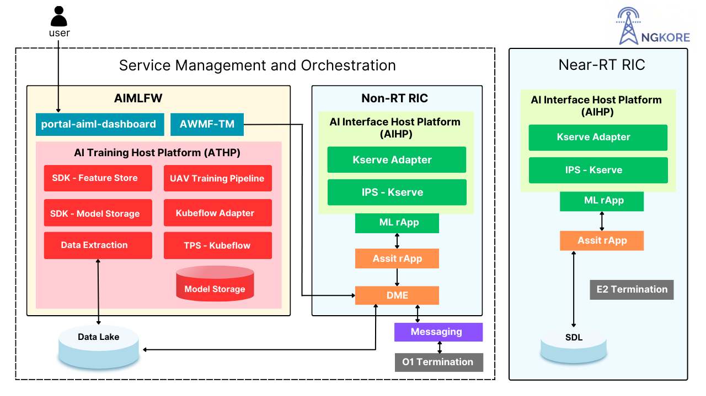

# UAV Path Prediction Using AI/ML Framework in Distributed ORAN Architecture

**Author:** [Nitin Rajput](https://www.linkedin.com/in/nitin-rajput-3a321114b/)

**Published:** October 27, 2024

Unmanned Aerial Vehicles (UAVs) are becoming essential in a range of applications, from surveillance and delivery to search and rescue missions. The ability to predict UAV paths accurately enhances both the effectiveness and safety of these missions, especially in complex environments or when connectivity is critical. Integrating UAV path prediction within the distributed Open Radio Access Network (O-RAN) architecture offers a powerful solution for managing UAV networks and ensuring real-time data flow, high reliability, and low latency.

In O-RAN, AI-driven path prediction can leverage the flexibility of disaggregated network components to dynamically adjust to UAV flight paths, helping meet the high-performance standards necessary for UAV operations. By combining O-RAN's open, intelligent, and software-defined nature with advanced AI/ML models, operators can enhance UAV navigation, optimize resource allocation, and improve response times in critical applications.

Readers can also view our video of deploying and running a UAV path prediction model in the distributed ORAN Architecture:

This blog explores how UAV path prediction fits within the O-RAN architecture, what technological components it utilizes, practical benefits it can bring to various UAV-powered operations and some of its use cases.

### Dynamic RAN Optimization

UAVs depend on a continuous, reliable connection to fulfill their tasks effectively, which can be challenging to maintain due to their mobility and unpredictable flight paths. Path prediction for UAVs offers a valuable solution by enabling the Radio Access Network (RAN) to dynamically adjust critical parameters like beamforming, frequency allocation, and handovers. These adjustments ensure that UAVs maintain stable, high-quality communication links even as they traverse various airspaces and encounter potential network disruptions.

Within the O-RAN architecture, we first need a host to train our model, in our case we have used the Near-Real-Time RAN Intelligent Controller (Near-RT RIC).

By using path prediction models, the Near-RT RIC can make proactive adjustments based on the anticipated location of the UAV. This foresight allows the RAN to allocate resources more effectively and respond to connectivity needs in advance, reducing latency and improving overall network performance. As a result, UAVs can maintain consistent communication and mission reliability, whether they’re conducting surveillance, performing deliveries, or assisting in search and rescue operations.

### Network Slicing and QoS Assurance

UAV path prediction is crucial in enabling effective network slicing, a critical feature for prioritizing and managing diverse UAV operations. Network slicing allows the operator to create virtual, dedicated network segments with custom attributes, like latency, bandwidth, and reliability depending on the use case. This flexibility is especially valuable in emergency response situations, where UAVs might require high-priority network slices to ensure real-time data transmission with minimal latency and high data rates.

Using UAV path prediction, dynamic network slices can adjust to the anticipated demands of each UAV based on its predicted path. For instance, if a drone is heading into an area requiring more intensive data processing or secure, uninterrupted transmission (e.g., during a search and rescue mission), the RAN can allocate resources accordingly, enhancing both service quality and responsiveness. This proactive slicing approach also improves Quality of Service (QoS) by ensuring that UAVs consistently receive the necessary connectivity to perform mission-critical tasks, irrespective of network traffic conditions or geographical limitations.

### Improved Resource Allocation and Energy Efficiency

Accurate UAV path prediction enables the RAN to fine-tune power settings and allocate connectivity resources more efficiently, preventing unnecessary handovers and frequent radio signal adjustments. This targeted approach minimizes resource wastage by reducing the frequency of network recalibrations, which are otherwise needed to maintain connectivity with moving UAVs. By optimizing these network interactions, the RAN ensures smoother operations for UAVs, especially in complex or high-density environments.

In the O-RAN framework, path prediction data also supports energy conservation across both UAVs and network equipment. By anticipating UAV trajectories, the network can adapt its power requirements and minimize radio resource consumption, enhancing the sustainability of UAV missions and reducing operational costs. For UAVs, this translates to less onboard energy consumption, which is particularly valuable for extending flight duration in battery-limited drones. Likewise, the RAN can reduce the workload on its hardware, enhancing the longevity and energy efficiency of its infrastructure.

### Support for Multi-UAV Coordination

In scenarios where multiple UAVs operate simultaneously, effective path prediction becomes essential for coordinated UAV movements, reducing interference, and ensuring optimal resource allocation. With accurate path predictions, the O-RAN can facilitate coordination among UAVs, avoiding potential communication bottlenecks or overlapping coverage zones that might lead to network congestion. This is especially valuable in applications like search-and-rescue missions or disaster response, where multiple UAVs are deployed within a shared airspace, each carrying out distinct tasks but relying on the same network.

By analyzing and predicting each UAV’s path, we can dynamically allocate resources to prevent congestion and prioritize UAVs engaged in mission-critical tasks, such as identifying survivors or delivering emergency supplies. This coordination is managed through the RIC, which can assign resources, adjust network parameters, and reroute UAVs as needed based on predicted trajectories and real-time mission demands.

### Integration of AI/ML Models for Prediction

The O-RAN architecture’s flexible, open framework enables the integration of AI/ML models within the Non-Real-Time RAN Intelligent Controller (Non-RT RIC) for advanced UAV path prediction. These AI/ML models are designed for long-term learning, allowing them to analyze and adapt to various factors influencing UAV operations, such as flight patterns, network congestion levels, and environmental conditions.

By continuously learning from these data sources, AI/ML models generate highly accurate predictions about UAV trajectories and connectivity demands. This predictive information is then communicated to the Near-Real-Time RIC (Near-RT RIC) for immediate, dynamic adjustments within the network. For example, if a model anticipates increased network load due to multiple UAVs operating in the same airspace, the Near-RT RIC can proactively manage resources to prevent bottlenecks, reducing latency and improving network reliability.

Through this integration, O-RAN leverages both historical insights and real-time adaptability, creating a system that optimizes the connectivity experience for UAVs based on anticipated patterns. This AI-driven approach not only enhances network performance but also strengthens the adaptability of UAV operations, making it well-suited for demanding applications like surveillance, logistics, and critical response missions.

## Use Cases of UAV Path Prediction in Next Generation Networks

The UAV path prediction in the next generation networks, offer a myriad of use cases, some of them include:

Path prediction for UAVs within the O-RAN framework opens up powerful military applications, enhancing mission effectiveness and connectivity in complex environments.

### Key Military Use Cases

1. **Surveillance & Reconnaissance:** Path prediction helps UAVs maintain low-latency connectivity and avoid detection in hostile areas. Predictive adjustments ensure continuous data relay for real-time insights in high-stakes missions.
2. **Tactical Coordination:** Predicting UAV paths enables coordination among multiple UAVs, reducing communication interference and optimizing coverage for efficient resource allocation across vast areas.
3. **Resource & Connectivity Optimization:** The Near-RT RIC dynamically adapts to predicted paths, securing high-priority network slices in mission-critical zones, ensuring uninterrupted communication for seamless situational awareness.

The integration of AI-driven path prediction with O-RAN is revolutionizing UAV-based military operations, providing resilient, adaptive connectivity in next-gen network environments.

### Search and Rescue Operations

In search and rescue missions, especially in disaster zones, UAV path prediction supports efficient area coverage and coordination. Predictive models guide UAVs to high-priority search zones while reducing overlap and enhancing the coverage area. This allows teams to locate people or resources faster and deliver critical supplies where needed, making path prediction essential for saving time and improving rescue outcomes.

### Emergency Response and Medical Deliveries

When delivering medical supplies or responding to emergencies, stable network connectivity is crucial. UAV path prediction enables accurate routing, ensuring UAVs maintain high-priority network slices and avoid congested areas. This minimizes delays and ensures that UAVs reach destinations swiftly, enhancing response times and potentially saving lives in critical situations.

### Logistics and Delivery Services

In logistics, path prediction helps UAVs navigate complex delivery routes, avoiding obstacles and optimizing travel time. Predictive pathing reduces fuel consumption and improves delivery accuracy, enabling UAVs to consistently meet deadlines. With better route planning, logistics companies can offer more reliable delivery services and reduce operational expenses.

### Environmental Monitoring and Wildlife Protection

For environmental monitoring, UAV path prediction aids in covering large areas like forests, oceans, or wildlife reserves, where connectivity may be sparse. Predicted paths allow for minimal interference with natural habitats, while enabling continuous data collection even in remote locations. This approach provides critical insights into environmental changes and supports wildlife protection efforts by allowing more strategic and non-intrusive UAV deployments.

In conclusion, UAV path prediction integrated within the O-RAN architecture represents an important advancement in next generation networks. This synergy of AI and O-RAN creates a dynamic framework, meeting the evolving demands of UAV applications in military, emergency response, logistics, and environmental monitoring. As next-generation networks continue to evolve, UAV path prediction will play an integral role in advancing connectivity, reliability, and the efficiency of UAV-based missions.
