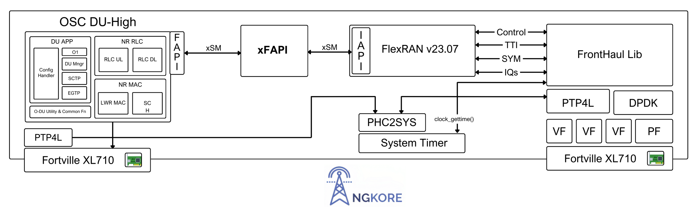
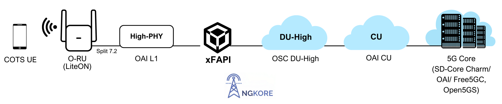

# Open RAN (O-RAN) Interoperability with xFAPI

**Author:** [Vipin Rathi](https://in.linkedin.com/in/vipratos) & [Shubham Kumar](https://www.linkedin.com/in/chmodshubham/)

**Published:** March 27, 2025

> *Part 3 of 3: xFAPI Series*

Achieving interoperability within Open RAN (O-RAN) frameworks requires robust integration between Layer 1 (L1) and Layer 2 (L2) components. xFAPI serves as an essential intermediate component, bridging these layers effectively and ensuring seamless communication across diverse deployment scenarios.

For deeper insights, refer to our previous blogs:

1. Challenges in L1-L2 Interoperability within O-RAN
2. Understanding xFAPI: Bridging L1 and L2 Layers of O-RAN

## Current Interoperability Testing with xFAPI

xFAPI has undergone comprehensive end-to-end interoperability testing across two key topologies:

### Topology 1: FlexRAN Integration
xFAPI has successfully demonstrated interoperability by establishing end-to-end connectivity between OSC DU-High and FlexRAN (versions v22.11 and v23.07).

**Deployment Stack:** 
Any 3GPP-Compliant 5G Core +  CU +  OSC DU-High + xFAPI + FlexRAN v22.11/v23.07 + LiteON +COTS UE

 

**Scenario 1**: Single Server Deployment

In this scenario, FlexRAN, xFAPI, and OSC DU-High operate on the same server. xFAPI effectively facilitates communication using the xSM interface on both L1 and L2 sides.

 

**Scenario 2:** Disaggregated L1-L2 Deployment

In this scenario, FlexRAN and xFAPI are deployed on one server, with OSC DU-High running independently on another. Here, xFAPI uses the xSM interface at the L1 side and the nFAPI interface at the L2 side to enable effective communication.

 

### Topology 2: OpenAirInterface (OAI) Integration
To further broaden its interoperability, xFAPI is undergoing modifications to support the nFAPI interface at the L1 side, thus facilitating successful connectivity between OSC DU-High and OAI L1.

**Deployment Stack:** 
Any 3GPP-Compliant 5G Core +  OAI CU + OSC DU-High + xFAPI + OAI L1 + LiteON + COTS UE

 

**Scenario 1:** Single Server Deployment

Here, OAI L1, xFAPI, and OSC DU-High are hosted together on a single server. xFAPI ensures connectivity by employing the nFAPI interface on the L1 side and the xSM interface on the L2 side.

 

**Scenario 2:** Disaggregated L1-L2 Deployment

In this configuration, OAI L1 runs separately on one server, while xFAPI and OSC DU-High are hosted on another. xFAPI implements the nFAPI interface at the L1 side and the xSM interface at the L2 side to facilitate seamless interoperability.

 

These tested topologies highlight xFAPI’s capacity to build an interoperable environment, significantly enhancing collaboration opportunities for diverse L1-L2 vendors within the O-RAN ecosystem.

Stay tuned for our upcoming blog, where we will explore how xFAPI’s evolving capabilities could extend further support to additional L1-L2 vendors and open-source stacks, promoting an even more resilient interoperable ecosystem.