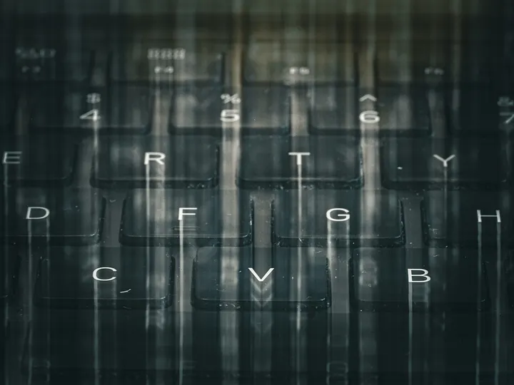
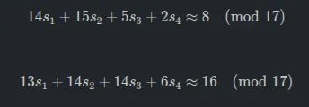
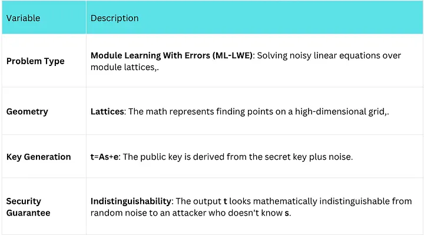
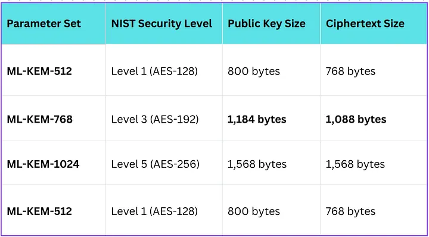

# FIPS-203
_The New Handshake: Understanding ML-KEM (FIPS 203)_

If the digital world has a “heartbeat,” it is the cryptographic handshake the split-second exchange that occurs every time you visit a secure website, send an encrypted message, or log into a bank. For decades, this heartbeat has relied on RSA and Elliptic Curve Cryptography (ECC).

However, the impending arrival of **Cryptographically Relevant Quantum Computers (CRQCs**) threatens to stop that heartbeat by shattering the mathematical problems RSA and ECC rely on.

Enter **ML-KEM**.

Officially finalized by NIST in August 2024 as **FIPS 203**, ML-KEM is the algorithm selected to protect the world’s secrets from the quantum threat. It is not just an upgrade; it is a fundamental replacement of the mathematical machinery that secures the internet.

Here is a deep dive into what ML-KEM is, how it works, and why it is the crown jewel of NIST’s post-quantum standardization.

## 1. What is ML-KEM?

ML-KEM stands for **Module-Lattice-Based Key-Encapsulation Mechanism**.

Before standardization, it was known as **CRYSTALS-Kyber**. NIST selected it as the primary standard for general encryption because of its potent combination of security and speed.

It is a “KEM,” not just “Encryption”

In classical RSA, you could technically encrypt a message directly with a public key. ML-KEM works differently. It is a Key Encapsulation Mechanism.

• **The Goal**: Two parties (Alice and Bob) need to agree on a shared secret (like a symmetric session key) over an insecure channel.

• **The Process**: Alice generates a public/private key pair. Bob uses Alice’s public key to “encapsulate” a shared secret, creating a “ciphertext.” He sends this to Alice, who uses her private key to “decapsulate” it, recovering the same shared secret.

This mechanism effectively replaces the Diffie-Hellman (DH) and ECDH key exchanges used in protocols like TLS (Transport Layer Security).

## 2. Maths Behind ML-KEM

While classical cryptography (like RSA) relies on the formula for factoring large numbers (N=p×q), ML-KEM relies on **linear algebra over rings** and the Module Learning With Errors (ML-LWE) problem.

Here is a breakdown of the mathematical formulas and concepts that drive ML-KEM.

## 1. The Core Equation: t:=As+e
The fundamental formula for generating a public key in ML-KEM is a matrix equation involving “noise.” It looks like a standard linear algebra equation, but with a twist.

The formula is generally represented as: t=As+e(modq)

• **A (The Matrix)**: A public matrix of polynomials. This acts as a grid or coordinate system,.

• **s (The Secret)**: A vector of secret polynomials (the private key).

• **e (The Error)**: A vector of small, random “error” polynomials (noise).

• **t (The Public Key)**: The resulting vector, which serves as the public key.

**Why this formula matters**: In standard algebra, if you knew A and t, you could easily solve for s using Gaussian elimination. However, because the small error term e is added, the equation becomes “noisy.” Solving for s becomes computationally infeasible for both classical and quantum computers because the noise masks the exact location of the solution on the lattice grid .

## 2. The “Arena”: Polynomial Rings (Rq​)

Unlike RSA, which does math using massive integers, ML-KEM performs these calculations using **polynomials**.

The operations take place in a specific mathematical structure called a ring, denoted as Rq​: Rq​=Zq​[X]/(Xn+1)

• Zq​: The coefficients of the polynomials are integers modulo q.

• Xn+1: When you multiply polynomials, if the power of X exceeds n, it wraps around (reduces) based on this formula.

• n=256: In ML-KEM, the degree of the polynomials (n) is typically fixed at 256.

This structure allows the algorithm to be extremely efficient. Instead of doing heavy integer multiplication, the computer is essentially performing operations on arrays of 256 small numbers.

## 3. Conceptual Example: Noisy Linear Equations

To visualize the math without the complex polynomials, you can look at the **scalar LWE problem** (the simplified ancestor of ML-KEM). The problem asks an attacker to solve a system of linear equations that are only “approximately” correct.

As described in the sources, an LWE input might look like this system of approximate equations modulo 17:

The goal is to recover the secret numbers s1​,s2​,s3​,s4​. Without the “≈” (the error), this is trivial high-school algebra. With the error, it becomes a hard lattice problem that resists quantum attack.

## 3. The Engine: Module Lattices

**Why is ML-KEM resistant to quantum computers when RSA is not?**

RSA relies on integer factorization: taking a massive number and finding its prime factors. A quantum computer running Shor’s Algorithm can solve this effortlessly.

ML-KEM relies on **Module Lattices**, specifically the hardness of the **Module Learning With Errors (ML-LWE)** problem.

- **The Math**: Imagine a massive grid of points in hundreds of dimensions. If you take a point on that grid and slightly “jitter” it by adding random noise (error), determining the original grid point becomes incredibly difficult.

- **The Quantum Resistance**: While quantum computers are great at finding “periods” (which breaks RSA), they are not significantly better than classical computers at solving these noisy, high-dimensional lattice vector problems.

## 4. The Specs: Speed vs. Size

The transition to Post-Quantum Cryptography (PQC) involves a trade-off. We are trading bandwidth for security. ML-KEM keys are larger than the tiny ECC keys we use today, but they are surprisingly fast.

**Key Sizes**

ML-KEM is defined in three parameter sets, corresponding to different security levels (AES-128, AES-192, and AES-256 equivalent).

• **Comparison**: An RSA-2048 public key is roughly 256 bytes. An ML-KEM-768 public key is roughly 1.2 KB. While this is larger, it is small enough to fit inside a single standard TCP packet (usually ~1500 bytes), avoiding the severe fragmentation issues seen with other post-quantum algorithms like McEliece (which has keys in the megabytes).

**Performance**

Despite the larger size, ML-KEM is computationally lightweight.

• **Encapsulation/Decapsulation**: In many benchmarks, ML-KEM is actually faster than RSA and comparable to Elliptic Curve Diffie-Hellman (ECDH).

**CPU Load**: The operations involve polynomial math that is very efficient for modern CPUs. Decapsulating a key with ML-KEM is significantly less CPU-intensive than the heavy exponentiation required to decrypt with RSA.

## 5. Implementation: The “Hybrid” Transition
You should not expect to switch to ML-KEM overnight and abandon classical crypto immediately. The industry standard is currently Hybrid Mode.

Because ML-KEM is relatively new compared to RSA (which has been scrutinized for decades), engineers are cautious. In a hybrid handshake (e.g., in TLS 1.3), the browser and server establish two shared secrets:

1. One using classical X25519 (Elliptic Curve).

2. One using **ML-KEM**.

They mix these secrets together. If ML-KEM turns out to have a bug, the classical encryption still protects the data. If a quantum computer attacks, the ML-KEM layer protects the data.

This is critical to deploy now because of the **“Harvest Now, Decrypt Later”** threat. Attackers are recording encrypted traffic today, waiting for a quantum computer to exist in the future to break it. Implementing ML-KEM today protects current traffic from that future destiny.

## 6. Why ML-KEM Won (And what lost)
NIST didn’t just pick ML-KEM; they evaluated dozens of candidates.

• **The Winner (ML-KEM)**: It offered the best balance of small key sizes and incredibly fast operation.

• **The Backup (HQC)**: NIST selected HQC (Hamming Quasi-Cyclic) as a backup for KEMs. It uses “Code-Based” cryptography rather than lattices. If a mathematical breakthrough ever breaks Lattices, the world will switch to HQC.

• **The Loser (SIKE)**: A promising candidate called SIKE (Supersingular Isometry Key Encapsulation) was broken by a classical computer in roughly one hour during the later rounds of the competition, proving why backups and rigorous testing are essential.

### Conclusion
ML-KEM (FIPS 203) is the new standard for digital confidentiality. It represents a shift from number theory (primes) to geometry (lattices). While the keys are slightly heavier, the algorithm is efficient, robust, and ready for deployment.

## An Analogy: The Foggy Orchard 
To understand why ML-KEM is quantum-resistant while RSA is not, imagine you are trying to hide a treasure.

**RSA** is like hiding the treasure in a safe protected by a massive multiplication problem. Classical computers are like thieves trying to guess the combination by turning the dial one tick at a time it takes forever. A Quantum computer, however, is like a thief with a specialized stethoscope (Shor’s algorithm) that can hear the tumblers click into place, opening the safe in minutes.

**ML-KEM (Lattices)** is like hiding the treasure in a massive, infinite apple orchard (a lattice). You give the recipient a map to the specific tree, but you add “noise.” You tell them, “Go to row 10,000, tree 500, and then walk 3.2 steps north and 1.5 steps east.” Because the grid is hundreds of dimensions deep (not just rows and columns), and because you added that random noise (the “steps” off the grid), finding the exact original tree is an absolute nightmare.

Crucially, the “stethoscope” that the Quantum Thief used on the RSA safe **does not work here**. Being able to hear tumblers doesn’t help you navigate a noisy, multi-dimensional forest. Both the classical thief and the quantum thief are equally lost in the lattice.

