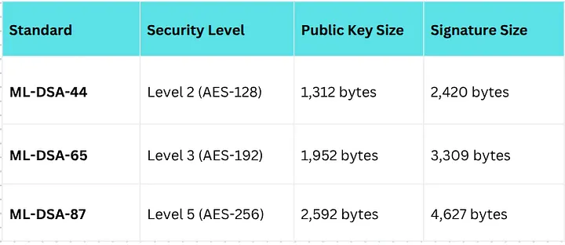

# FIPS-204

**Author:** [Khushi Chhillar](https://www.linkedin.com/in/kcl17/)

**Published:** December 21, 2025

## Introduction

In our previous exploration of ML-KEM, we discussed how we encrypt data in a post-quantum world. But encryption is only half the battle. We also need to prove who we are. From the padlock icon in your browser (TLS) to the software updates on your phone, Digital Signatures ensure authenticity and integrity. Currently, the world runs on RSA and Elliptic Curve Digital Signature Algorithm (ECDSA). Both will be broken by Shor’s Algorithm.

 

NIST’s answer to this threat is **FIPS 204**, also known as **ML-DSA (Module-Lattice-Based Digital Signature Algorithm)**. Formerly known as **CRYSTALS-Dilithium**, this algorithm is now the primary workhorse for verifying digital identity in the post-quantum era.

ML-DSA comes in **three** levels – **ML-DSA 44, ML-DSA 65, and ML-DSA 87**. Each one targets a different **NIST** security level, which basically means how much an attacker would need to break it, even with a quantum computer. The **higher the level, the stronger the protection, but it also means bigger keys and slower performance**.

## Lattice-Based Fiat-Shamir

While RSA relies on the difficulty of factoring large numbers (N=p×q), ML-DSA relies on the hardness of finding short vectors in high-dimensional lattices. Specifically, it solves the **Module Learning With Errors (ML-LWE)** and **Module Short Integer Solution (Module-SIS) problems**.

 

ML-DSA is constructed using a cryptographic paradigm called **Fiat-Shamir with Aborts**. To understand how this works, we have to look at the three-step interaction it simulates:

1. **Commitment**: The signer generates a random vector derived from the message and their secret key.

2. **Challenge**: A hash function creates a “challenge” based on that commitment.

3. **Response**: The signer calculates a response vector to satisfy the challenge.

### What is a Rejection Sampling ?

The unique mathematical twist in ML-DSA is the “Aborts” mechanism. In classical lattice schemes, simply outputting the response vector would often leak statistical information about the signer’s **Secret Key** because the signature would essentially map the shape of the secret lattice key. To prevent this, ML-DSA uses **Rejection Sampling**.

- The signer calculates a potential signature.

- They check if this signature falls within a specific, “safe” statistical distribution (essentially checking if the vector is “short” enough and doesn’t reveal the secret key’s geometry).

- If the signature leaks too much info (it is “unsafe”), the signer aborts, picks a new random value, and tries again.

- This cycle repeats until a safe signature is produced.

**The Result**: The final signature is mathematically independent of the secret key’s geometry, making it secure against both classical and quantum analysis.

## Trade-off of Size vs. Speed

If you are accustomed to the tiny 64-byte signatures of ECDSA, ML-DSA will look massive. However, what we lose in bandwidth, we gain in verification speed.

### Parameter Sets

NIST has standardized three security levels for ML-DSA, corresponding to AES strengths:

### Performance Asymmetry

The defining characteristic of ML-DSA is its **asymmetry in speed**:

- **Signing**: Moderately fast. It involves the “rejection sampling” loop mentioned above, so it might take a few attempts to generate a valid signature. However, on modern hardware, this still happens in microseconds ~roughly 75 microseconds for Level 5.

- **Verification**: Extremely fast. Verifying an ML-DSA signature involves simple matrix-vector multiplication and hashing. Benchmarks show it is often **20x faster** than verifying an ECDSA signature.

**Why this matters**: In high-traffic environments like a secure web server (TLS), the server does the signing (slower), but millions of clients (phones, laptops) do the verifying. ML-DSA is optimized exactly for this, making the client-side experience very snappy despite the larger data size.

## Why ML-DSA Won? (and what it replaces?)

NIST selected ML-DSA as the primary standard for general-purpose digital signatures.

- **Replacing RSA & ECDSA**: ML-DSA is the intended replacement for the vast majority of use cases: TLS certificates, document signing, and code signing.

- **vs. SLH-DSA (SPHINCS+)**: NIST also standardized SLH-DSA (FIPS 205). However, SLH-DSA is stateless and hash-based. While its public keys are tiny (32 bytes), its signatures are massive (variable, but up to 40KB) and it is significantly slower. ML-DSA is the preferred choice for performance.

- **vs. FN-DSA (Falcon)**: Another lattice algorithm, FN-DSA (upcoming FIPS 206), offers smaller signatures (~666 bytes) but is notoriously difficult to implement correctly due to complex floating-point arithmetic (Gaussian sampling) that is prone to side-channel attacks. ML-DSA was chosen as primary because it is easier to implement securely.

## Implementation Challenges

Migrating to ML-DSA introduces specific engineering hurdles that did not exist with RSA or ECC.

1. **Packet Fragmentation & size** :An ML-DSA-65 signature is 3.3 KB. This exceeds the standard Maximum Transmission Unit (MTU) of roughly 1,500 bytes for a network packet.

   - **Impact**: Protocols like UDP (used in DNSSEC) do not handle fragmentation well. A single signature will now span multiple packets, increasing the risk of packet loss and latency.

2. **Handling “Aborts”**: Developers implementing the algorithm from scratch (rather than using a library like OpenQuantumSafe) must be careful with the rejection sampling loop.

   - **Risk**: If the code takes a different amount of time depending on why it aborted or how many times it looped, it could create a **timing side-channel** that allows an attacker to deduce the secret key. Constant-time implementation is critical.

## Conclusion

ML-DSA (FIPS 204) is a lattice-based beast. It trades the compact elegance of Elliptic Curves for the brute-force geometric security of Module Lattices. While the keys and signatures are significantly “heavier” (measured in Kilobytes rather than Bytes), the blazing fast verification speed makes it a worthy successor to the throne of digital identity.

## Analogy: The “Crop” Technique

To understand the **Rejection Sampling** (Aborts) mechanism in ML-DSA:

 

Imagine you are trying to prove to someone that you are in a specific city (your Secret Key) by sending them a photo (the Signature), but you **cannot** let them know your exact GPS location.

1. **The Attempt**: You take a wide-angle photo of yourself.

2. **The Check**: Before sending it, you look at the background. Does it show a specific street sign or landmark that reveals exactly where you are?

3. **The Abort**: If the photo reveals too much (it falls into the “unsafe” distribution), you delete it (abort). You walk a few blocks over (add randomness) and take another photo.

4. **The Success**: Eventually, you get a photo that proves you are in the city (it satisfies the math) but looks generic enough that it doesn’t reveal your secret coordinates.

ML-DSA does this mathematically discarding any signature that looks too much like the secret lattice key, ensuring the final output looks like random noise to an attacker.
