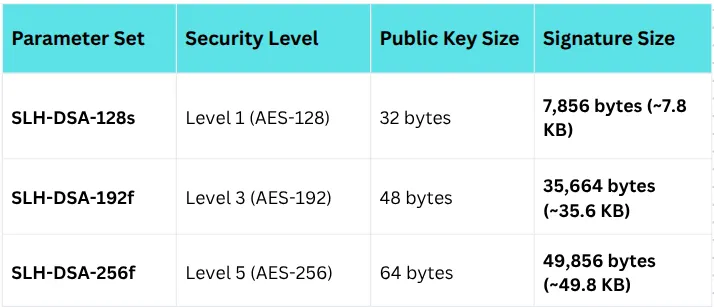

# FIPS-205

**Author:** [Khushi Chhillar](https://www.linkedin.com/in/kcl17/)

**Published:** December 25, 2025

## Introduction

In our previous posts, we covered the new “workhorses” of the post-quantum world: **ML-KEM** (for encryption) and **ML-DSA** (for signatures). Both rely on **Lattice Cryptography**, a field of mathematics involving high-dimensional grids that stump even quantum computers.

But NIST is a risk-averse organization. They asked a terrifying question: What if we are wrong about lattices? What if, ten years from now, a mathematician finds a fatal flaw in the lattice problems used by ML-KEM and ML-DSA?

To answer that question, NIST standardized a “safety net.” It is called FIPS 205, or SLH-DSA (Stateless Hash-Based Digital Signature Algorithm). Formerly known as SPHINCS+, this algorithm is the ultimate insurance policy for digital identity.

## The Core Concept: “Just Hashes”

While ML-DSA relies on complex geometric structures, SLH-DSA relies on something primitive and battle-tested: **Hash Functions**.

Cryptographic hash functions (like SHA-256) take an input and churn out a fixed-size string of characters. They are the “atoms” of cryptography used everywhere and understood deeply.

1.  **Maths Behind this**: SLH-DSA does not rely on number theory, factoring, or lattices. Its security depends solely on the difficulty of finding “pre-images” (reversing a hash function) or collisions.

2.  **The Quantum Resistance**: While Grover’s Algorithm can speed up attacks on hash functions quadratically, this is easily countered by simply making the hash output longer. There is no known “magic bullet” quantum algorithm (like Shor’s) that breaks hash functions exponentially.

This makes SLH-DSA extremely conservative. If you trust SHA-256 today, you can trust SLH-DSA tomorrow.

## How It Works: The Stateless Merkle Tree

>*One of our professor used to say that Money grows on Merkle Tree.*

Hash-based signatures have actually existed since the 1970s (e.g., Lamport signatures), but they had a fatal flaw: they were **stateful**. You had to remember exactly how many times you used a key; if you used a “one-time” key twice, the system broke. This made them dangerous for general use restoring a backup of a server could accidentally reset the state and destroy security.

But **SLH-DSA is different**. It is **Stateless**.

It works by aggregating huge numbers of one-time signatures (specifically Winternitz one-time signatures) into a massive structure called a **Merkle Tree**.

1. **Random Selection**: When you sign a document, the algorithm pseudo-randomly selects a few one-time keys from this massive tree to use.

2. **The Path**: The signature includes not just the verification of the message, but the entire “authentication path” through the tree to prove those specific keys belong to your public key.

3. **No State**: Because the tree is so incomprehensibly huge, the statistical probability of picking the same one-time key twice is negligible. You don’t need to remember anything; you just sign.

## The Specs: Tiny Keys, Massive Signatures

The trade-off for this extreme mathematical robustness is **size**. SLH-DSA has a unique profile that is the inverse of many other algorithms. According to FIPS 205, the sizes vary by parameter set (SHA2 or SHAKE variants):

>*Compare this to ML-DSA (Dilithium), where a Level 5 signature is only ~4.6 KB, or ECDSA which is a mere ~70 bytes*

1. **Public Keys** : The public keys are incredibly small typically just 32 to 64 bytes,. This is essentially just the “root” hash of the Merkle tree.

2. **Signatures** : The signatures are massive. Because they must contain the “authentication path” (the list of hashes proving the location in the tree), they consume significantly more bandwidth than lattice signatures.

3. **Performance** : SLH-DSA is also computationally heavy. Signing involves computing thousands of hashes. Signing can be orders of magnitude slower than ML-DSA (milliseconds vs. microseconds). Verification also relatively slow compared to the blazing speed of lattices.

## When Should You Use FIPS 205?

If SLH-DSA is slow and heavy, why did NIST standardize it?

1. **The “Lattice Collapse” Scenario**: If a brilliant mathematician discovers a fast way to solve lattice problems tomorrow, both FIPS 203 (ML-KEM) and FIPS 204 (ML-DSA) would crumble. FIPS 205 (SLH-DSA) would be the only standard left standing.

2. **Long-Term Document Signing**: If you are digitally signing a mortgage deed, a law, or a treaty that must be verifiable 30 years from now, size and speed don’t matter — trust matters. The conservative nature of hash-based security makes SLH-DSA ideal for archiving high-value data.

3. **Code Signing & Root Keys**: You don’t update your software kernel every second. For signing firmware or acting as a Root Certificate Authority (CA), the delay of a few milliseconds and a 40KB signature is acceptable in exchange for maximum security assurance.

## Conclusion

FIPS 205 (SLH-DSA) is not designed for the speed of the web; it is designed for the endurance of history. While ML-DSA will likely handle your daily TLS handshakes, SLH-DSA stands ready in the background a “nuclear bunker” built of pure hash functions, ensuring that even if the new math of lattices fails, our digital trust remains intact.

## Analogy: The Titanium Vault

*Think of the digital signature landscape like securing a building.*

• RSA/ECC (Current): These are standard deadbolts. They are light, fast, and we use them on every door. But we know a “Quantum Key” will eventually open them all.

• ML-DSA (Lattices): This is a high-tech biometric scanner. It is fast, efficient, and currently believed to be secure against the Quantum Key. We will put this on all our front doors.

• SLH-DSA (FIPS 205): This is a 10-ton titanium vault door. It takes a long time to open (performance), and it is physically massive (signature size). You wouldn’t put it on your bathroom door. But you absolutely use it for the foundation of the building or the main bank vault. It relies on simple, brutal physics (hashes) that we know are nearly impossible to break, ensuring that even if the high-tech scanner glitches, the vault remains closed.

