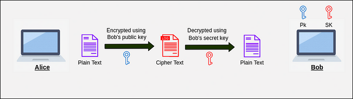
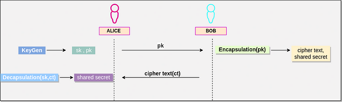

# Introduction to Post-Quantum Cryptography

**Author:** [Aditya Koranga](https://www.linkedin.com/in/aditya-koranga/)  

**Published:** June 27, 2022

## 1. Motivation for Post-Quantum Cryptography

While symmetric and asymmetric key cryptography have provided secure communications for decades, advancements in quantum computing are poised to undermine the security guarantees of existing algorithms. Quantum computers, utilizing the principles of quantum mechanics and qubits, can perform computations at speeds unattainable by classical computers. Owing to this computational power, operations such as code breaking and data searching can be performed exponentially faster, jeopardizing the confidentiality protected by present cryptographic systems.

As quantum computers become more practical and accessible, algorithms that rely on classical hardness assumptions, particularly those used in public-key cryptography, are becoming vulnerable. This challenge necessitates a shift to cryptographic methods that are resistant to quantum attacks. Post-Quantum Cryptography (PQC), also referred to as quantum-safe cryptography, comprises algorithms that are designed to remain secure even in the presence of quantum computational adversaries.

## 2. Cryptography and Its Types

Cryptography is the practice of securing information and communications by encoding data, such that only authorized parties can interpret and utilize the original content. The primary objectives of cryptography include confidentiality, integrity, and authentication.

Cryptography can be broadly classified into two principal types:

### 2.1 Symmetric Key Cryptography

Symmetric key cryptography, also known as private key cryptography, utilizes a single, shared key for both encryption and decryption. Both sender and receiver must possess this secret key:

- **Key Exchange:** The secure exchange of the shared key is a primary challenge in symmetric cryptography.
- **Encryption/Decryption:** Upon encryption with the secret key, data is converted into unintelligible ciphertext. The receiver uses the same key to decrypt the ciphertext back into plaintext.

Common examples of symmetric key algorithms include AES and DES.

### 2.2 Asymmetric Key Cryptography

Asymmetric key cryptography, or public-key cryptography, operates with key pairs: each party has a public key and a private key.

- **Public Key:** Can be distributed openly and is used for encryption.
- **Private Key:** Remains confidential and is required for decryption.

The sender encrypts data using the recipient’s public key, ensuring that only the recipient’s private key can decrypt the message. Widely used asymmetric algorithms include RSA and ECC.

While asymmetric cryptography offers significant advantages, quantum computers executing Shor’s Algorithm can efficiently break systems like RSA and ECC. Although AES (used in symmetric cryptography) retains some resilience against quantum threats, many essential applications, including digital signatures and blockchain, depend on the asymmetric approach. This underscores the necessity for quantum-resistant solutions.

## 3. Post-Quantum Cryptography

To respond to quantum computing threats, the National Institute of Standards and Technology (NIST) initiated a Post-Quantum Cryptography Standardization program. Beginning with 69 algorithms, the process has narrowed the field to 7 finalists and 8 alternates across several cryptographic families, including:

- Lattice-based
- Code-based
- Multivariate
- Hash-based
- Isogeny-based

Among the 7 finalists, there are 4 key encapsulation mechanisms (KEMs) and 3 signature algorithms. Of the KEMs, Kyber, NTRU, and SABER are lattice-based, while McEliece is code-based. Kyber is currently a key candidate.

**Kyber Key Encapsulation Mechanism Overview:**

1. **Key Generation:** 
   - A public and secret key pair is generated.
2. **Encapsulation:** 
   - The sender uses the recipient’s public key to produce a shared secret (`ss1`) and a ciphertext (`ct`).
3. **Decapsulation:** 
   - The recipient uses their private key to decapsulate the ciphertext and derive their version of the shared secret (`ss2`).
   - If `ss1 = ss2`, the key exchange is successfully verified.

