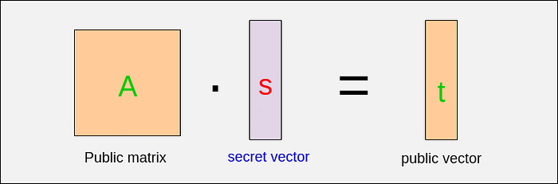
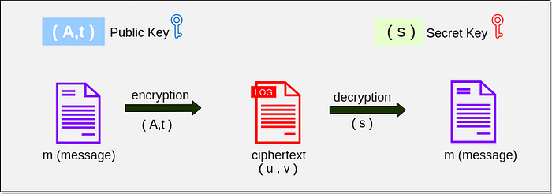

# Learning with Errors: Quantum-Proof Algorithm

**Author:** [Aditya Koranga](https://www.linkedin.com/in/aditya-koranga/)

**Published:** June 27, 2022

## Introduction

A foundational concept in lattice-based cryptography is the Learning with Errors (LWE) problem. LWE is a public key encryption method regarded as robust and is utilized by various lattice-based algorithms, including Kyber and Frodokem. As reflected by its name, the method incorporates the intentional addition of errors into its mathematical construction, which is critical for its security properties.

## How LWE Works

The basic framework begins with the following linear equation:

`A . s = t`

Where:

- `A` is a public matrix,
- `s` is a secret vector,
- `t` is a public vector.

Thus, `(A, t)` acts as the public key pair and `s` is the private key.

Given that both `A` and `t` are public, it is straightforward to determine the secret vector `s` using basic algebraic techniques such as Gaussian elimination. To address this, LWE introduces an additional error vector, making the equation:

`A . s + e = t`

Here, `e` is a small error (noise) vector. This single modification makes it computationally difficult to recover `s` from public information, thereby strengthening security.

With the inclusion of error `e`, the public key remains `(A, t)`, while `s` continues as the private key. The process then moves to encryption and decryption.

## Encryption

Consider a message `m` that needs to be encrypted (typically converted into a polynomial form). The encryption process utilizes the public key pair `(A, t)` and incorporates additional randomness:

- The ciphertext consists of two components:
  - `u`: a cipher polynomial,
  - `v`: a polynomial vector.

These are computed as follows, using error terms `e1`, `e2`, and `e3`:

`v = t . e1 + e2 + m`  
`u = A . e1 + e3`

Note that error `e1` is used in both equations. Once the ciphertext is generated, it can be transmitted securely.

## Decryption

Decryption involves the use of the secret key `s`. The original message `d` is recovered using:

`d = v — s . u`

Substituting the values for `v` and `u`:

`d = t . e1 + e2 + m — s . (A . e1 + e3)`  
`d = t . e1 + e2 + m — A . s . e1 — s . e3`

Given `A . s + e = t`, substituting for `t`:

`d = (A . s + e) . e1 + e2 + m — A . s . e1 — s . e3`  
`d = A . s . e1 + e . e1 + e2 + m — A . s . e1 — s . e3`

Canceling terms:

`d = e . e1 + e2 + m — s . e3`  
`d = m + e . e1 + e2 — s . e3`

The remaining terms `(e . e1 + e2 — s . e3)` are small noise values, which can be removed using mathematical rounding (commonly a `q/2` method). After error correction, the original message `m` is recovered, thus completing the decryption.

## Other Types of LWE

Variants of the LWE problem include Ring-LWE and Module-LWE (M-LWE). Kyber, for instance, utilizes M-LWE. These methods retain the core principles of standard LWE but differ in the construction of the public matrix `A`. In M-LWE, elements of one column may be repeated in other columns.

Public matrix in M-LWE

## Complete Flow Diagram

The full process for the Learning with Errors method is illustrated below.

