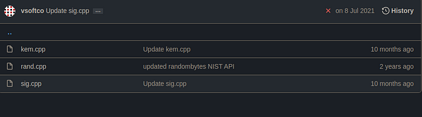
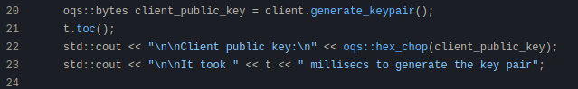
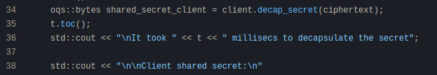
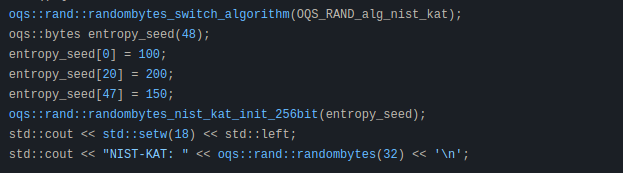
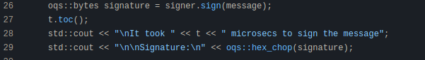
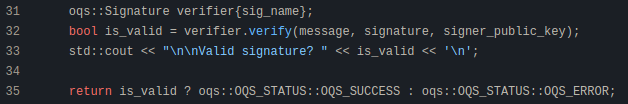

# Working of Open Quantum Safe Library

**Author:** [Aditya Koranga](https://www.linkedin.com/in/aditya-koranga/)  

**Published:** June 12, 2022

## 1. What is LibOQS?

Liboqs is an open-source C library providing quantum-safe cryptographic algorithms. It offers a suite of implementations for post-quantum key encapsulation mechanisms (KEMs) and digital signature algorithms, including Kyber, Saber, NTRU, McEliece, Frodo, Dilithium, RainBow, Picnic, among others.

To explore the practical implementation of these algorithms, it is useful to examine the C++ wrapper library, liboqs-cpp.

## 2. LibOQS-Cpp

Liboqs-cpp is a C++11 wrapper for the Open Quantum Safe liboqs C library. The core implementation is organized around three primary files:

- `kem.cpp`
- `rand.cpp`
- `sig.cpp`

Understanding these files provides comprehensive insight into how the library operates.

Each file is examined below.

### 2.1 KEM.cpp

Reference: https://github.com/open-quantum-safe/liboqs-cpp/blob/main/examples/kem.cpp

- The first step involves selecting a post-quantum KEM algorithm. In the presented example, 'Kyber512' is chosen, and its attributes and configuration are loaded.

- Key generation is performed for the client, creating a public key that will be used for subsequent cryptographic operations.

- Using the client's public key, the server performs the encapsulation operation. This process produces two values: the ciphertext and a shared secret.

- The decapsulation process follows. The server keeps the shared secret private. The client uses its own secret key to decapsulate the ciphertext, resulting in another shared secret.

- The two shared secrets (from encapsulation and decapsulation) are compared. If they match, the key agreement is valid, confirming secure communication. If not, an error is indicated.

### 2.2 RAND.cpp

Reference: https://github.com/open-quantum-safe/liboqs-cpp/blob/main/examples/rand.cpp

The role of this file is to manage random number generation—a fundamental part of cryptographic security.

- Secure random number generation begins with an entropy seed. In the liboqs implementation, this seed is 48 bytes.

- Various random number generators are supported, including custom RNGs and OpenSSL integration.

- The random number generation algorithm can be changed as needed.

> **Note:** The random number generation methods used (such as DRBG) do not produce truly random numbers since they implement algorithms to approximate randomness. Greater security would be achieved with true random number generators.

### 2.3 SIG.cpp

Reference: https://github.com/open-quantum-safe/liboqs-cpp/blob/main/examples/sig.cpp

This part of the library deals with digital signature creation and verification, vital for authenticating the sender.

- The process begins by selecting a signature algorithm; for example, 'Dilithium2'. The message to be signed is also specified.

- The public key of the signer is generated for use in subsequent verification steps.

- The signer then signs the message using their private (signing) key.

- Lastly, the generated signature is verified using the public key corresponding to the signing key. Successful verification demonstrates that the sender is legitimate and the message has not been altered.

This workflow encompasses the essential elements of the liboqs library. The system supports alternative KEM and signature algorithms beyond Kyber and Dilithium (both from the lattice-based family), many of which are recognized as secure by NIST.
