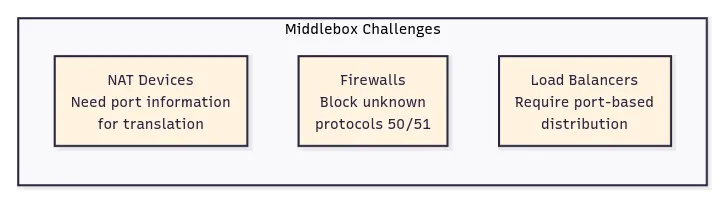
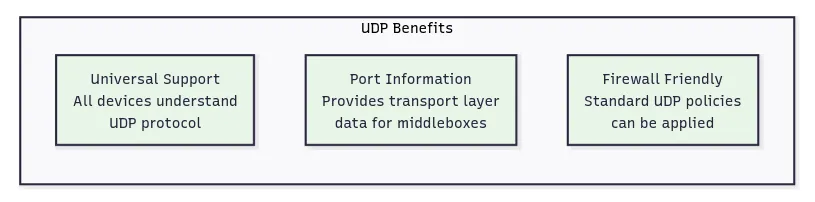
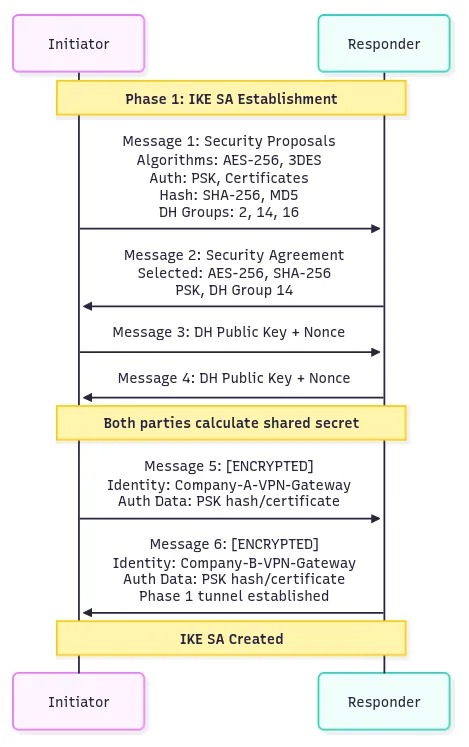

# Understanding IPsec: How Internet Security Works

**Author:** [Shubham Kumar](https://www.linkedin.com/in/chmodshubham/)  

**Published:** July 1, 2025

IPsec (Internet Protocol Security) is a comprehensive protocol suite designed to secure Internet Protocol communications at the network layer. Rather than being a single protocol, IPsec functions as a security framework that provides authentication, integrity, and confidentiality for IP packets.

Operating at Layer 3 of the OSI model, IPsec can secure any type of IP traffic without requiring modifications to existing applications. This network-layer approach means that once IPsec is configured, all applications automatically benefit from its protection — web browsing, email, file transfers, and custom protocols all get secured transparently.

IPsec achieves security through two primary mechanisms: Authentication Header (AH) for integrity and authentication, and Encapsulating Security Payload (ESP) for encryption and authentication. These protocols work in conjunction with Internet Key Exchange (IKE) to establish secure communications channels called Security Associations.

The protocol suite maintains security state information in two key databases: the Security Association Database (SAD) stores active connection parameters including encryption keys and algorithms, while the Security Policy Database (SPD) determines which traffic requires IPsec protection and how that protection should be applied.

## How does IPsec work?

IPsec connections include the following steps:

**Key exchange:** IPsec sets up keys with a key exchange between the connected devices, so that each device can decrypt the other device’s messages.

**Packet headers and trailers:** All data that is sent over a network is broken down into smaller pieces called packets. IPsec adds several headers to data packets containing authentication and encryption information. IPsec also adds trailers, which go after each packet’s payload instead of before.

> **Note:** Packet trailers are additional data appended to the end of a packet’s payload that contain control information such as integrity checksums, padding for encryption block alignment, and protocol-specific metadata needed for proper packet processing.

**Authentication:** IPsec provides authentication for each packet which ensures that packets are from a trusted source and not an attacker.

**Encryption:** IPsec encrypts the payloads within each packet and each packet’s IP header (tunnel mode only). This keeps data sent over IPsec secure and private.

**Transmission:** Encrypted IPsec packets travel across one or more networks to their destination using UDP as the transport protocol.

**Decryption:** At the other end of the communication, the packets are decrypted, and applications (e.g. a browser) can now use the delivered data.

## Why use UDP Underneath?

IPsec was originally designed to operate directly over IP using protocol numbers 50 (ESP) and 51 (AH). However, real-world deployment challenges led to the development of UDP encapsulation as a practical solution for middlebox (firewalls, load balancers, NATs) traversal.

> **Note:** A protocol number is a numerical identifier used to specify which protocol is being used within an IP packet. It’s a way for the receiving device to know how to interpret the data contained within the packet. Essentially, it tells the receiving end what kind of data is inside the IP packet (e.g., TCP, UDP, ICMP).

The main challenges came from three types of network devices. NAT devices rewrite IP addresses and port numbers but can’t process IPsec packets that either encrypt port information (ESP) or don’t use ports at all (AH), causing connection failures. Firewalls often block unfamiliar traffic, and IPsec protocol numbers 50 and 51 are less understood than standard TCP/UDP protocols. Load balancers make forwarding decisions based on port numbers, but IPsec packets don’t provide this information in the expected format.

IPsec uses UDP because this allows IPsec packets to get through firewalls and NAT devices more easily. TCP sets up dedicated connections between devices and ensures that all packets arrive, while UDP does not set up these dedicated connections. This makes UDP more suitable for IPsec encapsulation since it provides the transport layer information that middleboxes expect without the connection state complexity of TCP.

UDP encapsulation, formalized as NAT Traversal (NAT-T), addresses these issues by wrapping IPsec packets in UDP headers. The encapsulated packets use UDP port 4500, which provides the transport layer information that middleboxes expect. NAT devices can rewrite the UDP header information while leaving the encapsulated IPsec data intact. Firewalls can apply standard UDP policies, and load balancers can distribute traffic based on UDP port information.

> NAT-T (NAT Traversal) is a mechanism that allows IPsec traffic to pass through Network Address Translation devices by encapsulating IPsec packets within UDP headers, enabling the NAT device to track and translate the connection using standard UDP port information.

### UDP Encapsulation Call Flow Example

A UDP encapsulation workflow with a client in Delhi connecting to a corporate server in California through a NAT device includes:

1. **Initial IKE Discovery:** Client → Server: IKE packet on UDP port 500 containing vendor IDs and NAT detection payloads
2. **NAT Detection:** Server compares received source IP/port with values inside encrypted payload; mismatch indicates NAT presence
3. **Port Switch Negotiation:** Client ↔ Server: Both parties agree to switch from UDP port 500 to UDP port 4500 for all subsequent communication
4. **Encapsulated Data Flow:** Client → NAT → Server: Original IPsec packet wrapped in UDP header with source/destination port 4500
5. **NAT Processing:** NAT device rewrites UDP source IP and port while preserving the encapsulated IPsec payload
6. **Server Processing:** Server receives UDP packet, strips UDP header, and processes the original IPsec content normally

The NAT-T process includes several sophisticated mechanisms beyond simple UDP wrapping. During IKE negotiation, both parties detect whether NAT is present on the communication path by comparing hash values computed over IP address information. If the hashes differ between sender and receiver, NAT modification is detected and UDP encapsulation is activated.

## How the Internet Worked Before IPsec

The original Internet Protocol (IP) was designed in an era of trusted networks where security was not a primary concern. When researchers and academics created IP in the 1970s and 1980s, the network consisted of a limited number of trusted institutions, and the primary focus was on connectivity and reliability rather than security.

In this original model, data transmission was straightforward but completely unprotected. Applications would create data, TCP would add reliability mechanisms, and IP would handle routing — all in plain text. This approach created several fundamental vulnerabilities including eavesdropping where any device could read packet contents, data tampering where traffic could be modified without detection, and identity spoofing where source addresses could be easily forged.

Early security solutions operated at the application layer, requiring each service to implement its own protection mechanisms. Email used PGP for encryption/decryption, web traffic relied on TLS/SSL for protection, and remote access employed SSH for secure connections. This piecemeal approach meant that security coverage was inconsistent, with many protocols remaining completely unprotected.

> **Note:** PGP (Pretty Good Privacy) is a method for encrypting and decrypting emails to enhance their security and privacy.

The fundamental issue was that security was treated as an add-on feature rather than a core network service. Each application had to reinvent security mechanisms, leading to implementation inconsistencies and gaps in protection. IPsec addressed these limitations by moving security down to the network layer itself, providing universal protection that all applications could benefit from automatically.

## What Protocols Does IPsec Use?

IPsec employs a coordinated set of protocols that work together to provide comprehensive network security. At its core, IPsec uses two main security protocols: AH and ESP.

**Authentication Header (AH)** provides data integrity and authentication services without encryption. AH computes a cryptographic hash over the entire IP packet using shared secret keys, creating an Integrity Check Value that proves the packet originated from the claimed sender and hasn’t been modified in transit. The protocol also includes sequence numbers to prevent replay attacks where old packets are retransmitted by attackers.

**Encapsulating Security Payload (ESP)** offers both confidentiality through encryption and authentication through integrity checking. ESP encrypts the packet payload using symmetric encryption algorithms like AES, making the data unreadable to unauthorized parties. Additionally, ESP can provide the same integrity and authentication services as AH, often eliminating the need to use both protocols simultaneously.

AH and ESP both offer authentication and integrity but only ESP supports encryption. Because of this, ESP is the most popular choice nowadays.

**Security Associations (SAs)** are fundamental data structures that define how IPsec protects traffic between communication peers. Each SA contains all the security parameters needed to process packets in one direction, including encryption algorithms, authentication methods, cryptographic keys, and sequence numbers for replay protection. IPsec requires separate SAs for each direction of communication, so a bidirectional connection uses two SAs.

The establishment and management of these Security Associations is handled by **Internet Key Exchange (IKE)**, which is one of the primary protocols within the SA framework. IKE authenticates the identities of communicating parties using certificates or pre-shared keys. It negotiates which encryption and authentication algorithms both parties will use, generates and distributes cryptographic keys securely, and manages key lifecycle including renewal and deletion.

IKE operates in two distinct phases:

- **Phase 1** establishes a secure, encrypted tunnel for management communications and mutual authentication between peers. It can use either Main Mode (6 messages, higher security) or Aggressive Mode (3 messages, faster setup)
- **Phase 2** uses this secure tunnel to negotiate the actual IPsec parameters and create the Security Associations that will protect data traffic. It uses Quick Mode for efficient SA negotiation over the established secure tunnel

> **Note:**
>
> **Main Mode:** It is used to establish a secure channel (IKE SA) between two peers. It involves a series of 6 messages exchanged in three pairs to negotiate security parameters and authenticate the peers then exchanges identity information only after encryption is established.
>
> **Aggressive Mode:** It involves 3 message exchange, a faster alternative to IKE Main Mode but at the cost of reduced security. It sends the initiator identity in clear text potentially exposing it to attackers.
>
> **Quick Mode:** Uses the secure Phase 1 tunnel to quickly negotiate IPsec parameters without repeating the heavy authentication process.

*The Security Association Database (SAD)* stores information about active security connections, including encryption keys, algorithm parameters, sequence numbers, and lifetime values. Each security association represents a one-way security relationship between two parties.

*The Security Policy Database (SPD)* contains rules that determine how different types of traffic should be handled. The SPD specifies which traffic requires IPsec protection, what type of protection to apply, and what to do with traffic that doesn’t match any defined policies.

These components work together seamlessly. When an outbound packet needs protection, the SPD determines the required security treatment. If protection is needed but no suitable security association exists, IKE negotiates a new one and stores the results in the SAD. The appropriate security protocol (AH or ESP) then processes the packet according to the SAD parameters.

## IPsec 2-Phase Handshake

IPsec establishes secure communications through a two-phase negotiation process, where each phase serves a distinct purpose in building the complete security framework.

### Phase 1: IKE Security Association (SA) Establishment

In this phase, an ISAKMP (Internet Security Association and Key Management Protocol) session is established. This is also called the ISAKMP tunnel or IKE phase 1 tunnel.

Phase 1 creates a secure, authenticated channel that will be used for all subsequent negotiations. This phase typically uses IKE Main Mode, which involves six message exchanges between the initiator and responder.

**Message 1:** Initiator → Responder: “I want to establish a secure connection. Here are my supported security policies including encryption algorithms (AES-256, 3DES), authentication methods (PSK, certificates), hash algorithms (SHA-256, MD5), and Diffie-Hellman groups (Group 2, 14, 16) for key exchange”

**Message 2:** Responder → Initiator: “I accept your connection request. From your proposals, I choose AES-256 for encryption, SHA-256 for hashing, PSK for authentication, and DH Group 14 for key exchange”

**Message 3:** Initiator → Responder: “Here’s my Diffie-Hellman public key value and a random nonce number for replay protection.”

**Message 4:** Responder → Initiator: “Here’s my Diffie-Hellman public key value and nonce number. Now both can calculate the same shared secret”

**Message 5:** Initiator → Responder: [Encrypted with derived keys] “My identity is Company-A-VPN-Gateway and here’s my authentication data (PSK hash or certificate) to prove identity”

**Message 6:** Responder → Initiator: [Encrypted with derived keys] “My identity is Company-B-VPN-Gateway and here’s my authentication data. Phase 1 tunnel is now established and secured”

The process begins with the initiator sending its supported algorithms and parameters. The responder selects among these and confirms, followed by the exchange of Diffie-Hellman keys and nonces for shared secret computation. The final step is encrypted exchange and verification of identity credentials.

Phase 1 results in an IKE Security Association providing an encrypted, authenticated communication channel with a long lifetime, as identity verification is computationally expensive.

### Phase 2: IPsec Security Association Establishment

Phase 2 negotiates actual data protection using the Phase 1 secure channel (IKE Quick Mode, 3 messages).

- **Message 1:** Initiator → Responder: [Encrypted via Phase 1 tunnel] “For data traffic, proposes ESP protocol, AES-128 encryption, SHA-1 authentication, tunnel mode, and protection for defined network traffic, plus additional key material for perfect forward secrecy”
- **Message 2:** Responder → Initiator: [Encrypted via Phase 1 tunnel] “Agrees, supplies key material contribution, provides SPI values”
- **Message 3:** Initiator → Responder: [Encrypted via Phase 1 tunnel] “Confirms configuration, SAs established, ready for secure traffic, hash verification successful”

The initiator proposes protection parameters. The responder agrees and both generate keys for data encryption. A new Diffie-Hellman exchange commonly ensures perfect forward secrecy.

Phase 2 creates IPsec Security Associations in the SAD for actual data traffic. These SAs are periodically renewed for ongoing security.

## Tunneling vs Transport Mode

IPsec offers two distinct operational modes that determine how security is applied to IP packets. The choice between tunnel and transport mode affects packet structure, routing behavior, and deployment scenarios.

### Transport Mode

Transport mode applies IPsec protection to the payload of an IP packet while preserving the original IP header. In this mode, the IPsec header (ESP or AH) is inserted between the original IP header and the transport layer header (TCP or UDP). The original source and destination IP addresses remain visible, but the transport layer and application data are encrypted and authenticated.

**Packet Structure:**

*For AH:*

*For ESP:*

*For AH+ESP:*

When a packet is processed in transport mode, the original IP header guides routing decisions throughout the network. Network devices can apply quality of service policies based on the visible addressing information, and traffic analysis reveals the communication endpoints. However, the actual data exchange, including transport layer information and application content, remains protected from eavesdropping and tampering.

Transport mode is primarily used for end-to-end communications between two hosts that both support IPsec. This mode requires IPsec implementation on both endpoints and is commonly employed for securing specific application flows that need direct host-to-host protection.

### Tunnel Mode

Tunnel mode encapsulates the entire original IP packet within a new IP packet. The original packet, including its headers, becomes the payload of a new IP packet with different source and destination addresses. This new outer header typically points to IPsec gateways or VPN endpoints rather than the original communication endpoints.

**Packet Structure:**

*For AH:*

*For ESP:*

*For AH+ESP:*

In tunnel mode processing, the complete original packet is encrypted and becomes the payload of the new packet. Network routing decisions are based on the outer IP header, which usually directs traffic between security gateways. The original communication endpoints are hidden within the encrypted payload, providing location privacy and enabling network-to-network communications.

Tunnel mode enables IPsec gateways to provide transparent security services for entire networks. Client systems and servers do not need IPsec implementations since the security processing occurs at intermediate gateways. This approach allows existing applications and systems to benefit from IPsec protection without modification.

The packet structure differences have important implications for network behavior. Transport mode adds minimal overhead since only IPsec headers are added to existing packets. Tunnel mode creates larger packets due to the additional outer IP header, but provides complete traffic flow confidentiality.
