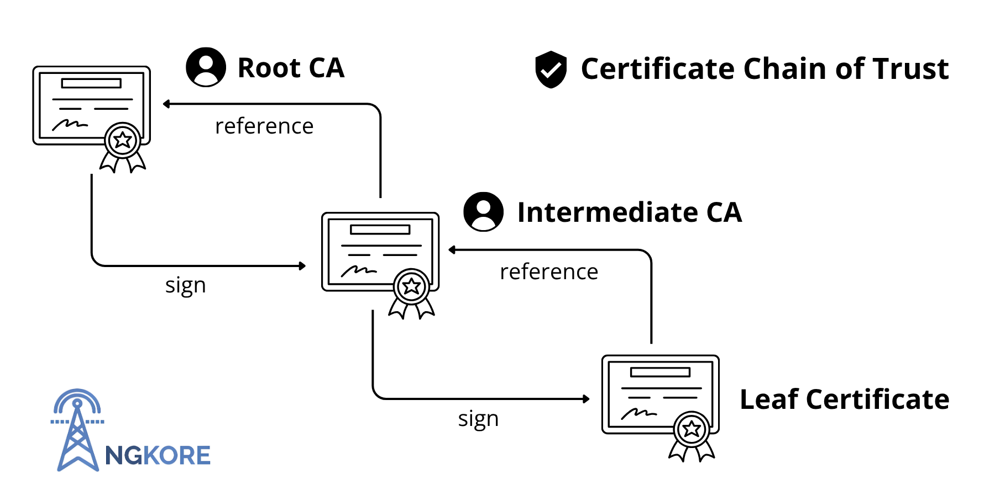
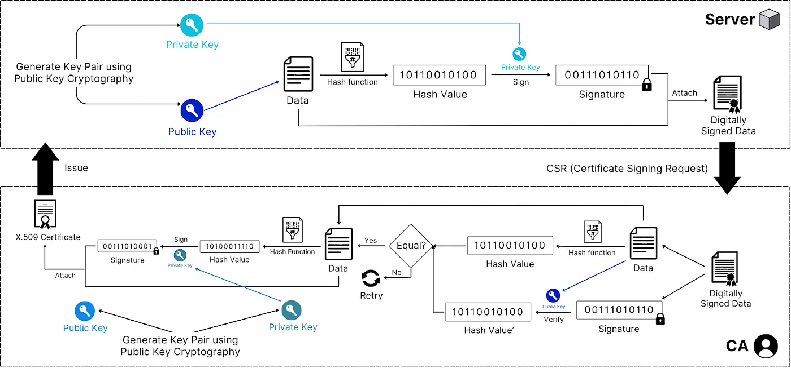

# TLS/SSL Connection

**Author:** [Shubham Kumar](https://www.linkedin.com/in/chmodshubham/)  

**Published:** June 22, 2025

Transport Layer Security (TLS) and its predecessor Secure Sockets Layer (SSL) are cryptographic protocols that provide secure communication over computer networks. This document presents an overview of TLS/SSL connections, certificate infrastructure, and the handshake process that establishes secure web communications.

## What is TLS?

TLS (Transport Layer Security) is a widely adopted security protocol that provides privacy and security for data transmitted over the internet. TLS encrypts communication between web applications and servers, secures email transmission, protects VoIP calls, and enables security across multiple network protocols. The Internet Engineering Task Force (IETF) standardized TLS, with version 1.3 published in 2018 as the current standard.

The terminology "SSL/TLS" is frequently used due to the historical transition from SSL to TLS and their similar roles in modern security.

## Protocol Evolution

SSL (Secure Sockets Layer) was the original protocol developed by Netscape to secure internet communications. TLS version 1.0 was introduced as a successor to SSL version 3.0, with the protocol renamed to TLS to reflect independence from Netscape's proprietary technology. As a result, the terms SSL and TLS are often used interchangeably.

HTTPS is the combination of HTTP with TLS, which ensures secure data transmission over the internet. This integration is the foundation for secure web applications, with major browsers requiring HTTPS for various advanced web features.

## Understanding TLS/SSL Certificates

A TLS/SSL certificate is a digital certificate issued by a Certificate Authority (CA) that certifies ownership of a domain through a public key. The CA digitally signs this certificate, and trust in the CA provides confidence that the public key belongs to the legitimate owners of the domain. These certificates follow the X.509 standard and are often called X.509 certificates interchangeably with TLS certificates.

The certificate ecosystem operates through a hierarchical chain of trust consisting of three primary levels:

- **Root CAs:** Root Certificate Authorities occupy the top level of the trust hierarchy as self-signed entities and the ultimate sources of trust in the ecosystem. The private key of a root CA is highly protected, usually offline. Common examples include DigiCert, GlobalSign, Let's Encrypt, and VeriSign.
- **Intermediate CAs:** These inherit trust from root CAs and issue certificates to end entities. Their existence minimizes the exposure in case of compromise, as intermediate keys can be revoked and replaced without affecting the root CA.
- **End-Entity Certificates (Leaf Certificates):** Directly issued to websites, email servers, or individuals.

In this hierarchy, root CAs self-sign their certificates and establish the foundation of trust. Root CAs then sign intermediate CA certificates, which subsequently sign end-entity certificates. This layered structure supports scalable and robust certificate validation through distributed trust management.

## Certificate Issuance (Pre-TLS Handshake)

Prior to participating in a TLS handshake, a server must acquire a valid certificate using the following sequence:

**Step 1: Certificate Signing Request (CSR) Generation**

- The server generates a public-private key pair.
- The server creates data containing its public key, domain name, organization details, and other identifying information.
- This data is hashed and digitally signed with the server's private key to create the CSR.

**Step 2: CA Verification and Signing**

- The CSR is submitted to a Certificate Authority (CA).
- The CA validates the server identity through domain validation, organization validation, or extended validation.
- The CA constructs certificate data including the public key, domain name, validity period, CA information, and certificate policies.
- The certificate data is hashed (usually with SHA-256) and signed using the CA's private key, resulting in a digital signature.
- The signed certificate and data form a standard X.509 certificate.

**Step 3: Certificate Distribution**

- The CA issues the certificate to the server.
- The server installs the certificate and can present it during TLS handshakes.

## TLS Handshake

The TLS handshake process consists of the following major steps:

**Step 1: Client Hello**

- The client initiates the connection and sends supported TLS versions, cipher suites, and a random value.

**Step 2: Server Hello**

- The server responds with its selected TLS version, cipher suite, and its own random number.
- The server sends its certificate chain, including the server certificate and relevant intermediate certificates.

> **Note:** The server transmits the entire certificate chain to provide the cryptographic data needed for signature verification. The client requires intermediate CA certificates—not just issuer metadata—to validate digital signatures. Ultimately, the client uses the root CA's pre-installed public key to verify the signature of the intermediate certificate.

**Step 3: Certificate Verification**

- The client extracts the certificate data and digital signature.
- The client identifies the issuing CA from the certificate information.
- The client locates the appropriate CA root certificate from its local trust store; the client does not contact the CA directly for the public key.
- Using the root certificate’s public key, the client verifies the digital signature on the intermediate certificate.
- The client hashes the certificate data using the algorithm specified, then compares the computed hash with the signature. A match confirms the certificate’s authenticity.
- Additional verification includes checking the certificate’s validity period, domain name, and proper chaining up to a trusted root CA.

**Step 4: Key Exchange**

- The client generates a pre-master secret, encrypts it with the server's public key (from the verified certificate), and transmits it.
- Both the client and server derive a master secret and session keys from the pre-master secret and the exchanged random values.

**Step 5: Finished Messages**

- Both parties send encrypted "Finished" messages using the newly established session keys.
- This exchange confirms a successful key exchange and authentication.

**Step 6: Secure Communication**

- All subsequent communication is encrypted with the session keys established during the handshake.